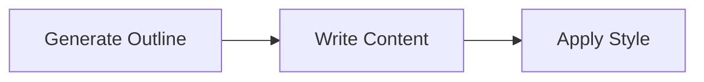
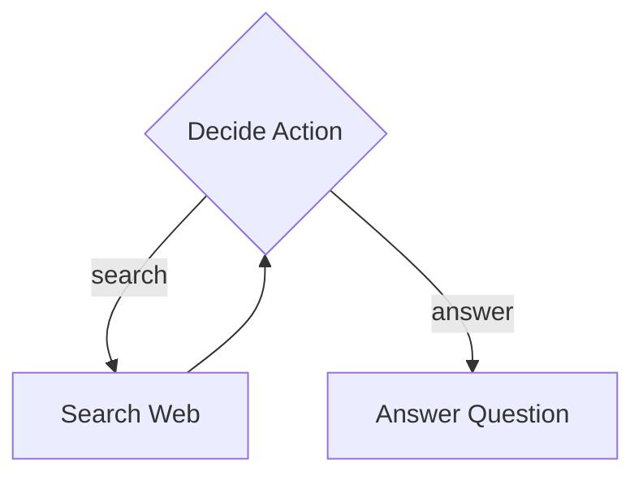
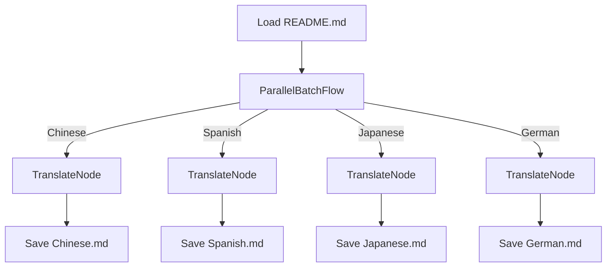
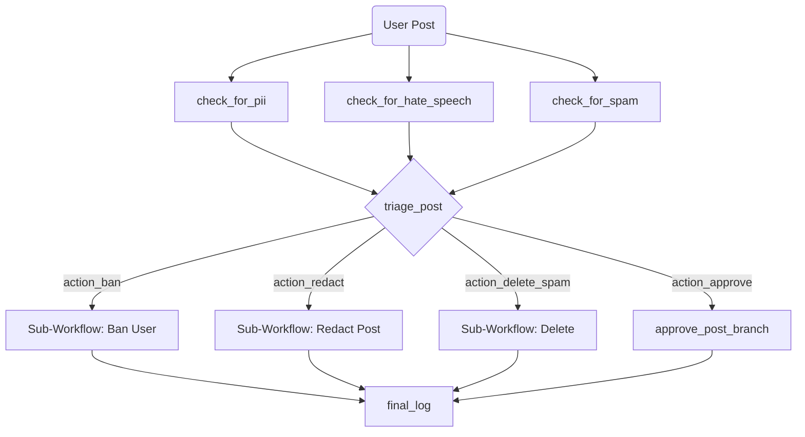

# Cascade: A Workflow Framework

Build complex, multi-step processes, from simple sequences to dynamic, graph-driven AI agents.

## Features

- **Zero Dependencies**: Lightweight and dependency-free, ensuring a small footprint and easy integration.

- **Composable & Reusable**: Define workflows by chaining nodes or embedding other flows as nodes.

- **Type-Safe**: Written in TypeScript to provide strong typing for your workflow definitions and context.

- **Async by Default**: Built on an asynchronous foundation to handle I/O-bound and CPU-bound tasks.

- **Middleware**: Intercept execution of nodes to handle cross-cutting concerns in a centralized way.

- **Conditional Branching**: Direct the flow's execution path based on the results of any node.

- **Retry Logic & Fallbacks**: Retry failed operations with configurable delays and fallback logic.

- **Cancellation Support**: Gracefully abort running workflows using standard `AbortController`s.

- **Pluggable Logging**: Use the built-in `ConsoleLogger` or bring your own (e.g., Pino, Winston).

- **Dynamic Graph Engine**: Define complex, graph-based workflows as simple JSON files.

- **Fluent & Functional API**: A chainable API on the `Node` class and a collection of functional helpers

## Installation

```bash
npm install gorango/cascade
```

## Quick Start

Create and run a simple workflow in a few lines of code.

```typescript
import { Node, Flow } from 'cascade'

const greetNode = new Node('greet')
  .exec(() => 'Hello, World!')

const flow = new Flow().start(greetNode)
flow.run()
```

## Learn by Example

The best way to understand the framework is by exploring the included sandbox examples. They are ordered by increasing complexity, each introducing new features and demonstrating the flexibility of the core engine.

### 1. Basic Sequential Flow: Article Writer

A simple, linear workflow that demonstrates the core concepts of creating a sequence of nodes to perform a multi-step task like generating an article.



- **Demonstrates**: `Node` chaining, passing data via `Context`, and a simple `BatchFlow`.
- **[Explore the Basic example &raquo;](./sandbox/1.basic/)**

### 2. Conditional Branching: Research Agent

A simple agent that uses a loop and conditional branching to decide whether to search the web for information or answer a question based on the current context.



- **Demonstrates**: Conditional branching with custom actions, creating loops, and building simple state machines.
- **[Explore the Research Agent example &raquo;](./sandbox/2.research/)**

### 3. Parallel Batch Processing: Document Translator

A practical example that translates a document into multiple languages concurrently. It uses the `ParallelBatchFlow` builder to showcase significant performance boosts for I/O-bound tasks.



- **Demonstrates**: `ParallelBatchFlow` for high-throughput concurrent processing of I/O-bound tasks.
- **[Explore the Parallel Translation example &raquo;](./sandbox/3.parallel/)**

### 4. Dynamic Graph Engine: AI Agent Runtime

The most advanced example: a powerful runtime that executes complex, graph-based AI workflows defined in simple JSON files. This shows how to build highly dynamic and modular AI agent systems.



- **Demonstrates**:
  - Dynamic flow creation from file-based definitions using `GraphBuilder`.
  - Parallel fan-in and fan-out (mid-flow branching).
  - Reusable, data-driven nodes (e.g., an LLM-powered router).
  - Complex sub-workflow composition.
- **[Explore the Dynamic AI Agent example &raquo;](./sandbox/4.dag/)**

## Core Concepts

### Node

The `Node` is the fundamental building block of a workflow. It represents a single, potentially asynchronous unit of work with a three-phase lifecycle:

1. `prep(args)`: Prepare data for execution (e.g., fetch from `Context`).
2. `exec(args)`: Perform the core logic, isolated from the context.
3. `post(args)`: Process results, update the `Context`, and return an "action" string to determine the next step.

A chainable API on the `Node` class has a set of functional helpers:

- `.map(fn)`: Transform the output of a node.
- `.filter(predicate)`: Conditionally proceed based on a node's output.
- `.tap(fn)`: Perform a side-effect without changing the output.
- `.toContext(key)`: Store a node's result in the context.

### Flow

A `Flow` is a special type of `Node` that orchestrates a sequence of other nodes. You define a starting node and chain subsequent nodes together, creating a graph of operations.

### Middleware

A `Flow` can be configured with middleware functions that wrap the execution of every node within it. This is the ideal pattern for handling **cross-cutting concerns** like performance monitoring, centralized logging, authentication, or transaction management without cluttering your business logic. Middleware is executed in a predictable FIFO (First-In, First-Out) order.

### Context

The `Context` is a shared, type-safe `Map`-like object passed through every node in a flow. It acts as a shared memory space, allowing nodes to pass data and share state.

### Actions & Branching

A node's `post()` method returns a string called an **action**. The flow uses this action to look up the next node to execute. The default action is `'default'`, but returning custom strings allows for conditional branching. The fluent `.filter()` method provides another powerful way to branch based on a `FILTER_FAILED` action.

### Builders

To simplify the creation of common and complex patterns, the framework provides a `builder` module. These helpers abstract the construction of executable `Flow`s.

- **`SequenceFlow`**: Creates a linear flow from a sequence of nodes.
- **`BatchFlow` / `ParallelBatchFlow`**: Process a collection of items sequentially or concurrently.
- **`GraphBuilder`**: Translates a declarative graph definition into a fully executable `Flow`.

## Unit Tests

For clear, focused examples of specific, individual features (like retries, middleware, cancellation, and composition), the unit tests are an excellent resource.

- Core workflow tests: [`src/workflow.test.ts`](src/workflow.test.ts)
- Collections tests: [`src/builder/collection.test.ts`](src/builder/collection.test.ts)
- Graph builder tests: [`src/builder/graph.test.ts`](src/builder/graph.test.ts)

## API Reference

### Core Classes (`cascade/workflow`)

- `Node`: The base class for a unit of work with built-in retry logic and a fluent API (`.map`, `.filter`, etc.).
- `Flow`: Orchestrates a sequence of nodes and supports middleware via `.use()`.
- `TypedContext`: The standard `Map`-based implementation for the `Context` interface.
- `ConsoleLogger`, `NullLogger`: Pre-built logger implementations.

### Functional Helpers (`cascade/fn`)

A collection of functions for creating nodes and pipelines in a more functional style.

- `mapNode`: Creates a `Node` from a simple, pure function.
- `contextNode`: Creates a `Node` from a function that requires access to the `Context`.
- `pipeline`: A functional alias for creating a linear sequence of nodes.

### Builder Classes (`cascade/builder`)

- `SequenceFlow`: A `Flow` that creates a linear flow from a sequence of nodes.
- `BatchFlow`: A `Flow` that processes a collection of items sequentially.
- `ParallelBatchFlow`: A `Flow` that processes a collection of items in parallel.
- `GraphBuilder`: Constructs a `Flow` from a declarative graph definition.

---
Licensed under the [MIT License](./LICENSE).
