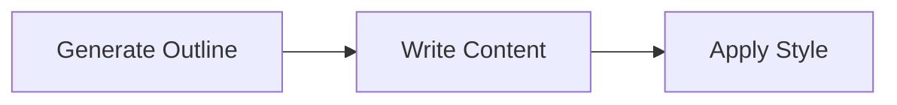
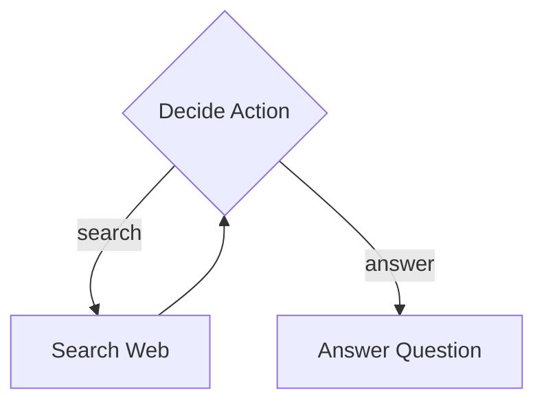
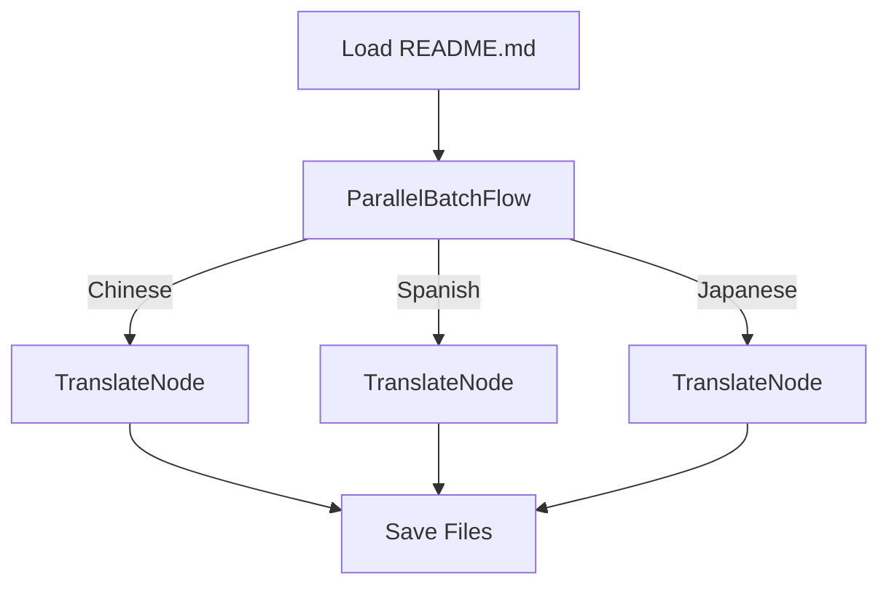
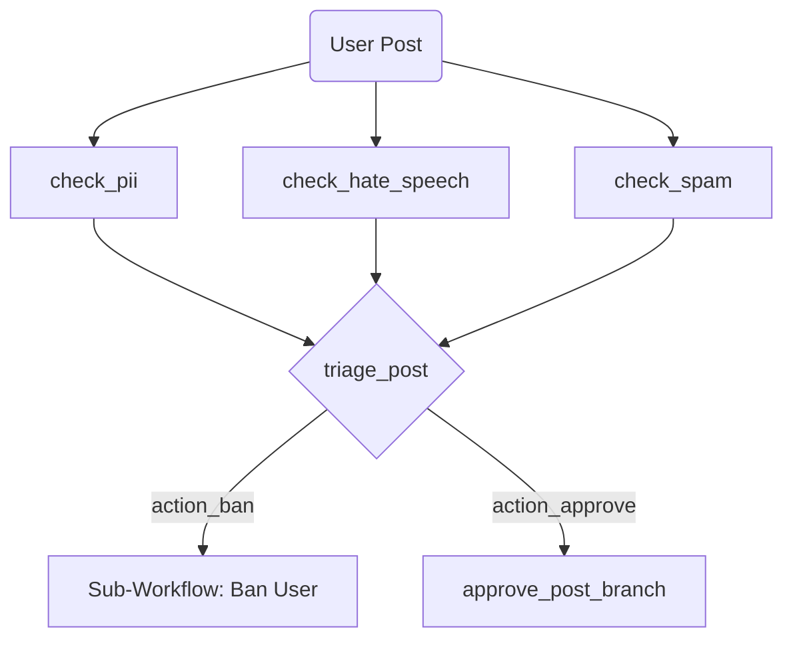

# Flowcraft: A Workflow Framework

Build complex, multi-step processes with a lightweight, composable, and type-safe TypeScript framework. Model everything from simple sequences to dynamic AI agents, running in-memory or across distributed systems.

**[Read the Full Documentation &raquo;](https://gorango.github.io/flowcraft/guide/)**

## Quick Start

Create and run your first workflow:

```typescript
import { contextKey, Flow, Node, TypedContext } from 'flowcraft'

// 1. Define a type-safe key for our data
const MESSAGE = contextKey<string>('message')

// 2. Create a custom Node class for our first step.
class GreetNode extends Node {
	// The `exec` method performs the core logic and returns a result.
	async exec({ params }: NodeArgs): Promise<string> {
		return `Hello, ${params.name}!`
	}

	// The `post` method takes the result from `exec` and updates the context.
	async post({ ctx, execRes }: NodeArgs<void, string>) {
		await ctx.set(MESSAGE, execRes)
	}
}

// 3. Create a second node to finish the sequence (using the Fluent API for demonstration).
const welcomeNode = new Node()
	.exec(async ({ ctx }) => `${await ctx.get(MESSAGE)} Welcome to Flowcraft!`)
	.tap(console.log) // Prints the final message

// 4. Instantiate, chain the nodes, and create a flow.
const greetNode = new GreetNode()
greetNode.next(welcomeNode)
const flow = new Flow(greetNode)

// 5. Run the flow with an initial context and params.
await flow.withParams({ name: 'World' }).run(new TypedContext())
// Output: "Hello, World! Welcome to Flowcraft!"
```

## Learn by Example

> [!TIP]
> The best way to learn is by exploring the included sandbox examples. They are ordered by complexity, each demonstrating a new feature of the core engine.

### 1. Basic Sequential Flow: Article Writer

A simple, linear workflow that demonstrates the core concepts of creating a sequence of nodes to perform a multi-step task.



- **Demonstrates**: `Node` chaining, passing data via `Context`.
- **[Explore the Basic example &raquo;](https://github.com/gorango/flowcraft/tree/main/sandbox/1.basic/)**

### 2. Conditional Branching: Research Agent

A simple agent that uses a loop and conditional branching to decide whether to search the web for information or answer a question based on the current context.



- **Demonstrates**: Conditional branching, creating loops, and building simple state machines.
- **[Explore the Research Agent example &raquo;](https://github.com/gorango/flowcraft/tree/main/sandbox/2.research/)**

### 3. Parallel Batch Processing: Document Translator

A practical example that translates a document into multiple languages concurrently using `ParallelBatchFlow` for a massive performance boost on I/O-bound tasks.



- **Demonstrates**: High-throughput concurrent processing for data-parallel tasks.
- **[Explore the Parallel Translation example &raquo;](https://github.com/gorango/flowcraft/tree/main/sandbox/3.parallel/)**

### 4. Dynamic Graph Engine: AI Agent Runtime

A powerful runtime that executes complex, graph-based AI workflows defined in simple JSON-like objects. This shows how to build highly dynamic and modular AI agent systems.



- **Demonstrates**:
  - Type-safe graph construction from declarative definitions using `GraphBuilder`.
  - Parallel fan-in and fan-out.
  - Reusable, data-driven nodes and complex sub-workflow composition.
- **[Explore the Dynamic AI Agent example &raquo;](https://github.com/gorango/flowcraft/tree/main/sandbox/4.dag/)**

### 5. Distributed Execution: AI Agent with BullMQ

This example takes the same type-safe graph definition from the previous example and runs it in a distributed environment using a custom `BullMQExecutor`, demonstrating a client-worker architecture for scalable background jobs.

- **Demonstrates**:
  - A pluggable `IExecutor` for distributed workflows.
  - How business logic (the graph) remains unchanged when the execution environment changes.
- **[Explore the Distributed AI Agent example &raquo;](https://github.com/gorango/flowcraft/tree/main/sandbox/5.distributed/)**

### 6. Advanced RAG Agent: Complex Data & Serialization

A complete Retrieval-Augmented Generation (RAG) agent that ingests a document, creates embeddings, performs a vector search, and synthesizes an answer, showcasing a sophisticated, data-driven AI workflow.

- **Demonstrates**:
  - A full, practical RAG pipeline with custom nodes.
  - Handling complex data types (`Map`, `Date`, etc.) in the `Context`.
  - Robust serialization (using `superjson`) for reliable state management.
- **[Explore the RAG Agent example &raquo;](https://github.com/gorango/flowcraft/tree/main/sandbox/6.rag/)**

## Core Concepts

### Node

The `Node` is the fundamental building block of a workflow. It represents a single unit of work and has a well-defined lifecycle (`prep`, `exec`, `post`).

It is generic: `Node<PrepRes, ExecRes, PostRes, TParams, TContext>`

#### Fluent API

A chainable API on the `Node` class provides a powerful way to define data processing pipelines:
- `.withParams(params)`: Sets type-safe static parameters for the node.
- `.map(fn)`: Transforms the output of a node.
- `.filter(predicate)`: Conditionally proceeds based on a node's output.
- `.tap(fn)`: Performs a side-effect without changing the output.
- `.toContext(key)`: Stores a node's result in the context.

### Flow & Context

- **`Flow`**: A special `Node` that orchestrates a graph of other nodes. It supports middleware via `.use()` for handling cross-cutting concerns like logging or transactions.
- **`Context`**: A shared, type-safe, `Map`-like object passed through every node. All its methods are asynchronous (`await ctx.get(KEY)`).

### Builders

To simplify complex patterns, the framework provides builders:
- **`SequenceFlow` / `pipeline`**: Creates a linear flow from a sequence of nodes.
- **`ParallelFlow`**: Executes a set of different nodes concurrently.
- **`BatchFlow` / `ParallelBatchFlow`**: Processes a collection of items with the same node, sequentially or concurrently.
- **`GraphBuilder`**: Translates a declarative graph definition (e.g., JSON) into a fully executable, serializable `WorkflowBlueprint`.

## Documentation

For a deep dive into all features, patterns, and APIs, please see the **[complete Flowcraft documentation](https://gorango.github.io/flowcraft/guide/)**.

---
Licensed under the [MIT License](https://github.com/gorango/flowcraft/tree/main/LICENSE).
