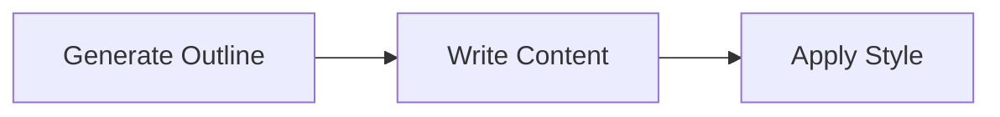
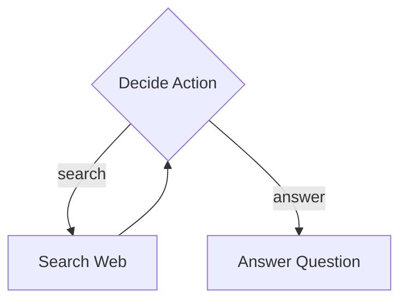
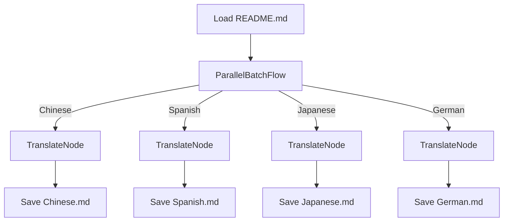
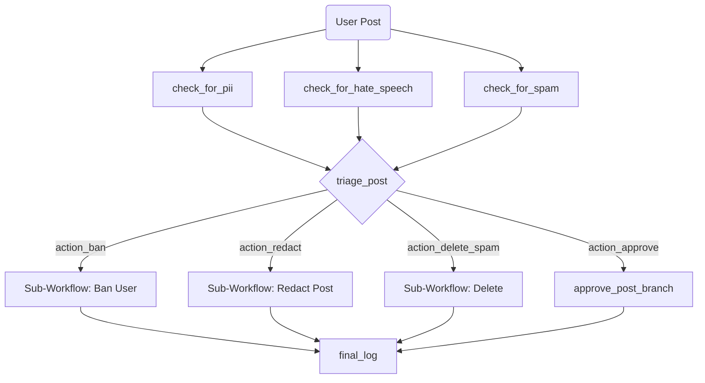
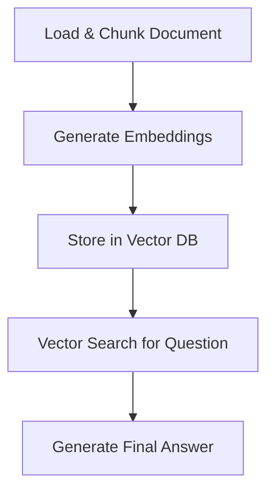

# Flowcraft: A Workflow Framework

Build complex, multi-step processes, from simple sequences to dynamic, graph-driven AI agents.

## Features

- **Zero Dependencies**: Lightweight and dependency-free, ensuring a small footprint and easy integration.

- **Composable & Reusable**: Define workflows by chaining nodes or embedding other flows as nodes.

- **Extensible Execution Engine**: A pluggable `Executor` pattern enables in-memory or distributed flows.

- **Type-Safe**: Written in TypeScript to provide strong typing for your workflow definitions, context, and node parameters.

- **Async by Default**: Built on an asynchronous foundation to handle I/O-bound and CPU-bound tasks.

- **Middleware**: Intercept execution of nodes to handle cross-cutting concerns like logging or auth.

- **Conditional Branching**: Direct the flow's execution path based on the results of any node.

- **Retry Logic & Fallbacks**: Retry failed operations with configurable delays and fallback logic.

- **Cancellation Support**: Gracefully abort running workflows using standard `AbortController`s.

- **Pluggable Logging**: Use the built-in `ConsoleLogger` or bring your own (e.g., Pino, Winston).

- **Dynamic Graph Engine**: Define complex, graph-based workflows as simple JSON files.

- **Fluent & Functional API**: A chainable API on the `Node` class and a collection of functional helpers.

## Installation

```bash
npm install flowcraft
```

## Quick Start

Create and run a simple workflow in a few lines of code.

```typescript
import { Flow, mapNode } from 'flowcraft' // Use mapNode for simple functions

// Create a node from a simple function that takes params and returns a value.
const greetNode = mapNode(() => 'Hello, World!')
	// Functional helpers make common tasks easy.
	.tap(console.log)

const flow = new Flow(greetNode)
// Run using the default InMemoryExecutor.
await flow.run()
```

## Learn by Example

> [!TIP]
> The best way to understand the framework is by exploring the included sandbox examples. They are ordered by increasing complexity, each introducing new features and demonstrating the flexibility of the core engine.

### 1. Basic Sequential Flow: Article Writer

A simple, linear workflow that demonstrates the core concepts of creating a sequence of nodes to perform a multi-step task like generating an article.



- **Demonstrates**: `Node` chaining, passing data via `Context`, and a simple `BatchFlow`.
- **[Explore the Basic example &raquo;](./sandbox/1.basic/)**

### 2. Conditional Branching: Research Agent

A simple agent that uses a loop and conditional branching to decide whether to search the web for information or answer a question based on the current context.



- **Demonstrates**: Conditional branching with custom actions, creating loops, and building simple state machines.
- **[Explore the Research Agent example &raquo;](./sandbox/2.research/)**

### 3. Parallel Batch Processing: Document Translator

A practical example that translates a document into multiple languages concurrently. It uses the `ParallelBatchFlow` builder to showcase significant performance boosts for I/O-bound tasks.



- **Demonstrates**: `ParallelBatchFlow` for high-throughput concurrent processing of I/O-bound tasks.
- **[Explore the Parallel Translation example &raquo;](./sandbox/3.parallel/)**

### 4. Dynamic Graph Engine: AI Agent Runtime

The most advanced example: a powerful runtime that executes complex, graph-based AI workflows defined in simple JSON-like objects. This shows how to build highly dynamic and modular AI agent systems.

> [!IMPORTANT]
> The `GraphBuilder` is fully **type-safe**. By defining a simple map of your node types to their data payloads, TypeScript can validate your entire graph at compile time, ensuring that the data provided to each node matches what its class expects. This eliminates a whole category of runtime configuration errors.



- **Demonstrates**:
  - **Type-safe graph construction** from declarative definitions using `GraphBuilder`.
  - Parallel fan-in and fan-out (mid-flow branching).
  - Reusable, data-driven nodes (e.g., an LLM-powered router).
  - Complex sub-workflow composition.
- **[Explore the Dynamic AI Agent example &raquo;](./sandbox/4.dag/)**

### 5. Distributed Execution: AI Agent with BullMQ

This example takes the same type-safe graph definition from the previous example and runs it in a distributed environment using a custom `BullMQExecutor`. It demonstrates a client-worker architecture for building scalable and resilient background job processors.

- **Demonstrates**:
  - A pluggable `IExecutor` for distributed workflows.
  - Client-worker architecture with state serialization.
  - Mid-flight, distributed cancellation of long-running jobs.
  - How business logic (the graph) remains unchanged when the execution environment changes.
- **[Explore the Distributed AI Agent example &raquo;](./sandbox/5.distributed/)**

### 6. Advanced RAG Agent: Complex Data & Serialization

A complete, end-to-end Retrieval-Augmented Generation (RAG) agent that ingests a document, creates embeddings in parallel, performs a vector search, and synthesizes an answer. This example showcases how to build a sophisticated, data-driven AI workflow.



- **Demonstrates**:
  - A full, practical RAG pipeline.
  - A mix of custom, single-responsibility nodes.
  - Handling complex data types (`Map`, `Date`, custom classes) in the `Context`.
  - The necessity of robust serialization (using `superjson`) for state management.
- **[Explore the RAG Agent example &raquo;](./sandbox/6.rag/)**

## Core Concepts

### Node

The `Node` is the fundamental building block of a workflow. It represents a single unit of work and is fully generic, allowing you to define types for its lifecycle results and its static parameters.

The class signature is: `Node<PrepRes, ExecRes, PostRes, TParams>`

- `PrepRes`: The type of data returned by the `prep` phase.
- `ExecRes`: The type of data returned by the `exec` phase.
- `PostRes`: The type of the "action" returned by the `post` phase.
- `TParams`: The type of the static parameters object for the node, accessible via `.withParams()`.

**Example: A Type-Safe GreetNode**

For nodes that do require static configuration, you can provide a type for the parameters to get full autocompletion and compile-time safety.

```typescript
// 1. Define the shape of the node's parameters.
interface GreetParams {
	greeting: string
	loudly: boolean
}

// 2. Define the node with the TParams generic.
class GreetNode extends Node<void, string, any, GreetParams> {
	// 3. The 'exec' method can safely access typed parameters.
	async exec({ params }: NodeArgs<GreetParams>): Promise<string> {
		let message = `${params.greeting}, World!`
		if (params.loudly) {
			message = message.toUpperCase()
		}
		return message
	}
}

// 4. Instantiate and configure with type-safe .withParams()
const greetNode = new GreetNode()
	.withParams({ greeting: 'Hello', loudly: true }) // Autocompletes and type-checks!
	.tap(console.log) // "HELLO, WORLD!"

// TypeScript would throw an error on this line:
// greetNode.withParams({ greting: 'Hi', loudly: false }); // Property 'greting' does not exist.
```

A chainable API on the `Node` class has a set of functional helpers:

- `.withParams(params)`: Sets type-safe static parameters for the node.
- `.map(fn)`: Transform the output of a node.
- `.filter(predicate)`: Conditionally proceed based on a node's output.
- `.tap(fn)`: Perform a side-effect without changing the output.
- `.toContext(key)`: Store a node's result in the context.
- `.withLens(lens, value)`: Applies a context mutation before the node executes

### Flow

A `Flow` is a special type of `Node` that orchestrates a sequence of other nodes. It is also generic (`Flow<PrepRes, ExecRes, TParams>`) and can be configured with its own parameters and middleware. It contains the logic for traversing its own graph of operations, making it a powerful, self-contained unit of work.

### Executor

An `Executor` is responsible for **running** a `Flow`. It provides the top-level execution environment, handling setup and teardown. The framework is decoupled from the execution strategy, allowing you to use the default `InMemoryExecutor` or plug in custom executors for different environments (e.g., distributed queues).

### Middleware

A `Flow` can be configured with middleware functions that wrap the execution of every node within it. This is the ideal pattern for handling **cross-cutting concerns** like performance monitoring, centralized logging, or transaction management without cluttering your business logic.

### Context

The `Context` is a shared, type-safe `Map`-like object passed through every node in a flow. It acts as a shared memory space, allowing nodes to pass data and share state.

### Actions & Branching

A node's `post()` method returns a string called an **action**. The flow uses this action to look up the next node to execute. The default action is a `symbol`, but returning custom strings allows for conditional branching. The fluent `.filter()` method provides another powerful way to branch based on a `FILTER_FAILED` action.

### Builders

To simplify the creation of common and complex patterns, the framework provides a `builder` module. These helpers abstract the construction of executable `Flow`s.

- **`SequenceFlow`**: Creates a linear flow from a sequence of nodes.
- **`BatchFlow` / `ParallelBatchFlow`**: Process a collection of items sequentially or concurrently.
- **`GraphBuilder`**: Translates a declarative graph definition into a fully executable `Flow`.

## Unit Tests

> [!TIP]
> For clear, focused examples of specific, individual features (like retries, middleware, cancellation, and composition), the unit tests are an excellent resource.

- Core workflow tests: [`src/workflow.test.ts`](src/workflow.test.ts)
- Patterns tests: [`src/builder/patterns.test.ts`](src/builder/patterns.test.ts)
- Graph builder tests: [`src/builder/graph.test.ts`](src/builder/graph.test.ts)

## API Reference

### Core Classes

- `Node`: The base class for a unit of work: `Node<PrepRes, ExecRes, PostRes, TParams>`. It has built-in retry logic and a fluent API (`.map`, `.filter`, etc.).
- `Flow`: Orchestrates a sequence of nodes: `Flow<PrepRes, ExecRes, TParams>`. Supports middleware via `.use()`.
- `InMemoryExecutor`: The default `IExecutor` implementation for running flows in-memory.
- `TypedContext`: The standard `Map`-based implementation for the `Context` interface.
- `ConsoleLogger`, `NullLogger`: Pre-built logger implementations.

### Functional Helpers

A collection of functions for creating nodes and pipelines in a more functional style.

- `mapNode`: Creates a `Node` from a simple, pure function: `mapNode<TIn extends Params, TOut>(fn)`. The function receives the node's `params` as its input.
- `contextNode`: Creates a `Node` from a function that requires access to the `Context`: `contextNode<TIn extends Params, TOut>(fn)`. The function receives the context and the node's `params`.
- `transformNode`: Creates a `Node` that applies one or more `ContextTransform` functions (often created with a `lens`). This is ideal for declarative state management.
- `pipeline`: A functional alias for creating a linear sequence of nodes.
- `mapCollection`: Creates a `Flow` that applies a function to each item in a collection in parallel, returning an array of the results.
- `filterCollection`: Creates a `Flow` that filters a collection in parallel based on a predicate function.
- `reduceCollection`: Creates a `Flow` that reduces a collection to a single value by applying a reducer function sequentially.

### Builder Classes

- `SequenceFlow`: A `Flow` that creates a linear flow from a sequence of nodes.
- `BatchFlow`: A `Flow` that processes a collection of items sequentially.
- `ParallelBatchFlow`: A `Flow` that processes a collection of items in parallel.
- `GraphBuilder`: Constructs a `Flow` from a declarative graph definition. Its `.build()` method returns a `BuildResult` object containing:
  - `flow`: The executable `Flow` instance.
  - `nodeMap`: A `Map` of all instantiated nodes, keyed by their ID.
  - `predecessorCountMap`: A `Map` of node IDs to their total number of incoming connections.
  - `predecessorIdMap`: A `Map` of node IDs to an array of their direct predecessor IDs, useful for advanced executors.

## Documentation

The complete [Flowcraft documentation](https://flowcraft-docs.netlify.app) is available on the website.

---
Licensed under the [MIT License](./LICENSE).
