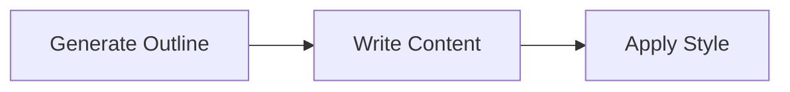
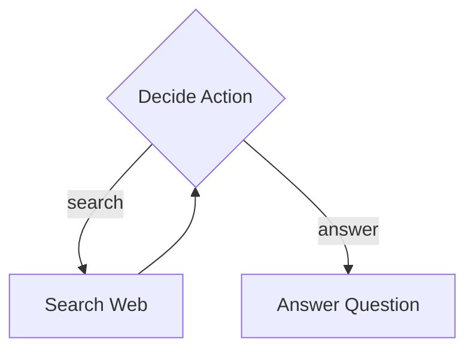
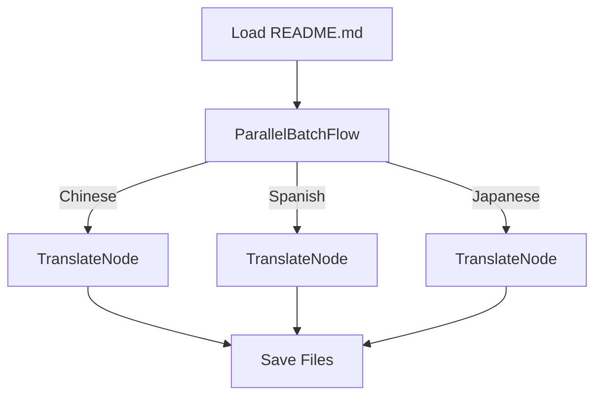
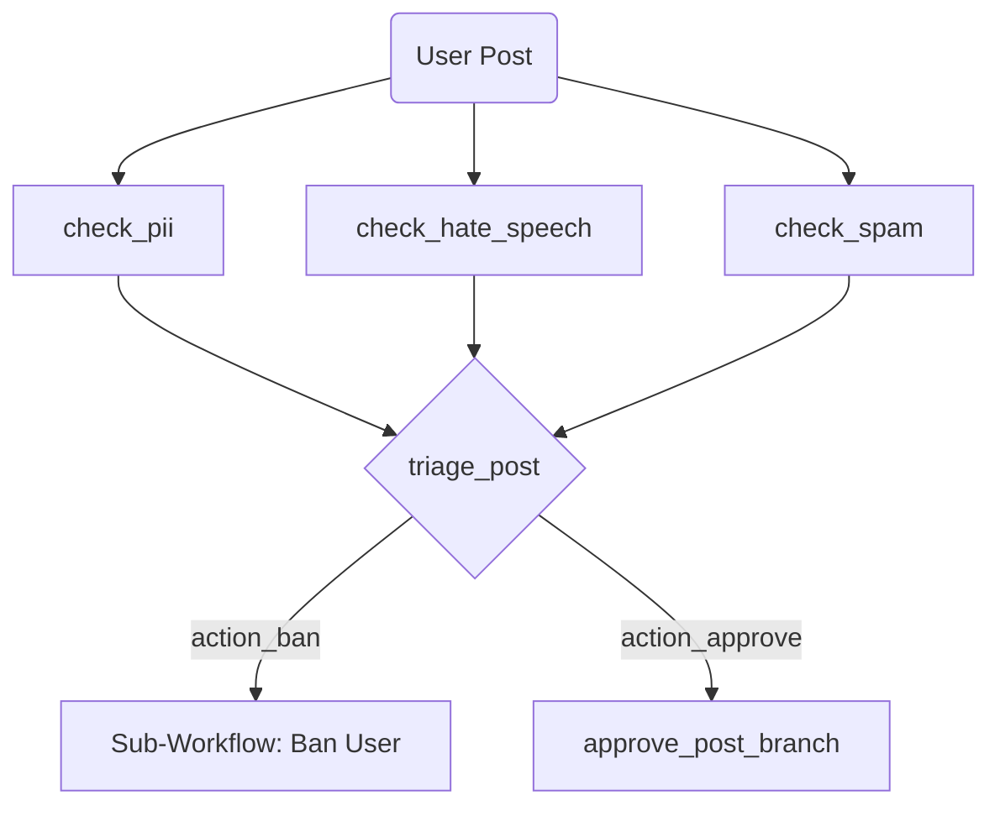

# Flowcraft

[](https://www.npmjs.com/package/flowcraft)
[](https://opensource.org/licenses/MIT)

Build complex, multi-step processes with a lightweight, composable, and type-safe approach. Model complex business processes, data pipelines, ETL workflows, or AI agents and scale from in-memory scripts to distributed systems without changing the core business logic.

## Key Features

- **Zero Dependencies**: Lightweight and dependency-free, ensuring a small footprint and easy integration.
- **Declarative Workflows**: Define workflows as serializable objects with nodes and edges.
- **Unopinionated Logic**: Nodes can be simple functions or structured classes, supporting any logic.
- **Progressive Scalability**: Run in-memory or scale to distributed systems using the same blueprint.
- **Resilient Execution**: Built-in support for retries, fallbacks, timeouts, and graceful cancellation.
- **Advanced Patterns**: Includes batch processing and loop constructs for complex workflows.
- **Extensibility**: Pluggable loggers, evaluators, serializers, and middleware for custom behavior.
- **Static Analysis**: Tools to detect cycles, validate blueprints, and generate visual diagrams.
- **Type-Safe API**: Fully typed with TypeScript for a robust developer experience.

For complete guides and API references: [Read the Friendly Manual](https://gorango.github.io/flowcraft/guide/).

## Installation

Flowcraft is a Node.js module using ES Modules (ESM) and TypeScript. Install it using your preferred package manager:

```bash
npm install flowcraft
```

---

## Learn by Example

> [!TIP]
> The best way to learn is by exploring the included sandbox examples. They are ordered by complexity, each demonstrating a new feature of the core engine.

### 1. Basic Sequential Flow: Article Writer

A simple, linear workflow that demonstrates the core concepts of creating a sequence of nodes to perform a multi-step task.



- **Demonstrates**: `Node` chaining, passing data via `Context`.
- **[Explore the Basic example &raquo;](https://github.com/gorango/flowcraft/tree/main/sandbox/1.basic/)**

### 2. Conditional Branching: Research Agent

A simple agent that uses a loop and conditional branching to decide whether to search the web for information or answer a question based on the current context.



- **Demonstrates**: Conditional branching, creating loops, and building simple state machines.
- **[Explore the Research Agent example &raquo;](https://github.com/gorango/flowcraft/tree/main/sandbox/2.research/)**

### 3. Parallel Batch Processing: Document Translator

A practical example that translates a document into multiple languages concurrently using `ParallelBatchFlow` for a massive performance boost on I/O-bound tasks.



- **Demonstrates**: High-throughput concurrent processing for data-parallel tasks.
- **[Explore the Parallel Translation example &raquo;](https://github.com/gorango/flowcraft/tree/main/sandbox/3.parallel/)**

### 4. Dynamic Graph Engine: AI Agent Runtime

A powerful runtime that executes complex, graph-based AI workflows defined in simple JSON-like objects. This shows how to build highly dynamic and modular AI agent systems.



- **Demonstrates**:
    - Type-safe graph construction from declarative definitions using `GraphBuilder`.
    - Parallel fan-in and fan-out.
    - Reusable, data-driven nodes and complex sub-workflow composition.
- **[Explore the Dynamic AI Agent example &raquo;](https://github.com/gorango/flowcraft/tree/main/sandbox/4.dag/)**

### 5. Distributed Execution: AI Agent with BullMQ

This example takes the same type-safe graph definition from the previous example and runs it in a distributed environment using a custom `BullMQExecutor`, demonstrating a client-worker architecture for scalable background jobs.

- **Demonstrates**:
    - A pluggable `IExecutor` for distributed workflows.
    - How business logic (the graph) remains unchanged when the execution environment changes.
- **[Explore the Distributed AI Agent example &raquo;](https://github.com/gorango/flowcraft/tree/main/sandbox/5.distributed/)**

### 6. Advanced RAG Agent: Complex Data & Serialization

A complete Retrieval-Augmented Generation (RAG) agent that ingests a document, creates embeddings, performs a vector search, and synthesizes an answer, showcasing a sophisticated, data-driven AI workflow.

- **Demonstrates**:
    - A full, practical RAG pipeline with custom nodes.
    - Handling complex data types (`Map`, `Date`, etc.) in the `Context`.
    - Robust serialization (using `superjson`) for reliable state management.
- **[Explore the RAG Agent example &raquo;](https://github.com/gorango/flowcraft/tree/main/sandbox/6.rag/)**

## Documentation

For a complete overview all features, patterns, examples, and APIs, please see the **[Flowcraft documentation](https://gorango.github.io/flowcraft/guide/)**.

## License

Flowcraft is licensed under the [MIT License](LICENSE).
