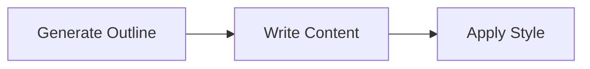
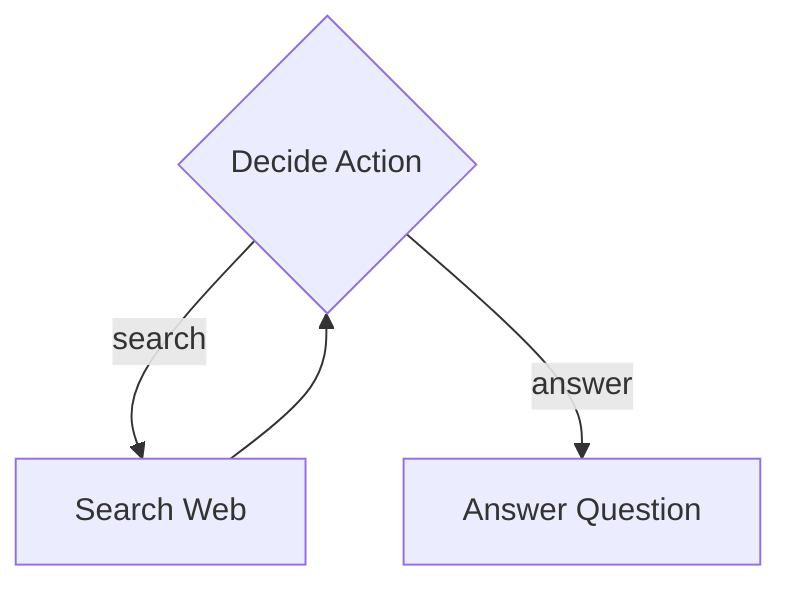
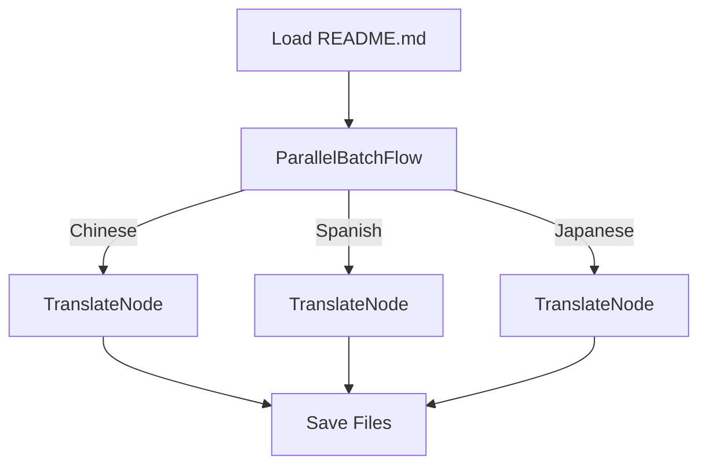
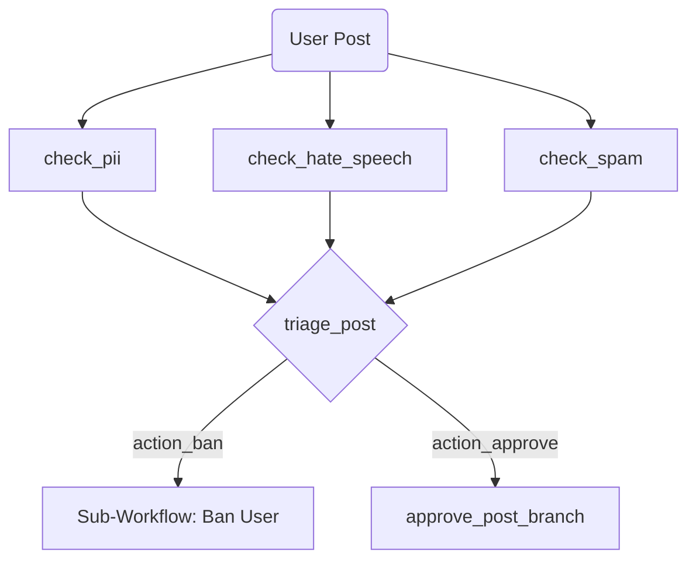

# Flowcraft: A Workflow Framework

Build complex, multi-step processes with a lightweight, composable, and type-safe TypeScript framework. Model everything from simple sequences to dynamic AI agents, running in-memory or across distributed systems.

**[Read the Friendly Manual &raquo;](https://gorango.github.io/flowcraft/guide/)**

## Features

- **Zero Dependencies**: Lightweight and dependency-free, ensuring a small footprint and easy integration.
- **Composable & Reusable**: Define workflows by chaining nodes or declaratively embedding other flows as nodes.
- **Type-Safe by Default**: Strong typing for workflow definitions, shared state, and node parameters.
- **Async First**: Built on an asynchronous foundation to handle I/O-bound tasks gracefully.
- **Resilient & Reliable**: Built-in support for retries with configurable delays and fallback logic.
- **Dynamic Graph Engine**: Construct executable workflows from declarative JSON, ideal for AI agents.
- **Extensible Execution**: A pluggable Executor pattern enables in-memory or distributed flows.
- **Advanced Control Flow**: Full support for conditional branching, loops, and parallel execution.
- **Modern Tooling**: A fluent functional API, static graph validation, and automatic visualizations.

---

Flowcraft is a lightweight, zero-dependency TypeScript framework for building complex, multi-step processes. It empowers you to model everything from simple sequential tasks to dynamic, graph-driven AI agents with a clear and composable API.

At its core, Flowcraft is guided by a few key principles:

1.  **Structure for Complexity**: It provides a clear way to model asynchronous processes. By breaking logic into discrete `Node`s with a defined lifecycle, you can turn tangled promise chains and `async/await` blocks into maintainable, testable graphs.
2.  **Start Simple, Scale Gracefully**: You can start with an in-memory workflow in a single file. As your needs grow, the architecture allows you to scale up to a robust, distributed system using message queues—**without changing your core business logic**.
3.  **Composability is Key**: A `Flow` is just a specialized `Node`. This simple but powerful concept means entire workflows can be treated as building blocks, allowing you to create highly modular and reusable systems.

## The Two Paths of Flowcraft

Flowcraft is designed to cater to two primary use cases, and the documentation is structured to guide you down the path that best fits your needs:

### 1. Programmatic Workflows

This is the path for developers who want to build and manage workflows directly within their application's code. Using a fluent, chainable API and functional helpers, you can quickly define, test, and run complex processes in-memory.

**Choose this path if you are:**

- Building background jobs for a web application.
- Creating complex, multi-step data processing pipelines.
- Looking for a structured way to manage complex `async/await` logic.

**[Learn how to build Programmatic Workflows &raquo;](https://gorango.github.io/flowcraft/guide/programmatic/basics.html)**

### 2. Declarative Workflows (for Scale)

This is the path for architects and developers building dynamic, data-driven, or distributed systems. You define your workflow's structure as a declarative data format (like JSON), and the `GraphBuilder` "compiles" it into an executable, serializable `Blueprint`.

**Choose this path if you are:**

- Building a system where workflows are defined by users or stored in a database.
- Creating a runtime for dynamic AI agents.
- Architecting a distributed system where tasks are executed by a pool of workers.

**[Learn how to build Declarative Workflows &raquo;](https://gorango.github.io/flowcraft/guide/declarative/basics.html)**

---

## Learn by Example

> [!TIP]
> The best way to learn is by exploring the included sandbox examples. They are ordered by complexity, each demonstrating a new feature of the core engine.

### 1. Basic Sequential Flow: Article Writer

A simple, linear workflow that demonstrates the core concepts of creating a sequence of nodes to perform a multi-step task.

- **Demonstrates**: `Node` chaining, passing data via `Context`.
- **[Explore the Basic example &raquo;](https://github.com/gorango/flowcraft/tree/main/sandbox/1.basic/)**

### 2. Conditional Branching: Research Agent

A simple agent that uses a loop and conditional branching to decide whether to search the web for information or answer a question based on the current context.

- **Demonstrates**: Conditional branching, creating loops, and building simple state machines.
- **[Explore the Research Agent example &raquo;](https://github.com/gorango/flowcraft/tree/main/sandbox/2.research/)**

### 3. Parallel Batch Processing: Document Translator

A practical example that translates a document into multiple languages concurrently using `ParallelBatchFlow` for a massive performance boost on I/O-bound tasks.

- **Demonstrates**: High-throughput concurrent processing for data-parallel tasks.
- **[Explore the Parallel Translation example &raquo;](https://github.com/gorango/flowcraft/tree/main/sandbox/3.parallel/)**

### 4. Dynamic Graph Engine: AI Agent Runtime

A powerful runtime that executes complex, graph-based AI workflows defined in simple JSON-like objects. This shows how to build highly dynamic and modular AI agent systems.

- **Demonstrates**:
    - Type-safe graph construction from declarative definitions using `GraphBuilder`.
    - Parallel fan-in and fan-out.
    - Reusable, data-driven nodes and complex sub-workflow composition.
- **[Explore the Dynamic AI Agent example &raquo;](https://github.com/gorango/flowcraft/tree/main/sandbox/4.dag/)**

### 5. Distributed Execution: AI Agent with BullMQ

This example takes the same type-safe graph definition from the previous example and runs it in a distributed environment using a custom `BullMQExecutor`, demonstrating a client-worker architecture for scalable background jobs.

- **Demonstrates**:
    - A pluggable `IExecutor` for distributed workflows.
    - How business logic (the graph) remains unchanged when the execution environment changes.
- **[Explore the Distributed AI Agent example &raquo;](https://github.com/gorango/flowcraft/tree/main/sandbox/5.distributed/)**

### 6. Advanced RAG Agent: Complex Data & Serialization

A complete Retrieval-Augmented Generation (RAG) agent that ingests a document, creates embeddings, performs a vector search, and synthesizes an answer, showcasing a sophisticated, data-driven AI workflow.

- **Demonstrates**:
    - A full, practical RAG pipeline with custom nodes.
    - Handling complex data types (`Map`, `Date`, etc.) in the `Context`.
    - Robust serialization (using `superjson`) for reliable state management.
- **[Explore the RAG Agent example &raquo;](https://github.com/gorango/flowcraft/tree/main/sandbox/6.rag/)**

## Documentation

For a deep dive into all features, patterns, and APIs, please see the **[complete Flowcraft documentation](https://gorango.github.io/flowcraft/guide/)**.

---

Licensed under the [MIT License](https://github.com/gorango/flowcraft/tree/main/LICENSE).
