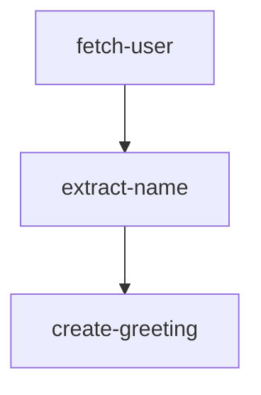

# Basic Workflow

[[view source code]](https://github.com/gorango/flowcraft/tree/master/examples/1.basic)

This example demonstrates a basic, linear workflow that creates a greeting message. It showcases:
- Defining a workflow with [`createFlow`](/api/flow#createflow-id).
- Passing data from one node to the next.
- Executing the workflow with [`FlowRuntime`](/api/runtime#flowruntime-class).

## The Goal

We want to create a workflow that:
1. Fetches a user object.
2. Extracts the user's name.
3. Generates a greeting message.



## The Code

#### `flow.ts`
```typescript
import { createFlow } from 'flowcraft'

// --- 1. Define the Node Logic ---

// Node to simulate fetching a user
async function fetchUser() {
	console.log('Fetching user...')
	return { output: { id: 1, name: 'Alice' } }
}

// Node to extract the user's name
async function extractName(ctx: any) {
	const input = ctx.input as { name: string }
	console.log('Extracting name...')
	return { output: input.name }
}

// Node to create a greeting
async function createGreeting(ctx: any) {
	const input = ctx.input as string
	console.log('Creating greeting...')
	return { output: `Hello, ${input}!` }
}

// --- 2. Define the Workflow ---

export function createGreetingFlow() {
	return createFlow('greeting-workflow')
		.node('fetch-user', fetchUser)
		.node('extract-name', extractName)
		.node('create-greeting', createGreeting)
		// Define the execution order
		.edge('fetch-user', 'extract-name')
		.edge('extract-name', 'create-greeting')
}
```

#### `main.ts`
```typescript
import { ConsoleLogger, FlowRuntime } from 'flowcraft'
import { createGreetingFlow } from './flow.js'

// --- 3. Run the Workflow ---

async function main() {
	const greetingFlow = createGreetingFlow()

	// Get the serializable blueprint and the function registry.
	const blueprint = greetingFlow.toBlueprint()
	const functionRegistry = greetingFlow.getFunctionRegistry()

	// Create a runtime.
	const runtime = new FlowRuntime({
		logger: new ConsoleLogger(),
	})

	console.log('Starting workflow...')
	const result = await runtime.run(blueprint, {}, { functionRegistry })

	console.log('\n--- Workflow Complete ---')
	console.log('Final Greeting:', result.context['create-greeting'])
	console.log('Final Context:', result.context)
}

main()
```

## The Output

When you run this code, you will see the logs from each node executing in sequence, followed by the final result.

```
Starting workflow...
[INFO] Starting workflow execution
Fetching user...
Extracting name...
Creating greeting...
[INFO] Workflow execution completed

--- Workflow Complete ---
Final Greeting: Hello, Alice!
Final Context: {
	'fetch-user': { id: 1, name: 'Alice' },
	'extract-name': 'Alice',
	'create-greeting': 'Hello, Alice!'
}
```

This example forms the foundation for building more complex and dynamic workflows with Flowcraft.

---

[[view source code]](https://github.com/gorango/flowcraft/tree/master/examples/1.basic)
