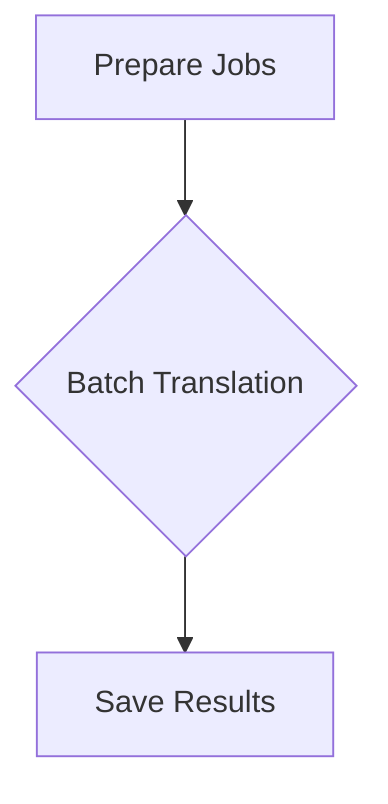

# Example: Parallel Batch Translation

This example demonstrates using Flowcraft's `.batch()` helper to translate a document into multiple languages concurrently, showcasing significant performance improvements for I/O-bound tasks.

### The Goal

Translate a source `README.md` file into multiple languages (Spanish, German, etc.) in parallel and save each translation to the `translations/` directory.

### The Code

```typescript
// main.ts
import * as fs from 'node:fs/promises'
import * as path from 'node:path'
import process from 'node:process'
import dotenv from 'dotenv'
import { FlowRuntime } from 'flowcraft'
import { createTranslateFlow } from './flow.js'

dotenv.config()

async function main() {
	const sourceReadmePath = path.resolve(process.cwd(), '../../README.md')
	const outputDir = path.resolve(process.cwd(), 'translations')
	await fs.mkdir(outputDir, { recursive: true })

	const text = (await fs.readFile(sourceReadmePath, 'utf-8'))
		.split('##')
		.slice(0, 2)
		.join('##')

	const languages = [
		'Spanish',
		'German',
		// 'Chinese',
		// 'Japanese',
		// 'Russian',
		// 'Portuguese',
		// 'French',
		// 'Korean',
	]

	const translateFlow = createTranslateFlow()
	const blueprint = translateFlow.toBlueprint()
	const functionRegistry = translateFlow.getFunctionRegistry()

	const runtime = new FlowRuntime({})

	console.log(`Starting parallel translation into ${languages.length} languages...`)
	const startTime = Date.now()

	await runtime.run(
		blueprint,
		{ text, languages, output_dir: outputDir },
		{ functionRegistry },
	)

	const duration = (Date.now() - startTime) / 1000
	console.log(`\nTotal parallel translation time: ${duration.toFixed(2)} seconds`)
	console.log('\n=== Translation Complete ===')
}

main().catch(console.error)
```

```typescript
// flow.ts
import type { NodeContext, NodeResult } from 'flowcraft'
import * as fs from 'node:fs/promises'
import * as path from 'node:path'
import { createFlow } from 'flowcraft'
import { callLLM } from './utils.js'

interface TranslationContext {
	'text': string
	'languages': string[]
	'output_dir': string
	'prepare-jobs': { language: string, text: string }[]
	'translations': { language: string, translation: string }[]
}

// 1. Prepare the list of translation jobs
async function prepareJobs(ctx: NodeContext<TranslationContext>): Promise<NodeResult> {
	const languages = (await ctx.context.get('languages'))!
	const text = (await ctx.context.get('text'))!
	// The output of this node is an array of objects, which the batch processor will iterate over.
	const jobs = languages.map(language => ({ language, text }))
	return { output: jobs }
}

// 2. This function will be executed FOR EACH item in the batch
async function translateItem(ctx: NodeContext<TranslationContext>): Promise<NodeResult> {
	// The `input` for a batch worker is a single item from the source array.
	const { language, text } = ctx.input as { language: string, text: string }
	const prompt = `
Translate the following markdown text into ${language}.
Preserve markdown formatting, links, and code blocks.
Return only the translated text.

Original Text:
${text}`

	console.log(`Translating to ${language}...`)
	const translation = await callLLM(prompt)
	console.log(`✓ Finished ${language}`)
	return { output: { language, translation } }
}

// 3. This node runs AFTER the entire batch is complete
async function saveResults(ctx: NodeContext<TranslationContext>): Promise<NodeResult> {
	// The `input` for the successor of a batch is an array of all worker outputs.
	const translations = ctx.input as { language: string, translation: string }[]
	const outputDir = (await ctx.context.get('output_dir'))!

	if (!translations || translations.length === 0) {
		console.warn('No translations to save.')
		return { output: 'Saved 0 files.' }
	}

	const promises = translations.map(({ language, translation }) => {
		const filename = path.join(outputDir!, `README_${language.toUpperCase()}.md`)
		console.log(`Saving translation to ${filename}`)
		return fs.writeFile(filename, translation, 'utf-8')
	})

	await Promise.all(promises)
	return { output: `Saved ${translations.length} files.` }
}

export function createTranslateFlow() {
	const flow = createFlow<TranslationContext>('parallel-translation')

	// Define all the nodes first
	flow.node('prepare-jobs', prepareJobs)
		.node('save-results', saveResults, { inputs: 'translations' })

	// Define the batch operation.
	// This implicitly creates 'translate-batch_scatter' and 'translate-batch_gather' nodes.
	flow.batch('translate-batch', translateItem, {
		// The scatter node will read its list of items from the context key 'prepare-jobs',
		// which is the output of the node with that ID.
		inputKey: 'prepare-jobs',
		// The gather node will collect all worker results into an array and place it
		// in the context under the key 'translations'.
		outputKey: 'translations',
	})

	// Wire the graph edges to define the sequence of execution.
	// 1. Run 'prepare-jobs' first.
	// 2. The output of 'prepare-jobs' is used by 'translate-batch_scatter'.
	// 3. When 'translate-batch_gather' is complete, run 'save-results'.
	flow.edge('prepare-jobs', 'translate-batch_scatter')
	flow.edge('translate-batch_gather', 'save-results')

	return flow
}
```

### Visualization

The use of `.batch()` creates a scatter-gather pattern in our graph.



### Performance Comparison

Running translations in parallel dramatically reduces the total execution time compared to a one-by-one sequential approach.

- **Sequential**: ~60 seconds
- **Parallel (this example)**: ~10 seconds

_(Actual times will vary based on API response speed and system.)_

This example shows how Flowcraft can orchestrate both sequential and parallel tasks in a single, readable definition, making it a great fit for data processing pipelines.
