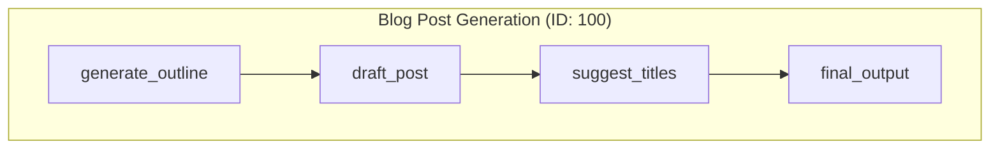

# Example: Dynamic AI Agent from Visual Graphs

This example demonstrates a runtime engine that can execute complex, graph-based AI workflows defined as simple JSON files. It showcases how to build a powerful AI agent that can reason, branch, and call other workflows recursively using the `workflow` framework.

### The Goal

Demonstrate a runtime engine that executes complex, graph-based AI workflows defined as JSON files, with support for parallelism, branching, and nested workflows.

### The Code

### The Code

```typescript
// main.ts
import type { NodeDefinition, WorkflowBlueprint } from 'flowcraft'
import { promises as fs } from 'node:fs'
import path from 'node:path'
import process from 'node:process'
import { FlowRuntime } from 'flowcraft'
import { agentNodeRegistry } from './registry.js'
import 'dotenv/config'

// The configuration object defines the different scenarios this sandbox can run.
const config = {
	'1.blog-post': {
		mainWorkflowId: '100',
		getInitialContext: () => ({
			topic: 'The rise of AI-powered workflow automation in modern software development.',
		}),
	},
	'2.job-application': {
		mainWorkflowId: '200',
		getInitialContext: () => ({
			applicantName: 'Jane Doe',
			resume: 'Experienced developer with a background in TypeScript, Node.js, and building complex DAG workflow systems. Also proficient in React and SQL.',
			coverLetter: 'To Whom It May Concern, I am writing to express my interest in the Senior Developer position.',
		}),
	},
	'3.customer-review': {
		mainWorkflowId: '300',
		getInitialContext: () => ({
			initial_review: 'The new dashboard is a huge improvement, but I noticed that the export-to-PDF feature is really slow and sometimes crashes the app on large datasets. It would be great if you could look into this.',
		}),
	},
	'4.content-moderation': {
		mainWorkflowId: '400',
		getInitialContext: () => ({
			userId: 'user-456',
			userPost: 'Hi, I need help with my account. My email is test@example.com and my phone is 555-123-4567.',
		}),
	},
} as const

type UseCase = keyof typeof config

const ACTIVE_USE_CASE: UseCase = '4.content-moderation' // Change this to test other scenarios

/**
 * Loads a legacy JSON graph and transforms it into a modern WorkflowBlueprint.
 * It also intelligently configures nodes that are convergence points for routers.
 */
async function loadAndProcessBlueprint(filePath: string): Promise<WorkflowBlueprint> {
	const fileContent = await fs.readFile(filePath, 'utf-8')
	const v1Graph = JSON.parse(fileContent)
	const blueprintId = path.basename(filePath, '.json')

	const nodes: NodeDefinition[] = v1Graph.nodes.map((v1Node: any) => {
		// Map the legacy format to the new format
		const node: NodeDefinition = {
			id: v1Node.id,
			uses: v1Node.type,
			params: v1Node.data,
			config: v1Node.config,
		}

		// **UPGRADE**: If the old format uses 'sub-workflow', map it to the built-in 'subflow'
		if (node.uses === 'sub-workflow') {
			node.uses = 'subflow'
			node.params = {
				blueprintId: v1Node.data.workflowId.toString(),
				inputs: v1Node.data.inputs,
				outputs: v1Node.data.outputs,
			}
		}

		return node
	})

	const edges = v1Graph.edges

	// --- **NEW**: Smartly configure joinStrategy for router convergence points ---
	const nodePredecessorMap = new Map<string, string[]>()
	edges.forEach((edge: any) => {
		if (!nodePredecessorMap.has(edge.target))
			nodePredecessorMap.set(edge.target, [])
		nodePredecessorMap.get(edge.target)!.push(edge.source)
	})

	for (const node of nodes) {
		const predecessors = nodePredecessorMap.get(node.id)
		if (predecessors && predecessors.length > 1) {
			// Check if all predecessors are the same (i.e., it's a fan-out from a single router)
			const firstPredecessor = predecessors[0]
			if (predecessors.every(p => p === firstPredecessor)) {
				console.log(`[Blueprint Loader] Automatically setting joinStrategy='any' for convergence node '${node.id}'`)
				node.config = { ...node.config, joinStrategy: 'any' }
			}
		}
	}
	// --- End of smart configuration ---

	return { id: blueprintId, nodes, edges }
}

async function main() {
	console.log(`--- Running Use-Case (Data-First): ${ACTIVE_USE_CASE} ---\n`)

	// Load all blueprints so they are available for sub-workflow calls.
	const blueprints: Record<string, WorkflowBlueprint> = {}
	const useCaseDirs = ['1.blog-post', '2.job-application', '3.customer-review', '4.content-moderation']
	for (const dirName of useCaseDirs) {
		const dirPath = path.join(process.cwd(), 'data', dirName)
		const files = await fs.readdir(dirPath)
		for (const file of files) {
			if (file.endsWith('.json')) {
				const blueprint = await loadAndProcessBlueprint(path.join(dirPath, file))
				blueprints[blueprint.id] = blueprint
			}
		}
	}

	const runtime = new FlowRuntime({
		registry: agentNodeRegistry,
		blueprints,
	})

	const mainWorkflowId = config[ACTIVE_USE_CASE].mainWorkflowId
	const mainBlueprint = blueprints[mainWorkflowId]

	if (!mainBlueprint)
		throw new Error(`Main workflow blueprint with ID '${mainWorkflowId}' was not found.`)

	const initialContext = config[ACTIVE_USE_CASE].getInitialContext()

	const result = await runtime.run(mainBlueprint, initialContext)

	console.log('\n--- Workflow Complete ---\n')
	console.log('Final Output:\n')
	// **FIXED**: The final output is stored under the 'outputKey' from the final node.
	console.log(result.context.final_output)
	console.log('\n--- Final Context State ---')
	console.dir(result.context, { depth: null })
}

main().catch(console.error)
```

```typescript
// nodes.ts
import type { IAsyncContext, NodeContext, NodeResult, RuntimeDependencies } from 'flowcraft'
import { callLLM, resolveTemplate } from './utils.js'

/**
 * A generic context for our LLM nodes.
 */
interface LlmNodeContext extends NodeContext<Record<string, any>, RuntimeDependencies> {
	params: {
		promptTemplate: string
		inputs: Record<string, string | string[]>
		outputKey?: string
	}
	context: IAsyncContext
}

/**
 * Resolves input values from the context based on the node's `inputs` mapping.
 */
async function resolveInputs(context: IAsyncContext<any>, inputs: Record<string, string | string[]>): Promise<Record<string, any>> {
	const resolved: Record<string, any> = {}
	for (const [templateKey, sourceKeyOrKeys] of Object.entries(inputs)) {
		const sourceKeys = Array.isArray(sourceKeyOrKeys) ? sourceKeyOrKeys : [sourceKeyOrKeys]
		let valueFound = false
		for (const sourceKey of sourceKeys) {
			if (await context.has(sourceKey)) {
				const value = await context.get(sourceKey)
				// Ensure we don't pass 'undefined' if the key exists but has no value
				if (value !== undefined) {
					resolved[templateKey] = value
					valueFound = true
					break // Found a value, no need to check other keys for this template variable
				}
			}
		}
		if (!valueFound) {
			// If an input isn't found (e.g., from an untaken branch), use an empty string.
			resolved[templateKey] = ''
		}
	}
	return resolved
}

export async function llmProcess(ctx: NodeContext<Record<string, any>, RuntimeDependencies>): Promise<NodeResult> {
	const llmCtx = ctx as any as LlmNodeContext
	const templateData = await resolveInputs(ctx.context, llmCtx.params.inputs)
	const prompt = resolveTemplate(llmCtx.params.promptTemplate, templateData)
	const result = await callLLM(prompt)
	return { output: result }
}

export async function llmCondition(ctx: NodeContext<Record<string, any>, RuntimeDependencies>): Promise<NodeResult> {
	const result = await llmProcess(ctx)
	const action = result.output?.toLowerCase().includes('true') ? 'true' : 'false'
	return { action, output: result.output }
}

export async function llmRouter(ctx: NodeContext<Record<string, any>, RuntimeDependencies>): Promise<NodeResult> {
	const result = await llmProcess(ctx)
	const action = result.output?.trim() ?? 'default'
	return { action, output: result.output }
}

export async function outputNode(ctx: NodeContext<Record<string, any>, RuntimeDependencies>): Promise<NodeResult> {
	const llmCtx = ctx as any as LlmNodeContext
	const { outputKey = 'final_output' } = llmCtx.params
	const templateData = await resolveInputs(ctx.context, llmCtx.params.inputs)
	const finalOutput = resolveTemplate(llmCtx.params.promptTemplate, templateData)
	await ctx.context.set(outputKey as any, finalOutput)
	return { output: finalOutput }
}
```

```typescript
// registry.ts
import type { NodeRegistry } from 'flowcraft'
import { llmCondition, llmProcess, llmRouter, outputNode } from './nodes.js'

/**
 * A central registry mapping the string 'uses' from a blueprint
 * to the actual node function implementation.
 * This is created once and passed to the FlowRuntime.
 */
export const agentNodeRegistry: NodeRegistry = {
	'llm-process': llmProcess,
	'llm-condition': llmCondition,
	'llm-router': llmRouter,
	'output': outputNode,
	// The 'subflow' node is built-in to runtime, so it doesn't need to be registered here.
}
```

```typescript
// utils.ts
import OpenAI from 'openai'

const openaiClient = new OpenAI()

/**
 * Calls the OpenAI Chat Completions API.
 * @param prompt The user prompt to send to the LLM.
 * @returns The content of the LLM's response as a string.
 */
export async function callLLM(prompt: string): Promise<string> {
	try {
		console.log(`\n--- Sending to LLM ---\n${prompt.substring(0, 300)}...\n---------------------\n`)
		const response = await openaiClient.chat.completions.create({
			model: 'gpt-4o-mini',
			messages: [{ role: 'user', content: prompt }],
			temperature: 0.2,
		})
		const result = response.choices[0].message.content || ''
		console.log(`--- Received from LLM ---\n${result}\n-----------------------\n`)
		return result
	}
	catch (error: any) {
		console.error('Error calling OpenAI API:', error)
		throw new Error(`OpenAI API call failed: ${error.message}`)
	}
}

/**
 * Resolves a template string by replacing {{key}} with values from a data object.
 * This is crucial for dynamically constructing prompts.
 */
export function resolveTemplate(template: string, data: Record<string, any>): string {
	return template.replace(/\{\{(.*?)\}\}/g, (_, key) => {
		const value = data[key.trim()]
		if (value === undefined || value === null) {
			console.warn(`Template variable '{{${key.trim()}}}' not found in data.`)
			return `{{${key.trim()}}}`
		}
		return String(value)
	})
}

### Visualization


```
