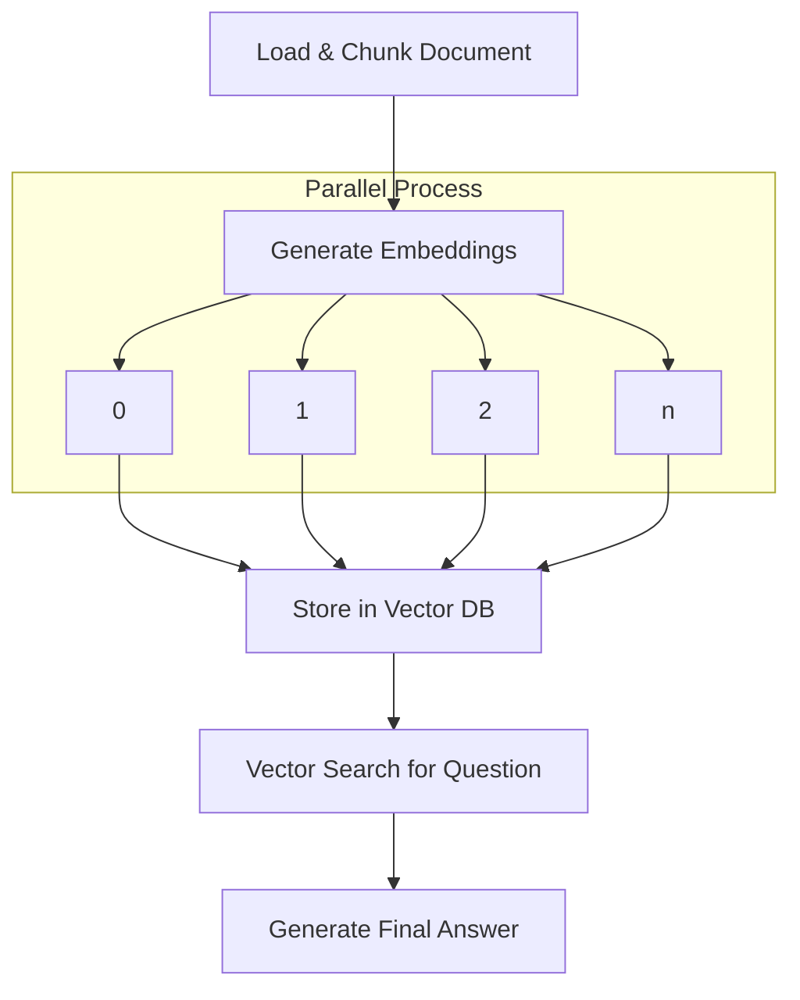

# Advanced RAG Agent with Document Analysis

[[view source code]](https://github.com/gorango/flowcraft/tree/master/examples/5.rag)

This example demonstrates a sophisticated Retrieval-Augmented Generation (RAG) agent. The workflow ingests and analyzes a document, uses embeddings to find relevant information, and generates a precise answer to a user's question.

## The Goal

Build a RAG agent that ingests a document, generates embeddings, performs vector searches, and synthesizes answers using complex data structures and robust serialization.

This example highlights the use of `superjson` for handling complex data types like `Map`, `Date`, and custom class instances in the workflow context. For more details on serialization, read about [Serializers](/guide/serializers).



## The Code

#### `flow.ts`
Defines the RAG workflow nodes for document chunking, embedding generation, vector storage, similarity search, and final answer synthesis.

```typescript
import type { NodeContext, NodeResult } from 'flowcraft'
import * as fs from 'node:fs/promises'
import { createFlow } from 'flowcraft'
import { DocumentChunk, SearchResult } from './types.js'
import { callLLM, cosineSimilarity, getEmbedding, resolveTemplate } from './utils.js'

 interface RagContext {
 	document_path: string
 	question: string
 	vector_db: Map<string, { chunk: DocumentChunk, vector: number[] }>
 	search_results: SearchResult[]
 	final_answer: string
 	// For batch processing
 	load_and_chunk: DocumentChunk[]
 	embedding_results: { chunk: DocumentChunk, vector: number[] }[]
 }

async function loadAndChunk(ctx: NodeContext<RagContext>): Promise<NodeResult> {
	const path = (await ctx.context.get('document_path'))!
	console.log(`[Node] Reading and chunking file: ${path}`)

	const content = await fs.readFile(path!, 'utf-8')
	const chunks = new Map<string, DocumentChunk>()
	const paragraphs = content.split(/\n\s*\n/).filter(p => p.trim().length > 10)

	for (const [i, paragraph] of paragraphs.entries()) {
		const chunkId = `chunk_${i}`
		const chunk = new DocumentChunk(chunkId, paragraph.trim(), path!)
		chunks.set(chunkId, chunk)
	}
 	console.log(`[Node] Created ${chunks.size} chunks.`)
	// The runtime will store this output array in the context under the key 'load_and_chunk'.
	return { output: Array.from(chunks.values()) }
}

 async function generateSingleEmbedding(
 	ctx: NodeContext<RagContext, any, DocumentChunk>,
 ): Promise<NodeResult<{ chunk: DocumentChunk; vector: number[] }>> {
 	const chunk = ctx.input
 	if (!chunk || !chunk.text) {
 		throw new TypeError('Batch worker for embeddings received an invalid chunk.')
 	}
 	const vector = await getEmbedding(chunk.text)
 	return { output: { chunk, vector } }
 }

 async function storeInVectorDB(
 	ctx: NodeContext<RagContext, any, { chunk: DocumentChunk; vector: number[] }[]>,
 ): Promise<NodeResult<string>> {
 	console.log('[Node] Simulating storage of chunks and vectors.')
 	const embeddingResults = ctx.input
 	const db = new Map<string, { chunk: DocumentChunk; vector: number[] }>()

 	if (!embeddingResults || embeddingResults.length === 0) {
 		console.warn('[Node] No embedding results to store in DB. Upstream might have failed.')
 		return { output: 'DB Ready (empty)' }
 	}

 	for (const { chunk, vector } of embeddingResults) {
 		if (chunk && vector) {
 			db.set(chunk.id, { chunk, vector })
 		}
 	}
 	await ctx.context.set('vector_db', db)
 	console.log(`[Node] DB is ready with ${db.size} entries.`)
 	return { output: 'DB Ready' }
 }

async function vectorSearch(ctx: NodeContext<RagContext>): Promise<NodeResult> {
	const question = (await ctx.context.get('question'))
	const db = (await ctx.context.get('vector_db'))
	console.log(`[Node] Performing vector search for question: "${question}"`)

	if (!db || db.size === 0) {
		console.error('[Node] Vector DB is empty. Cannot perform search.')
		return { output: [] }
	}

	const questionVector = await getEmbedding(question!)
	const similarities: { id: string, score: number }[] = []
	for (const [chunkId, { vector }] of db.entries()) {
		const score = cosineSimilarity(questionVector, vector)
		similarities.push({ id: chunkId, score })
	}

	similarities.sort((a, b) => b.score - a.score)
	const topResults = similarities.slice(0, 2)

	const searchResults = topResults.map(({ id, score }) => {
		const chunk = db.get(id)!.chunk
		return new SearchResult(chunk, score)
	})
	await ctx.context.set('search_results', searchResults)
	console.log(`[Node] Found ${searchResults.length} relevant results.`)
	return { output: searchResults }
}

async function generateFinalAnswer(ctx: NodeContext<RagContext>): Promise<NodeResult> {
	const searchResults = ctx.input as SearchResult[]
	const contextText = searchResults?.map(r => r.chunk.text).join('\n\n---\n\n') ?? 'No context found.'
	const question = (await ctx.context.get('question'))!
	const prompt = resolveTemplate(
		'Based on the following context, please provide a clear and concise answer to the user\'s question.\n\n**CONTEXT**\n\n{{context}}\n\n**QUESTION**\n\n{{question}}\n\n**ANSWER**',
		{ context: contextText, question },
	)
	const answer = await callLLM(prompt)
	await ctx.context.set('final_answer', answer)
	return { output: answer }
}

// --- Flow Definition ---

export function createRagFlow() {
	return createFlow<RagContext>('advanced-rag-agent')
		// 1. Define the standard nodes
		.node('load_and_chunk', loadAndChunk)
		.node('store_in_db', storeInVectorDB, { inputs: 'embedding_results' })
		.node('vector_search', vectorSearch)
		.node('generate_final_answer', generateFinalAnswer)

		// 2. Define the parallel batch processing step
		.batch('generate-embeddings', generateSingleEmbedding, {
			// This tells the batch scatter node where to find the input array
			inputKey: 'load_and_chunk',
			// This tells the batch gather node where to save the final results array
			outputKey: 'embedding_results',
		})

		// 3. Wire the graph edges to connect the steps
		.edge('load_and_chunk', 'generate-embeddings_scatter')
		// Connect the batch gatherer to the next step. The data flow is now
		// handled by the `inputs` mapping on the 'store_in_db' node itself.
		.edge('generate-embeddings_gather', 'store_in_db')
		.edge('store_in_db', 'vector_search')
		.edge('vector_search', 'generate_final_answer')
}
```

#### `types.ts`
Defines TypeScript classes for representing document chunks and search results in the RAG system.

```typescript
export class DocumentChunk {
	constructor(
		public readonly id: string,
		public readonly text: string,
		public readonly source: string,
		public readonly ingestedAt: Date = new Date(),
	) { }
}

export class SearchResult {
	constructor(
		public readonly chunk: DocumentChunk,
		public readonly score: number,
	) { }
}
```

#### `utils.ts`
Provides utility functions for OpenAI API interactions, embedding generation, cosine similarity calculations, and template resolution with SuperJSON support.

```typescript
import OpenAI from 'openai'
import SuperJSON from 'superjson'
import 'dotenv/config'

const openaiClient = new OpenAI()

/**
 * Calls the OpenAI Chat Completions API for generation tasks.
 */
export async function callLLM(prompt: string): Promise<string> {
	console.log(`\n--- Sending to LLM for Generation ---\n${prompt}\n`)
	try {
		const response = await openaiClient.chat.completions.create({
			model: 'gpt-4o-mini',
			messages: [{ role: 'user', content: prompt }],
			temperature: 0.1,
		})
		const result = response.choices[0].message.content || ''
		console.log(
			'--- Received from LLM ---',
			'\n====================================================\n',
			result,
			'\n====================================================\n',
		)
		return result
	}
	catch (error: any) {
		console.error('Error calling OpenAI API for generation:', error)
		throw new Error(`OpenAI API call failed: ${error.message}`)
	}
}

/**
 * Calls the OpenAI Embeddings API.
 */
export async function getEmbedding(text: string): Promise<number[]> {
	console.log(`[Embeddings API] Generating embedding for text: "${text.substring(0, 50)}..."`)
	try {
		const response = await openaiClient.embeddings.create({
			model: 'text-embedding-3-small',
			input: text.replace(/\n/g, ' '),
		})
		return response.data[0].embedding
	}
	catch (error: any) {
		console.error('Error calling OpenAI Embeddings API:', error)
		throw new Error(`OpenAI Embeddings API call failed: ${error.message}`)
	}
}

/**
 * Simulates cosine similarity between two vectors.
 */
export function cosineSimilarity(vecA: number[], vecB: number[]): number {
	const dotProduct = vecA.reduce((sum, a, i) => sum + a * vecB[i], 0)
	const magnitudeA = Math.sqrt(vecA.reduce((sum, a) => sum + a * a, 0))
	const magnitudeB = Math.sqrt(vecB.reduce((sum, b) => sum + b * b, 0))
	return dotProduct / (magnitudeA * magnitudeB)
}

/**
 * Resolves a template string by replacing {{key}} with values from a data object.
 */
export function resolveTemplate(template: string, data: Record<string, any>): string {
	return template.replace(/\{\{(.*?)\}\}/g, (_, key) => {
		const value = data[key.trim()]
		if (value === undefined || value === null) {
			console.warn(`Template variable '{{${key.trim()}}}' not found in data.`)
			return ''
		}
		// Use superjson to handle complex objects like our SearchResult class
		if (typeof value === 'object')
			return SuperJSON.stringify(value)

		return String(value)
	})
}
```

#### `main.ts`
Serves as the entry point, configuring the FlowRuntime with a custom SuperJSON serializer and executing the RAG workflow with a specified document and question.

```typescript
import type { ISerializer } from 'flowcraft'
import * as fs from 'node:fs/promises'
import * as path from 'node:path'
import process from 'node:process'
import { FlowRuntime } from 'flowcraft'
import SuperJSON from 'superjson'
import { createRagFlow } from './flow.js'
import { DocumentChunk, SearchResult } from './types.js'

// Register custom classes with SuperJSON for proper serialization
SuperJSON.registerClass(DocumentChunk)
SuperJSON.registerClass(SearchResult)

// Create a serializer adapter for the runtime
class SuperJsonSerializer implements ISerializer {
	serialize(data: Record<string, any>): string {
		return SuperJSON.stringify(data)
	}

	deserialize(text: string): Record<string, any> {
		return SuperJSON.parse(text)
	}
}

async function main() {
	console.log('--- RAG Agent Workflow ---')

	const ragFlow = createRagFlow()
	const blueprint = ragFlow.toBlueprint()
	const functionRegistry = ragFlow.getFunctionRegistry()

	const runtime = new FlowRuntime({
		serializer: new SuperJsonSerializer(), // Plug in the custom serializer
	})

	const documentPath = path.join(process.cwd(), 'documents', 'sample.md')
	const initialContext = {
		document_path: documentPath,
		question: 'How does Flowcraft implement declarative workflows?',
	}

	const result = await runtime.run(blueprint, initialContext, { functionRegistry })

	console.log('\n--- Workflow Complete ---\n')
	console.log('Final Answer:\n', result.context.final_answer)

	console.log('\n\n--- Final Context State (Serialized with SuperJSON) ---')
	const outputFilePath = path.join(process.cwd(), 'tmp', 'final-context-v2.json')
	await fs.mkdir(path.dirname(outputFilePath), { recursive: true })

	const serializedContext = result.serializedContext
	await fs.writeFile(outputFilePath, JSON.stringify(JSON.parse(serializedContext), null, 2), 'utf-8')

	console.log(`Full context saved to: ${outputFilePath}\n`)
	console.log('Inspect the file to see that complex types like Map, Date, and classes were preserved.')
}

main().catch(console.error)
```

---

[[view source code]](https://github.com/gorango/flowcraft/tree/master/examples/5.rag)
