# Distributed AI Agent with a Pluggable Executor

This example demonstrates the power of the `Executor` pattern by running the same complex, graph-based AI agent from the DAG example in a distributed environment using **BullMQ**.

## The Goal

Run the DAG example in a distributed environment using BullMQ, with client-worker separation and awaitable workflows.

```mermaid
graph TD
    subgraph "Client Application"
        Client("🚀 Client")
    end

    subgraph "Redis"
        direction LR
        Queue[("BullMQ Queue")]
        State[("State Store")]
    end

    subgraph "Worker Service(s)"
        Worker("⚙️ Worker")
    end

    Client -- "1. Enqueues Start Job" --> Queue
    Client -- "2. Writes Initial Context" --> State

    Worker -- "3. Dequeues Job" --> Queue
    Worker -- "4. Reads/Writes Workflow State" --> State
    Worker -- "5. Enqueues Next Job(s)" --> Queue

    State -- "6. Final result is written" --> Worker
    State -- "7. Client reads final result" --> Client
```



## The Code

#### `client.ts`
```typescript
import type { WorkflowResult } from 'flowcraft'
import { promises as fs } from 'node:fs'
import path from 'node:path'
import process from 'node:process'
import { Queue } from 'bullmq'
import { analyzeBlueprint } from 'flowcraft'
import IORedis from 'ioredis'
import 'dotenv/config'

const QUEUE_NAME = 'flowcraft-queue'
const ACTIVE_USE_CASE = '4.content-moderation'

const config = {
	'1.blog-post': {
		mainWorkflowId: '100',
		initialContext: {
			topic: 'The rise of AI-powered workflow automation in modern software development.',
		},
	},
	'2.job-application': {
		mainWorkflowId: '200',
		initialContext: {
			applicantName: 'Jane Doe',
			resume: 'Experienced developer with a background in TypeScript, Node.js, and building complex DAG workflow systems. Also proficient in React and SQL.',
			coverLetter: 'To Whom It May Concern, I am writing to express my interest in the Senior Developer position.',
		},
	},
	'3.customer-review': {
		mainWorkflowId: '300',
		initialContext: {
			initial_review: 'The new dashboard is a huge improvement, but the export-to-PDF feature is really slow and sometimes crashes the app on large datasets.',
		},
	},
	'4.content-moderation': {
		mainWorkflowId: '400',
		initialContext: {
			userId: 'user-456',
			userPost: 'Hi, I need help with my account. My email is test@example.com and my phone is 555-123-4567.',
		},
	},
}

export async function waitForWorkflow(redis: IORedis, runId: string, timeoutMs: number): Promise<{ status: string, payload?: WorkflowResult, reason?: string }> {
	const statusKey = `workflow:status:${runId}`
	const startTime = Date.now()

	console.log(`Awaiting result for Run ID ${runId} on key: ${statusKey}`)

	while (Date.now() - startTime < timeoutMs) {
		const statusJson = await redis.get(statusKey)
		if (statusJson) {
			await redis.del(statusKey) // Clean up
			return JSON.parse(statusJson)
		}
		await new Promise(resolve => setTimeout(resolve, 500))
	}

	return { status: 'failed', reason: `Timeout: Client did not receive a result within ${timeoutMs}ms.` }
}

async function loadBlueprint(blueprintPath: string) {
	const blueprintContent = await fs.readFile(blueprintPath, 'utf-8')
	return JSON.parse(blueprintContent)
}

async function main() {
	console.log('--- Distributed Workflow Client ---')

	const runId = Math.floor(Math.random() * 10).toString()
	const redisConnection = new IORedis({ maxRetriesPerRequest: null })
	const queue = new Queue(QUEUE_NAME, { connection: redisConnection })

	const useCase = config[ACTIVE_USE_CASE]
	const blueprintPath = path.join(process.cwd(), '..', '5.dag', 'data', ACTIVE_USE_CASE, `${useCase.mainWorkflowId}.json`)
	const blueprint = await loadBlueprint(blueprintPath)

	const analysis = analyzeBlueprint(blueprint)
	const startNodeIds = analysis.startNodeIds

	const initialContextData = useCase.initialContext

	const stateKey = `workflow:state:${runId}`
	for (const [key, value] of Object.entries(initialContextData)) {
		await redisConnection.hset(stateKey, key, JSON.stringify(value))
	}

	const startJobs = startNodeIds.map((nodeId: any) => ({
		name: 'executeNode',
		data: { runId, blueprintId: useCase.mainWorkflowId, nodeId },
	}))

	console.log(`🚀 Enqueuing ${startJobs.length} start job(s) for Run ID: ${runId}`)
	await queue.addBulk(startJobs)

	try {
		const finalStatus = await waitForWorkflow(redisConnection, runId, 60000)
		console.log('\n=============================================================')

		switch (finalStatus.status) {
			case 'completed':
				console.log(`✅ Workflow Run ID: ${runId} COMPLETED.`)
				console.log('Final Output:', finalStatus.payload?.context?.moderation_result)
				break
			case 'cancelled':
				console.warn(`🛑 Workflow Run ID: ${runId} was successfully CANCELLED.`)
				console.log(`   Reason: ${finalStatus.reason}`)
				break
			case 'failed':
				console.error(`❌ Workflow Run ID: ${runId} FAILED or timed out.`)
				console.error(`   Reason: ${finalStatus.reason}`)
				break
		}
		console.log('=============================================================\n')
	}
	catch (error) {
		console.error(`Error waiting for workflow to complete for Run ID ${runId}`, error)
	}

	await redisConnection.quit()
	await queue.close()
}

main().catch(console.error)
```

#### `worker.ts`
```typescript
import type { WorkflowBlueprint } from 'flowcraft'
import { promises as fs } from 'node:fs'
import path from 'node:path'
import process from 'node:process'
import { BullMQAdapter, RedisCoordinationStore } from '@flowcraft/bullmq-adapter'
import IORedis from 'ioredis'
import { agentNodeRegistry } from '../../5.dag/src/registry.js'
import 'dotenv/config'

/**
 * Loads all blueprint files from the data directory into a cache.
 */
async function loadAllBlueprints(): Promise<Record<string, WorkflowBlueprint>> {
	const blueprintCache: Record<string, WorkflowBlueprint> = {}
	const useCaseDirs = ['1.blog-post', '2.job-application', '3.customer-review', '4.content-moderation']
	for (const dirName of useCaseDirs) {
		const dirPath = path.join(process.cwd(), '..', '5.dag', 'data', dirName)
		const files = await fs.readdir(dirPath)
		for (const file of files) {
			if (file.endsWith('.json')) {
				const fileContent = await fs.readFile(path.join(dirPath, file), 'utf-8')
				const graph = JSON.parse(fileContent)
				const blueprintId = path.basename(file, '.json')
				// Basic transformation into required format
				blueprintCache[blueprintId] = {
					id: blueprintId,
					nodes: graph.nodes.map((n: any) => ({
						id: n.id,
						uses: n.type === 'sub-workflow' ? 'subflow' : n.type,
						params: n.type === 'sub-workflow'
							? { blueprintId: n.data.workflowId.toString(), inputs: n.data.inputs, outputs: n.data.outputs }
							: n.data,
						config: n.config,
					})),
					edges: graph.edges,
				}
			}
		}
	}
	return blueprintCache
}

async function main() {
	console.log('--- Distributed Workflow Worker (Adapter-based) ---')
	const redisConnection = new IORedis({ maxRetriesPerRequest: null })

	// 1. Load all blueprints that the runtime will need.
	const blueprints = await loadAllBlueprints()
	console.log(`[Worker] Loaded ${Object.keys(blueprints).length} blueprints into the cache.`)

	// 2. Create the coordination store.
	const coordinationStore = new RedisCoordinationStore(redisConnection)

	// 3. Instantiate the adapter with all necessary components.
	const adapter = new BullMQAdapter({
		connection: redisConnection,
		queueName: 'flowcraft-queue',
		coordinationStore,
		runtimeOptions: {
			registry: agentNodeRegistry,
			blueprints,
		},
	})

	// 4. Start the worker. The adapter now handles all orchestration logic.
	adapter.start()

	process.on('SIGINT', () => {
		console.log('Gracefully shutting down worker...')
		redisConnection.quit()
		process.exit(0)
	})
}

main().catch(console.error)
```
