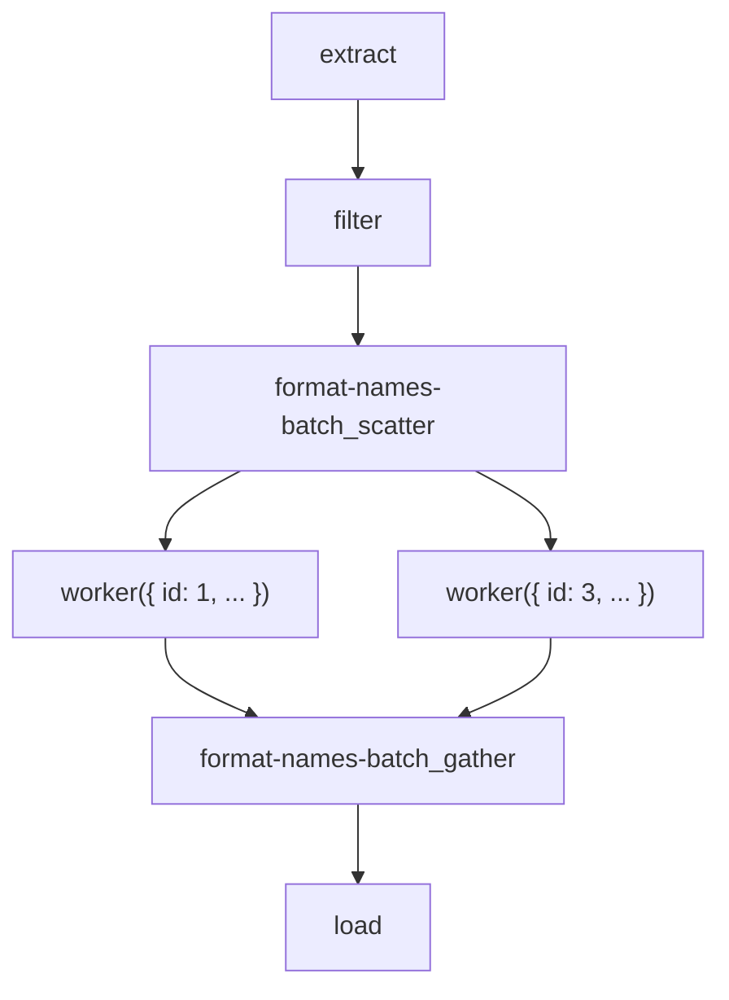

# Example: ETL Pipeline

This example demonstrates how Flowcraft can be used to build a simple Extract, Transform, Load (ETL) pipeline. This is a common use case in data engineering.

### The Goal

Our ETL pipeline will:
1.  **Extract**: Fetch raw user data from a mock API.
2.  **Transform**:
	-   Filter for active users.
	-   Format their names.
	-   This will be done in parallel using **batch processing**.
3.  **Load**: Simulate loading the transformed data into a database.

### The Code

```typescript
import { ConsoleLogger, createFlow, FlowRuntime } from 'flowcraft'

interface User {
	id: number
	firstName: string
	lastName: string
	isActive: boolean
}

// --- 1. Define Node Logic ---

// E: Extract - Fetch raw data
async function extractRawData() {
	console.log('EXTRACT: Fetching raw user data...')
	const rawData: User[] = [
		{ id: 1, firstName: 'john', lastName: 'doe', isActive: true },
		{ id: 2, firstName: 'jane', lastName: 'smith', isActive: false },
		{ id: 3, firstName: 'peter', lastName: 'jones', isActive: true },
	]
	return { output: rawData }
}

// T: Transform - Filter for active users
async function filterActiveUsers({ input }: { input: User[] }) {
	console.log('TRANSFORM: Filtering for active users...')
	return { output: input.filter(u => u.isActive) }
}

// T: Transform - The worker for our parallel batch job
async function formatUserName({ input }: { input: User }) {
	// This runs for each active user
	const fullName = `${input.firstName.charAt(0).toUpperCase()}${input.firstName.slice(1)} ${input.lastName.charAt(0).toUpperCase()}${input.lastName.slice(1)}`
	return { output: { id: input.id, fullName } }
}

// L: Load - Simulate saving to a database
async function loadToDatabase({ input }: { input: { id: number, fullName: string }[] }) {
	console.log('LOAD: Saving transformed data to database...')
	console.log(input)
	return { output: { recordsLoaded: input.length } }
}

// --- 2. Define the Workflow ---

const etlFlow = createFlow('etl-pipeline')
	.node('extract', extractRawData)
	.node('filter', filterActiveUsers)
	.node('load', loadToDatabase, { inputs: 'formatted-names' }) // Input comes from batch output

	// This is our parallel transformation step
	.batch('format-names-batch', formatUserName, {
		inputKey: 'filter', // The array of active users
		outputKey: 'formatted-names' // The array of formatted names
	})

	// Define the execution graph
	.edge('extract', 'filter')
	.edge('filter', 'format-names-batch_scatter') // From filter to the start of the batch
	.edge('format-names-batch_gather', 'load') // From the end of the batch to load

	.toBlueprint()

// --- 3. Run the Workflow ---

async function main() {
	const runtime = new FlowRuntime({
		logger: new ConsoleLogger(),
		registry: etlFlow.getFunctionRegistry()
	})

	const result = await runtime.run(etlFlow, {})
	console.log('\n--- ETL Complete ---', result.context.load)
}

main()
```

### Visualization

The use of `.batch()` creates a scatter-gather pattern in our graph.



This example shows how Flowcraft can orchestrate both sequential and parallel tasks in a single, readable definition, making it a great fit for data processing pipelines.
