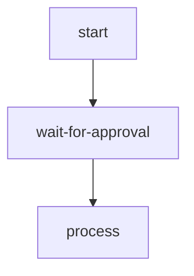

# Human-in-the-Loop Workflow

[[view source code]](https://github.com/gorango/flowcraft/tree/master/examples/hitl)

This example demonstrates a human-in-the-loop workflow that pauses for external input before continuing. It showcases:

- Using the `.wait()` method to create pause points
- Handling the `'awaiting'` workflow status
- Resuming workflows with the `runtime.resume()` method
- Persisting awaiting state in serialized context

## The Goal

We want to create a workflow that:

1. Processes initial data
2. Pauses for human approval
3. Continues based on the approval decision



## The Code

#### `flow.ts`

```typescript
import { createFlow } from 'flowcraft'

export function createApprovalFlow() {
  return createFlow('approval-workflow')
    .node('start', async ({ input }) => {
      console.log('Starting workflow with input:', input)
      return { output: { value: input } }
    })
    .edge('start', 'wait-for-approval')
    .wait('wait-for-approval')  // Pauses execution here
    .edge('wait-for-approval', 'process')
    .node('process', async ({ input }) => {
      const approved = input?.approved
      console.log('Processing with approval:', approved)
      if (approved) {
        return { output: { result: 'Approved and processed' } }
      }
      return { output: { result: 'Rejected' } }
    })
}
```

#### `main.ts`

```typescript
import { FlowRuntime } from 'flowcraft'
import { createApprovalFlow } from './flow.js'

async function main() {
  const approvalFlow = createApprovalFlow()
  const blueprint = approvalFlow.toBlueprint()
  const functionRegistry = approvalFlow.getFunctionRegistry()

  const runtime = new FlowRuntime({ registry: functionRegistry })

  console.log('=== Initial Run ===')
  const initialResult = await runtime.run(blueprint, 42)

  console.log('Initial result status:', initialResult.status)
  console.log('Awaiting node:', initialResult.context._awaitingNodeId)

  if (initialResult.status === 'awaiting') {
    console.log('\n=== Resuming ===')
    const resumeResult = await runtime.resume(blueprint, initialResult.serializedContext, {
      output: { approved: true }
    })

    console.log('Resume result status:', resumeResult.status)
    console.log('Final context:', resumeResult.context)
  }
}

main()
```

## The Output

When you run this code, you will see:

```
=== Initial Run ===
Starting workflow with input: 42
Initial result status: awaiting
Awaiting node: wait-for-approval

=== Resuming ===
Processing with approval: true
Resume result status: completed
Final context: {
  input: 42,
  _outputs.start: { value: 42 },
  _outputs.wait-for-approval: { approved: true },
  _outputs.process: { result: 'Approved and processed' }
}
```

## Key Concepts

- **Wait Nodes**: Created with `.wait(id)`, these pause execution and set the workflow status to `'awaiting'`.
- **State Persistence**: The awaiting state is stored in the context and survives serialization.
- **Resume Method**: Use `runtime.resume()` to provide input and continue from the pause point.
- **Workflow Status**: Check `result.status` to handle different execution states.

This pattern is ideal for workflows requiring human intervention, such as approvals, reviews, or manual data entry.

---

[[view source code]](https://github.com/gorango/flowcraft/tree/master/examples/hitl)