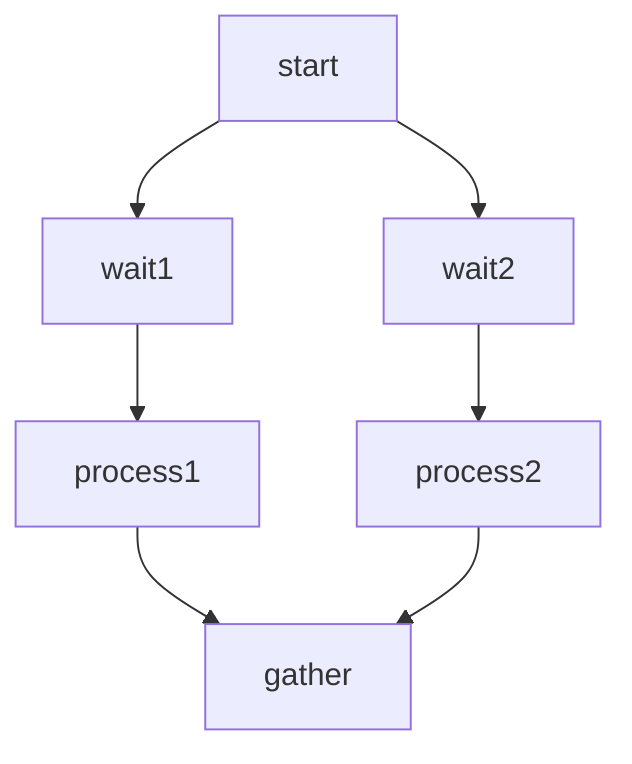

# Human-in-the-Loop Workflow with Multiple Concurrent Waits

[[view source code]](https://github.com/gorango/flowcraft/tree/master/examples/hitl)

This example demonstrates a human-in-the-loop workflow with multiple concurrent wait nodes that pause for external input before continuing. It showcases:

- Using the `.wait()` method to create multiple pause points in parallel branches
- Handling the `'awaiting'` workflow status with multiple waiting nodes
- Resuming workflows with the `runtime.resume()` method, specifying which node to resume
- Persisting multiple awaiting states in serialized context

## The Goal

We want to create a workflow that:

1. Processes initial data
2. Branches into multiple parallel paths, each requiring human input
3. Pauses at multiple wait nodes concurrently
4. Continues each branch independently based on the provided input
5. Combines results from all branches



## The Code

#### Workflow Definition

```typescript
import { createFlow } from 'flowcraft'

export function createMultiWaitFlow() {
  return createFlow('multi-wait-workflow')
    .node('start', async ({ input }) => {
      console.log('Starting workflow with input:', input)
      return { output: { value: input } }
    })
    .edge('start', 'wait1')
    .wait('wait1')  // First pause point
    .edge('wait1', 'process1')
    .node('process1', async ({ input }) => {
      console.log('Processing branch 1 with input:', input)
      return { output: { result1: `Branch 1: ${input.value}` } }
    })
    .edge('start', 'wait2')
    .wait('wait2')  // Second pause point (concurrent)
    .edge('wait2', 'process2')
    .node('process2', async ({ input }) => {
      console.log('Processing branch 2 with input:', input)
      return { output: { result2: `Branch 2: ${input.value}` } }
    })
    .edge('process1', 'gather')
    .edge('process2', 'gather')
    .node('gather', async ({ input }) => {
      console.log('Combining results from both branches')
      return { output: { combined: `Results: ${input.result1.result1}, ${input.result2.result2}` } }
    }, { inputs: { result1: '_outputs.process1', result2: '_outputs.process2' } })
}
```

#### Execution Script

```typescript
import { FlowRuntime } from 'flowcraft'
import { createMultiWaitFlow } from './flow.js'

async function main() {
  const multiWaitFlow = createMultiWaitFlow()
  const blueprint = multiWaitFlow.toBlueprint()
  const functionRegistry = multiWaitFlow.getFunctionRegistry()

  const runtime = new FlowRuntime({ registry: functionRegistry })

  console.log('=== Initial Run ===')
  const initialResult = await runtime.run(blueprint, 42)

  console.log('Initial result status:', initialResult.status)
  console.log('Awaiting nodes:', initialResult.context._awaitingNodeIds)

  if (initialResult.status === 'awaiting') {
    // Resume each waiting node separately
    for (const nodeId of initialResult.context._awaitingNodeIds) {
      console.log(`\n=== Resuming ${nodeId} ===`)
      const resumeResult = await runtime.resume(blueprint, initialResult.serializedContext, {
        output: { value: 42 }
      }, nodeId)

      console.log(`Resume result status for ${nodeId}:`, resumeResult.status)
      if (resumeResult.status === 'awaiting') {
        // If still awaiting other nodes, update the context for next resume
        initialResult.serializedContext = resumeResult.serializedContext
      } else {
        console.log('Final context:', resumeResult.context)
      }
    }
  }
}

main()
```

#### `multi-wait-main.ts`

```typescript
import { FlowRuntime } from 'flowcraft'
import { createMultiWaitFlow } from './flow.js'
```

## The Output

When you run this code, you will see:

```
=== Initial Run ===
Starting workflow with input: 42
Initial result status: awaiting
Awaiting nodes: ['wait1', 'wait2']

=== Resuming wait1 ===
Processing branch 1 with input: { value: 42 }
Resume result status for wait1: awaiting
Awaiting nodes: ['wait2']

=== Resuming wait2 ===
Processing branch 2 with input: { value: 42 }
Combining results from both branches
Resume result status for wait2: completed
Final context: {
  input: 42,
  _outputs.start: { value: 42 },
  _outputs.wait1: { value: 42 },
  _outputs.process1: { result1: 'Branch 1: 42' },
  _outputs.wait2: { value: 42 },
  _outputs.process2: { result2: 'Branch 2: 42' },
  _outputs.gather: { combined: 'Results: Branch 1: 42, Branch 2: 42' }
}
```

## Key Concepts

- **Wait Nodes**: Created with `.wait(id)`, these pause execution and set the workflow status to `'awaiting'`.
- **Multiple Concurrent Waits**: Support for multiple wait nodes running in parallel, each tracked separately in `_awaitingNodeIds`.
- **State Persistence**: The awaiting state is stored in the context and survives serialization.
- **Resume Method**: Use `runtime.resume()` with a `nodeId` parameter to specify which waiting node to resume.
- **Workflow Status**: Check `result.status` to handle different execution states.

This pattern is ideal for workflows requiring human intervention across multiple parallel branches, such as multi-step approvals, parallel reviews, or distributed data entry.

## Implementation Details

The example above demonstrates how to handle multiple concurrent wait states by resuming each node individually. The workflow:

1. **Starts** with initial data and branches into two parallel paths
2. **Pauses** at both `wait1` and `wait2` nodes simultaneously
3. **Resumes** each wait node separately using the `nodeId` parameter
4. **Processes** each branch independently after resumption
5. **Combines** the results from both branches in the final gather node

This showcases the full power of Flowcraft's human-in-the-loop capabilities for complex, multi-branch workflows requiring parallel human interventions.

### Key Implementation Notes

- **Multiple Awaiting Nodes**: The workflow state tracks multiple nodes in `_awaitingNodeIds` array
- **Selective Resumption**: Use the `nodeId` parameter in `runtime.resume()` to target specific waiting nodes
- **State Updates**: After resuming one node, update the serialized context for subsequent resumptions
- **Parallel Processing**: Each branch processes independently, allowing for different human inputs at different times
- **Result Combination**: The gather node receives outputs from both branches and combines them into a final result

---

[[view source code]](https://github.com/gorango/flowcraft/tree/master/examples/hitl)