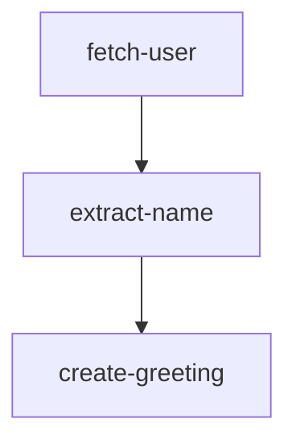
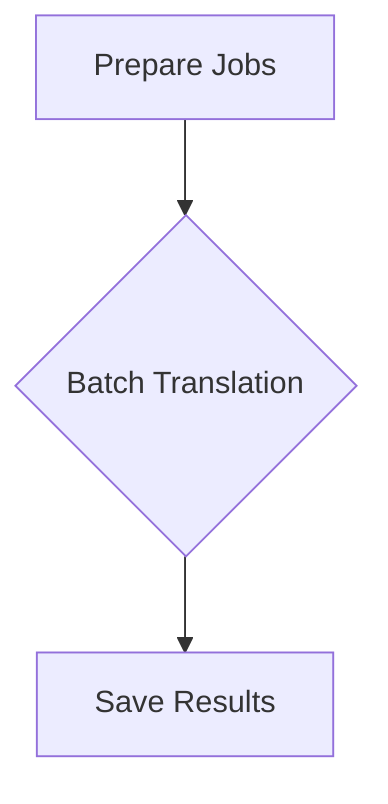
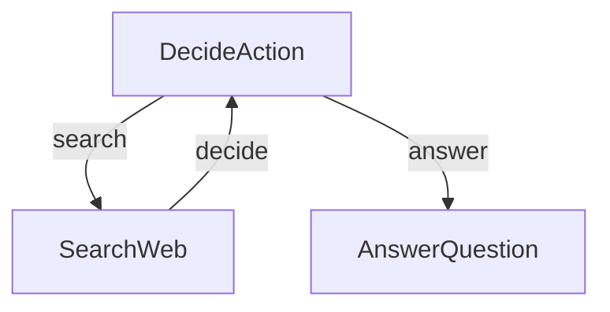
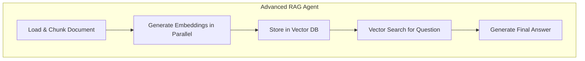
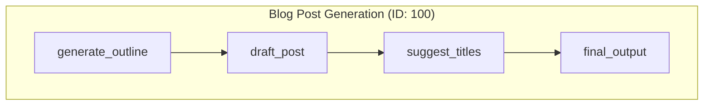

# Examples Index

This page provides an overview of all Flowcraft examples, including summaries and visualizations of each workflow.

## Basic Workflow

A basic, linear workflow that creates a greeting message. It demonstrates defining a workflow with `createFlow`, passing data between nodes, and executing with `FlowRuntime`.

## Parallel Batch Translation

Demonstrates using Flowcraft's `.batch()` helper to translate a document into multiple languages concurrently, showcasing performance improvements for I/O-bound tasks.

## Research Agent

A simple research agent that searches the web and answers questions using conditional branching and loops.

## Advanced RAG Agent with Document Analysis

A sophisticated RAG agent that ingests documents, generates embeddings, performs vector searches, and synthesizes answers.

## Dynamic AI Agent from Visual Graphs

A runtime engine for executing graph-based AI workflows defined as JSON files, with support for parallelism, branching, and nested workflows.

## Distributed AI Agent with a Pluggable Executor

Runs the DAG example in a distributed environment using BullMQ, with client-worker separation and awaitable workflows.
