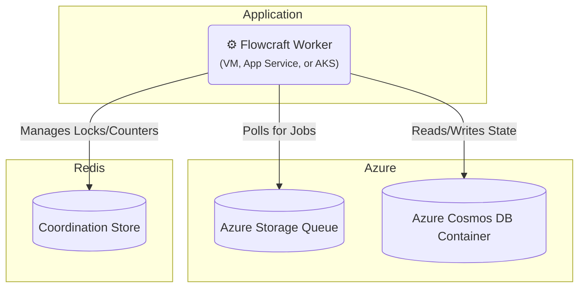

# Runtime Adapter: Azure (Queues & Cosmos DB)

[](https://www.npmjs.com/package/@flowcraft/azure-adapter)

The Azure adapter provides a fully native solution for running distributed workflows on Microsoft Azure. It uses **Azure Storage Queues** for reliable job queuing and **Azure Cosmos DB** for the context store. For the coordination store, it relies on Redis.

This is an excellent choice for applications built on the Azure stack.

## Installation

You will need the adapter package, the Azure clients, and `ioredis`.

```bash
npm install @flowcraft/azure-adapter @azure/storage-queue @azure/cosmos ioredis
```

## Architecture

This adapter leverages native Azure services for the queue and context, with Redis handling coordination.



## Usage

The following example shows how to configure and start a worker using the `AzureQueueAdapter`.

#### `worker.ts`
```typescript
import { CosmosClient } from '@azure/cosmos'
import { QueueClient } from '@azure/storage-queue'
import { AzureQueueAdapter, CosmosDbContext, RedisCoordinationStore } from '@flowcraft/azure-adapter'
import IORedis from 'ioredis'
// Assume agentNodeRegistry and blueprints are loaded from your application's shared files.
import { agentNodeRegistry, blueprints } from './shared'

async function main() {
	console.log('--- Starting Flowcraft Worker (Azure) ---')

	// 1. Instantiate clients using connection strings from environment variables.
	const queueClient = new QueueClient(process.env.AZURE_STORAGE_CONNECTION_STRING, 'flowcraft-jobs')
	const cosmosClient = new CosmosClient(process.env.COSMOS_DB_CONNECTION_STRING)
	const redisConnection = new IORedis(process.env.REDIS_URL)

	// 2. Create the coordination store using Redis.
	const coordinationStore = new RedisCoordinationStore(redisConnection)

	// 3. Instantiate the adapter.
	const adapter = new AzureQueueAdapter({
		queueClient,
		cosmosClient,
		coordinationStore,
		cosmosDatabaseName: 'flowcraftDb', // You must create this database
		contextContainerName: 'contexts', // You must create this container
		statusContainerName: 'statuses', // You must create this container
		runtimeOptions: {
			registry: agentNodeRegistry,
			blueprints,
		},
	})

	// 4. Start the worker. It will begin polling the Azure Queue for jobs.
	adapter.start()

	console.log('Worker is running. Waiting for jobs...')
}

main().catch(console.error)
```

## Key Components

-   **Job Queue**: Uses Azure Storage Queues. The adapter polls for messages and deletes them upon successful processing.
-   **Context Store**: The `CosmosDbContext` class stores the state for each workflow run as a single item in a Cosmos DB container, partitioned by `runId`. It efficiently uses the `patch` operation for updates.
-   **Coordination Store**: The `RedisCoordinationStore` uses atomic Redis commands (`INCR`, `SETNX`) to manage distributed locks and counters for fan-in joins.
