# Runtime Adapter: Azure (Queues & Cosmos DB)

[](https://www.npmjs.com/package/@flowcraft/azure-adapter)

The Azure adapter provides a fully native solution for running distributed workflows on Microsoft Azure. It uses **Azure Storage Queues** for reliable job queuing and **Azure Cosmos DB** for the context store. For the coordination store, it relies on Redis.

This is an excellent choice for applications built on the Azure stack.

## Installation

You will need the adapter package, the Azure clients, and `ioredis`.

```bash
npm install @flowcraft/azure-adapter @azure/storage-queue @azure/cosmos ioredis
```

## Infrastructure Setup

Before running the adapter, you need to provision the following Azure resources:

- **Storage Queue**: For job queuing.
- **Cosmos DB**: A database with two containers for context and status storage.
- **Redis**: For coordination (can be Azure Cache for Redis or external).

### Using Azure CLI

1. Create a storage account and queue:
```bash
az storage account create --name flowcraftstorage --resource-group your-rg --location eastus --sku Standard_LRS
az storage queue create --name flowcraft-jobs --account-name flowcraftstorage
```

2. Create Cosmos DB account and database:
```bash
az cosmosdb create --name flowcraft-cosmos --resource-group your-rg --kind GlobalDocumentDB --locations regionName=eastus failoverPriority=0 isZoneRedundant=false
az cosmosdb database create --name flowcraft-cosmos --db-name flowcraftDb --resource-group your-rg
```

3. Create containers in Cosmos DB:
```bash
az cosmosdb collection create --collection-name contexts --name flowcraft-cosmos --db-name flowcraftDb --resource-group your-rg --partition-key-path "/runId"
az cosmosdb collection create --collection-name statuses --name flowcraft-cosmos --db-name flowcraftDb --resource-group your-rg --partition-key-path "/runId"
```

4. Create Azure Cache for Redis:
```bash
az redis create --name flowcraft-redis --resource-group your-rg --location eastus --sku Basic --vm-size C1
```

### Using Terraform

```hcl
resource "azurerm_resource_group" "example" {
  name     = "flowcraft-rg"
  location = "East US"
}

resource "azurerm_storage_account" "example" {
  name                     = "flowcraftstorage"
  resource_group_name      = azurerm_resource_group.example.name
  location                 = azurerm_resource_group.example.location
  account_tier             = "Standard"
  account_replication_type = "LRS"
}

resource "azurerm_storage_queue" "example" {
  name                 = "flowcraft-jobs"
  storage_account_name = azurerm_storage_account.example.name
}

resource "azurerm_cosmosdb_account" "example" {
  name                = "flowcraft-cosmos"
  location            = azurerm_resource_group.example.location
  resource_group_name = azurerm_resource_group.example.name
  offer_type          = "Standard"
  kind                = "GlobalDocumentDB"

  consistency_policy {
    consistency_level = "Session"
  }

  geo_location {
    location          = "East US"
    failover_priority = 0
  }
}

resource "azurerm_cosmosdb_sql_database" "example" {
  name                = "flowcraftDb"
  resource_group_name = azurerm_cosmosdb_account.example.resource_group_name
  account_name       = azurerm_cosmosdb_account.example.name
}

resource "azurerm_cosmosdb_sql_container" "contexts" {
  name                = "contexts"
  resource_group_name = azurerm_cosmosdb_account.example.resource_group_name
  account_name       = azurerm_cosmosdb_account.example.name
  database_name      = azurerm_cosmosdb_sql_database.example.name
  partition_key_path  = "/runId"
}

resource "azurerm_cosmosdb_sql_container" "statuses" {
  name                = "statuses"
  resource_group_name = azurerm_cosmosdb_account.example.resource_group_name
  account_name       = azurerm_cosmosdb_account.example.name
  database_name      = azurerm_cosmosdb_sql_database.example.name
  partition_key_path  = "/runId"
}

resource "azurerm_redis_cache" "example" {
  name                = "flowcraft-redis"
  location            = azurerm_resource_group.example.location
  resource_group_name = azurerm_resource_group.example.name
  capacity            = 1
  family              = "C"
  sku_name            = "Basic"
}
```

## Architecture

This adapter leverages native Azure services for the queue and context, with Redis handling coordination.

```mermaid
graph TD
    subgraph "Application"
        Worker("⚙️ Flowcraft Worker<br><small>(VM, App Service, or AKS)</small>")
    end

    subgraph "Azure"
        Queue[("Azure Storage Queue")]
        State[("Azure Cosmos DB Container")]
    end

    subgraph "Redis"
        Coordination[("Coordination Store")]
    end

    Worker -- "Polls for Jobs" --> Queue
    Worker -- "Reads/Writes State" --> State
    Worker -- "Manages Locks/Counters" --> Coordination
```



## Usage

The following example shows how to configure and start a worker using the `AzureQueueAdapter`.

#### `worker.ts`
```typescript
import { CosmosClient } from '@azure/cosmos'
import { QueueClient } from '@azure/storage-queue'
import { AzureQueueAdapter, RedisCoordinationStore } from '@flowcraft/azure-adapter'
import IORedis from 'ioredis'
// Assume agentNodeRegistry and blueprints are loaded from your application's shared files.
import { agentNodeRegistry, blueprints } from './shared'

async function main() {
	console.log('--- Starting Flowcraft Worker (Azure) ---')

	// 1. Instantiate clients using connection strings from environment variables.
	const queueClient = new QueueClient(process.env.AZURE_STORAGE_CONNECTION_STRING, 'flowcraft-jobs')
	const cosmosClient = new CosmosClient(process.env.COSMOS_DB_CONNECTION_STRING)
	const redisConnection = new IORedis(process.env.REDIS_URL)

	// 2. Create the coordination store using Redis.
	const coordinationStore = new RedisCoordinationStore(redisConnection)

	// 3. Instantiate the adapter.
	const adapter = new AzureQueueAdapter({
		queueClient,
		cosmosClient,
		coordinationStore,
		cosmosDatabaseName: 'flowcraftDb', // You must create this database
		contextContainerName: 'contexts', // You must create this container
		statusContainerName: 'statuses', // You must create this container
		runtimeOptions: {
			registry: agentNodeRegistry,
			blueprints,
		},
	})

	// 4. Start the worker. It will begin polling the Azure Queue for jobs.
	adapter.start()

	console.log('Worker is running. Waiting for jobs...')
}

main().catch(console.error)
```

## Client Usage

Once your worker is running, you'll need a way to start workflows. The following example shows how to enqueue the initial jobs for a workflow using the Azure adapter.

#### `client.ts`
```typescript
import { CosmosClient } from '@azure/cosmos'
import { QueueClient, QueueMessageEncoder } from '@azure/storage-queue'
import { RedisCoordinationStore } from '@flowcraft/azure-adapter'
import type { WorkflowResult } from 'flowcraft'
import { analyzeBlueprint } from 'flowcraft'
import IORedis from 'ioredis'
// Assume blueprints and config are loaded from your application's shared files.
import { blueprints, config } from './shared'
import 'dotenv/config'

const ACTIVE_USE_CASE = '4.content-moderation'

export async function waitForWorkflow(
	cosmosClient: CosmosClient,
	databaseName: string,
	containerName: string,
	runId: string,
	timeoutMs: number,
): Promise<{ status: string; payload?: WorkflowResult; reason?: string }> {
	const startTime = Date.now()

	console.log(`Awaiting result for Run ID ${runId} in Cosmos DB container: ${containerName}`)

	while (Date.now() - startTime < timeoutMs) {
		try {
			const container = cosmosClient.database(databaseName).container(containerName)

			const { resource } = await container.item(runId, runId).read()

			if (resource && resource.status !== 'running') {
				return {
					status: resource.status,
					payload: resource.status === 'completed' ? resource.result : undefined,
					reason: resource.reason,
				}
			}
		} catch (error) {
			// Item might not exist yet, continue polling
		}

		await new Promise((resolve) => setTimeout(resolve, 1000))
	}

	return {
		status: 'failed',
		reason: `Timeout: Client did not receive a result within ${timeoutMs}ms.`,
	}
}

async function main() {
	console.log('--- Distributed Workflow Client (Azure) ---')

	const runId = Math.floor(Math.random() * 1000000).toString()

	// 1. Instantiate clients using connection strings from environment variables (same as worker)
	const queueClient = new QueueClient(process.env.AZURE_STORAGE_CONNECTION_STRING, 'flowcraft-jobs')
	const cosmosClient = new CosmosClient(process.env.COSMOS_DB_CONNECTION_STRING)
	const redisConnection = new IORedis(process.env.REDIS_URL)

	// 2. Create the coordination store using Redis (needed for status tracking)
	const coordinationStore = new RedisCoordinationStore(redisConnection)

	// 3. Get workflow configuration
	const useCase = config[ACTIVE_USE_CASE]
	const blueprint = blueprints[useCase.mainWorkflowId]

	const analysis = analyzeBlueprint(blueprint)
	const startNodeIds = analysis.startNodeIds
	const initialContextData = useCase.initialContext

	// 4. Set initial context in Cosmos DB
	const contextsContainer = cosmosClient.database('flowcraftDb').container('contexts')

	await contextsContainer.items.create({
		id: runId,
		runId,
		context: initialContextData,
		createdAt: new Date().toISOString(),
	})

	// 5. Initialize workflow status in Cosmos DB
	const statusesContainer = cosmosClient.database('flowcraftDb').container('statuses')

	await statusesContainer.items.create({
		id: runId,
		runId,
		status: 'running',
		lastUpdated: new Date().toISOString(),
	})

	// 6. Enqueue start jobs to Azure Storage Queue
	const startJobs = startNodeIds.map((nodeId: any) => {
		const message = QueueMessageEncoder.encode(JSON.stringify({
			runId,
			blueprintId: useCase.mainWorkflowId,
			nodeId,
		}), 'text/plain', 'utf-8')

		return queueClient.sendMessage(message)
	})

	console.log(`🚀 Enqueuing ${startJobs.length} start job(s) for Run ID: ${runId}`)
	await Promise.all(startJobs)

	try {
		const finalStatus = await waitForWorkflow(cosmosClient, 'flowcraftDb', 'statuses', runId, 60000)
		console.log('\n=============================================================')

		switch (finalStatus.status) {
			case 'completed':
				console.log(`✅ Workflow Run ID: ${runId} COMPLETED.`)
				console.log('Final Output:', finalStatus.payload?.context?.moderation_result)
				break
			case 'cancelled':
				console.warn(`🛑 Workflow Run ID: ${runId} was successfully CANCELLED.`)
				console.log(`   Reason: ${finalStatus.reason}`)
				break
			case 'failed':
				console.error(`❌ Workflow Run ID: ${runId} FAILED or timed out.`)
				console.error(`   Reason: ${finalStatus.reason}`)
				break
		}
		console.log('=============================================================\n')
	} catch (error) {
		console.error(`Error waiting for workflow to complete for Run ID ${runId}`, error)
	}

	await redisConnection.quit()
}

main().catch(console.error)
```

This client example demonstrates how to:
- Set initial context data in Cosmos DB
- Initialize workflow status tracking in Cosmos DB
- Enqueue the initial jobs to Azure Storage Queue to start workflow execution
- Wait for workflow completion by polling the Cosmos DB status container

## Workflow Reconciliation

To enhance fault tolerance, the Azure adapter includes a utility for detecting and resuming stalled workflows. This is critical in production environments where workers might crash, leaving workflows in an incomplete state.

### How It Works

The reconciler queries the Cosmos DB `statuses` container for workflows that have a `status` of 'running' but have not been updated in a configurable amount of time (the `stalledThresholdSeconds`). For each stalled run, it safely re-enqueues the next set of executable nodes. The adapter automatically maintains the `lastUpdated` timestamp on the status item.

### Reconciler Usage

A reconciliation process should be run periodically as a separate script or scheduled job (e.g., a cron job, Azure Function with a Timer Trigger, or a simple `setInterval`).

#### `reconcile.ts`
```typescript
import { createAzureReconciler } from '@flowcraft/azure-adapter';

// Assume 'adapter' and 'cosmosClient' are initialized just like in your worker
const reconciler = createAzureReconciler({
  adapter,
  cosmosClient,
  cosmosDatabaseName: 'flowcraftDb',
  statusContainerName: 'statuses',
  stalledThresholdSeconds: 300, // 5 minutes
});

async function runReconciliation() {
  console.log('Starting reconciliation cycle...');
  const stats = await reconciler.run();
  console.log(`Reconciliation complete. Stalled: ${stats.stalledRuns}, Resumed: ${stats.reconciledRuns}, Failed: ${stats.failedRuns}`);
}

// Run this function on a schedule
runReconciliation();
```

The `run()` method returns a `ReconciliationStats` object:
-   `stalledRuns`: Number of workflows identified as stalled.
-   `reconciledRuns`: Number of workflows where at least one job was successfully re-enqueued.
-   `failedRuns`: Number of workflows where an error occurred during the reconciliation attempt.

## Key Components

-   **Job Queue**: Uses Azure Storage Queues. The adapter polls for messages and deletes them upon successful processing.
-   **Context Store**: The `CosmosDbContext` class stores the state for each workflow run as a single item in a Cosmos DB container, partitioned by `runId`.
-   **Coordination Store**: The `RedisCoordinationStore` uses atomic Redis commands (`INCR`, `SETNX`) to manage distributed locks and counters for fan-in joins.
-   **Reconciler**: The `createAzureReconciler` factory provides a utility to find and resume stalled workflows.
