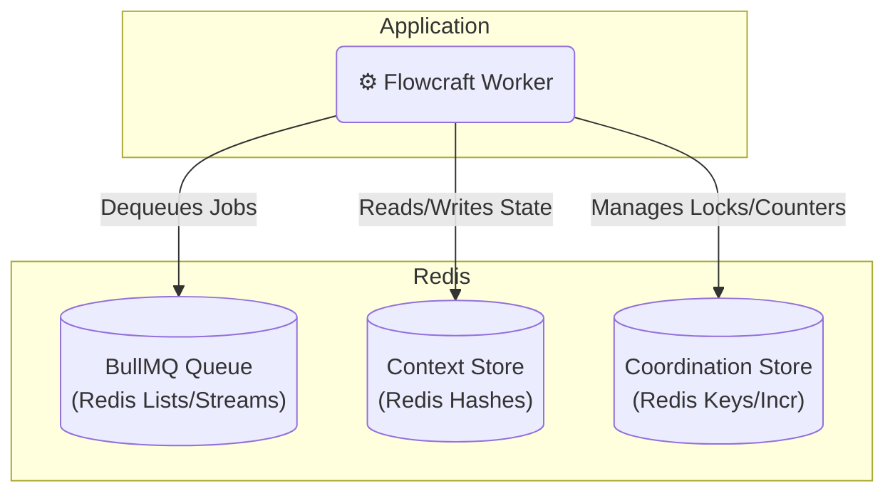

# Adapter: BullMQ (Redis)

[](https://www.npmjs.com/package/@flowcraft/bullmq-adapter)

The BullMQ adapter is a robust, high-performance solution that leverages Redis for all distributed components: the job queue, the context store, and the coordination store. This makes it an excellent choice for its simplicity, efficiency, and the rich feature set provided by the battle-tested [BullMQ](https://bullmq.io/) library.

## Installation

You will need the adapter package, `bullmq`, and `ioredis`.

```bash
npm install @flowcraft/bullmq-adapter bullmq ioredis
```

## Architecture

This adapter uses Redis for all three distributed concerns, making for a streamlined and efficient setup.



## Usage

The following example shows how to configure and start a worker using the `BullMQAdapter`. The worker will automatically connect to the queue and begin processing jobs.

#### `worker.ts`
```typescript
import { BullMQAdapter, RedisContext, RedisCoordinationStore } from '@flowcraft/bullmq-adapter'
import IORedis from 'ioredis'
// Assume agentNodeRegistry and blueprints are loaded from your application's shared files.
import { agentNodeRegistry, blueprints } from './shared'

async function main() {
	console.log('--- Starting Flowcraft Worker (BullMQ) ---')

	// 1. Establish a connection to Redis. BullMQ and Flowcraft will share this.
	const redisConnection = new IORedis({
		maxRetriesPerRequest: null, // Recommended for long-running workers
	})

	// 2. Create the coordination store.
	const coordinationStore = new RedisCoordinationStore(redisConnection)

	// 3. Instantiate the adapter.
	const adapter = new BullMQAdapter({
		connection: redisConnection,
		queueName: 'flowcraft-job-queue', // Optional: defaults to 'flowcraft-queue'
		coordinationStore,
		runtimeOptions: {
			// Provide the runtime with the necessary node implementations and blueprints.
			registry: agentNodeRegistry,
			blueprints,
		},
	})

	// 4. Start the worker. It will now listen for and execute jobs.
	adapter.start()

	console.log('Worker is running. Waiting for jobs...')
}

main().catch(console.error)
```

## Key Components

-   **Job Queue**: Managed by BullMQ, which provides a reliable and feature-rich queueing system on top of Redis.
-   **Context Store**: The `RedisContext` class implements the `IAsyncContext` interface. It stores the state for each workflow run in a separate Redis Hash, ensuring data isolation.
-   **Coordination Store**: The `RedisCoordinationStore` uses atomic Redis commands like `INCR` and `SETNX` to safely manage distributed locks and counters for fan-in joins.
