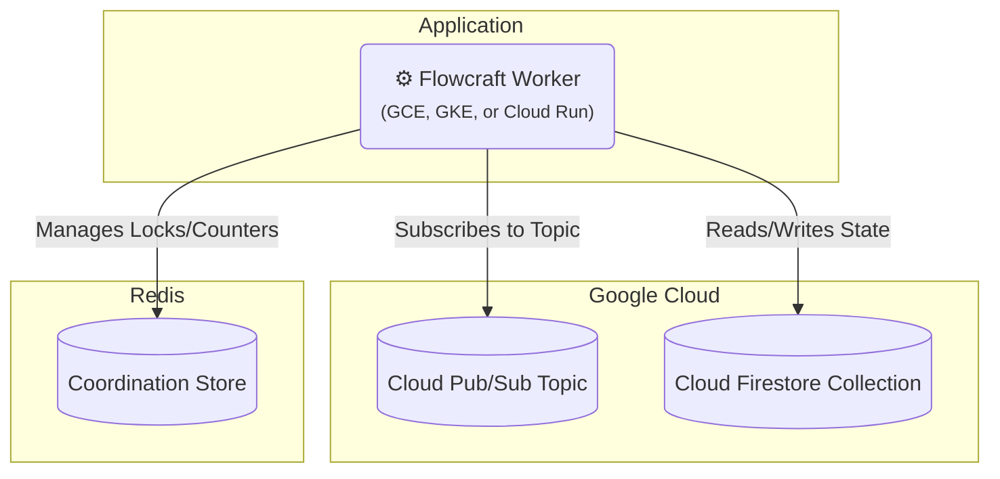

# Runtime Adapter: Google Cloud (Pub/Sub & Firestore)

[](https://www.npmjs.com/package/@flowcraft/gcp-adapter)

The Google Cloud adapter provides a fully native, serverless-friendly solution for running distributed workflows on GCP. It uses **Pub/Sub** for event-driven job queuing and **Firestore** for the context store. For the coordination store, it relies on Redis.

This is an ideal choice for applications built on the Google Cloud Platform.

## Installation

You will need the adapter package, the GCP clients, and `ioredis`.

```bash
npm install @flowcraft/gcp-adapter @google-cloud/pubsub @google-cloud/firestore ioredis
```

## Architecture

This adapter leverages native GCP services for the queue and context, with Redis handling coordination.



## Usage

The following example shows how to configure and start a worker using the `PubSubAdapter`.

#### `worker.ts`
```typescript
import { PubSubAdapter, RedisCoordinationStore } from '@flowcraft/gcp-adapter'
import { Firestore } from '@google-cloud/firestore'
import { PubSub } from '@google-cloud/pubsub'
import IORedis from 'ioredis'
// Assume agentNodeRegistry and blueprints are loaded from your application's shared files.
import { agentNodeRegistry, blueprints } from './shared'

async function main() {
	console.log('--- Starting Flowcraft Worker (GCP Pub/Sub) ---')

	const projectId = process.env.GCP_PROJECT_ID
	const redisUrl = process.env.REDIS_URL // e.g., 'redis://:password@host:port'

	// 1. Instantiate the GCP and Redis clients.
	// In a real environment, credentials will be picked up automatically from the environment.
	const pubsubClient = new PubSub({ projectId })
	const firestoreClient = new Firestore({ projectId })
	const redisConnection = new IORedis(redisUrl)

	// 2. Create the coordination store using Redis.
	const coordinationStore = new RedisCoordinationStore(redisConnection)

	// 3. Instantiate the adapter.
	const adapter = new PubSubAdapter({
		pubsubClient,
		firestoreClient,
		coordinationStore,
		topicName: 'flowcraft-jobs', // You must create this topic
		subscriptionName: 'flowcraft-workers', // You must create this subscription
		contextCollectionName: 'flowcraft-contexts',
		statusCollectionName: 'flowcraft-statuses',
		runtimeOptions: {
			registry: agentNodeRegistry,
			blueprints,
		},
	})

	// 4. Start the worker. It will begin listening for messages on the Pub/Sub subscription.
	adapter.start()

	console.log('Worker is running. Waiting for jobs...')
}

main().catch(console.error)
```

## Workflow Reconciliation

To enhance fault tolerance, the GCP adapter includes a utility for detecting and resuming stalled workflows. This is critical in production environments where workers might crash, leaving workflows in an incomplete state.

### How It Works

The reconciler queries the Firestore `statuses` collection for workflows that have a `status` of 'running' but whose `lastUpdated` timestamp is older than a configurable threshold. For each stalled run, it safely re-enqueues the next set of executable nodes. The adapter automatically maintains the `lastUpdated` timestamp on the status document.

### Reconciler Usage

A reconciliation process should be run periodically as a separate script or scheduled job (e.g., a cron job, Cloud Scheduler job targeting a Cloud Function, or a simple `setInterval`).

#### `reconcile.ts`
```typescript
import { createGcpReconciler } from '@flowcraft/gcp-adapter';

// Assume 'adapter' and 'firestoreClient' are initialized just like in your worker
const reconciler = createGcpReconciler({
  adapter,
  firestoreClient,
  statusCollectionName: 'flowcraft-statuses',
  stalledThresholdSeconds: 300, // 5 minutes
});

async function runReconciliation() {
  console.log('Starting reconciliation cycle...');
  const stats = await reconciler.run();
  console.log(`Reconciliation complete. Stalled: ${stats.stalledRuns}, Resumed: ${stats.reconciledRuns}, Failed: ${stats.failedRuns}`);
}

// Run this function on a schedule
runReconciliation();
```

The `run()` method returns a `ReconciliationStats` object:
-   `stalledRuns`: Number of workflows identified as stalled.
-   `reconciledRuns`: Number of workflows where at least one job was successfully re-enqueued.
-   `failedRuns`: Number of workflows where an error occurred during the reconciliation attempt.

## Key Components

-   **Job Queue**: Uses a Google Cloud Pub/Sub topic and subscription. The adapter is event-driven, listening for messages pushed from the subscription. It `acks` messages on success and `nacks` them on failure for redelivery.
-   **Context Store**: The `FirestoreContext` class stores the state for each workflow run as a separate document in a Firestore collection.
-   **Coordination Store**: The `RedisCoordinationStore` uses atomic Redis commands (`INCR`, `SETNX`) to manage distributed locks and counters for fan-in joins.
-   **Reconciler**: The `createGcpReconciler` factory provides a utility to find and resume stalled workflows.
