# Runtime Adapter: Google Cloud (Pub/Sub & Firestore)

[](https://www.npmjs.com/package/@flowcraft/gcp-adapter)

The Google Cloud adapter provides a fully native, serverless-friendly solution for running distributed workflows on GCP. It uses **Pub/Sub** for event-driven job queuing and **Firestore** for the context store. For the coordination store, it relies on Redis.

This is an ideal choice for applications built on the Google Cloud Platform.

## Installation

You will need the adapter package, the GCP clients, and `ioredis`.

```bash
npm install @flowcraft/gcp-adapter @google-cloud/pubsub @google-cloud/firestore ioredis
```

## Infrastructure Setup

Before running the adapter, you need to provision the following GCP resources:

- **Pub/Sub Topic**: For job publishing.
- **Pub/Sub Subscription**: For worker consumption.
- **Firestore Database**: With two collections for context and status storage.
- **Redis**: For coordination (can be Cloud Memorystore or external).

### Using gcloud CLI

1. Create Pub/Sub topic and subscription:
```bash
gcloud pubsub topics create flowcraft-jobs
gcloud pubsub subscriptions create flowcraft-workers --topic flowcraft-jobs
```

2. Enable Firestore (if not already enabled):
```bash
gcloud services enable firestore.googleapis.com
```

3. Create Firestore collections (manual via console or code; no CLI command for collections).

4. Create Cloud Memorystore for Redis:
```bash
gcloud redis instances create flowcraft-redis --size=1 --region=us-central1 --redis-version=redis_6_x
```

### Using Terraform

```hcl
resource "google_pubsub_topic" "flowcraft_jobs" {
  name = "flowcraft-jobs"
}

resource "google_pubsub_subscription" "flowcraft_workers" {
  name  = "flowcraft-workers"
  topic = google_pubsub_topic.flowcraft_jobs.name
}

resource "google_firestore_database" "database" {
  project     = var.project_id
  name        = "(default)"
  location_id = "nam5"
  type        = "FIRESTORE_NATIVE"
}

resource "google_redis_instance" "flowcraft_redis" {
  name           = "flowcraft-redis"
  memory_size_gb = 1
  region         = "us-central1"
  redis_version  = "REDIS_6_X"
}
```

Note: Firestore collections are created dynamically by the adapter.

## Architecture

This adapter leverages native GCP services for the queue and context, with Redis handling coordination.

```mermaid
graph TD
    subgraph "Application"
        Worker("⚙️ Flowcraft Worker<br><small>(GCE, GKE, or Cloud Run)</small>")
    end

    subgraph "Google Cloud"
        Queue[("Cloud Pub/Sub Topic")]
        State[("Cloud Firestore Collection")]
    end

    subgraph "Redis"
        Coordination[("Coordination Store")]
    end

    Worker -- "Subscribes to Topic" --> Queue
    Worker -- "Reads/Writes State" --> State
    Worker -- "Manages Locks/Counters" --> Coordination
```



## Usage

The following example shows how to configure and start a worker using the `PubSubAdapter`.

#### `worker.ts`
```typescript
import { PubSubAdapter, RedisCoordinationStore } from '@flowcraft/gcp-adapter'
import { Firestore } from '@google-cloud/firestore'
import { PubSub } from '@google-cloud/pubsub'
import IORedis from 'ioredis'
// Assume agentNodeRegistry and blueprints are loaded from your application's shared files.
import { agentNodeRegistry, blueprints } from './shared'

async function main() {
	console.log('--- Starting Flowcraft Worker (GCP Pub/Sub) ---')

	const projectId = process.env.GCP_PROJECT_ID
	const redisUrl = process.env.REDIS_URL // e.g., 'redis://:password@host:port'

	// 1. Instantiate the GCP and Redis clients.
	// In a real environment, credentials will be picked up automatically from the environment.
	const pubsubClient = new PubSub({ projectId })
	const firestoreClient = new Firestore({ projectId })
	const redisConnection = new IORedis(redisUrl)

	// 2. Create the coordination store using Redis.
	const coordinationStore = new RedisCoordinationStore(redisConnection)

	// 3. Instantiate the adapter.
	const adapter = new PubSubAdapter({
		pubsubClient,
		firestoreClient,
		coordinationStore,
		topicName: 'flowcraft-jobs', // You must create this topic
		subscriptionName: 'flowcraft-workers', // You must create this subscription
		contextCollectionName: 'flowcraft-contexts',
		statusCollectionName: 'flowcraft-statuses',
		runtimeOptions: {
			registry: agentNodeRegistry,
			blueprints,
		},
	})

	// 4. Start the worker. It will begin listening for messages on the Pub/Sub subscription.
	adapter.start()

	console.log('Worker is running. Waiting for jobs...')
}

main().catch(console.error)
```

## Client Usage

Once your worker is running, you'll need a way to start workflows. The following example shows how to publish the initial jobs for a workflow using the GCP adapter.

#### `client.ts`
```typescript
import { PubSubAdapter, RedisCoordinationStore } from '@flowcraft/gcp-adapter'
import { Firestore } from '@google-cloud/firestore'
import { PubSub } from '@google-cloud/pubsub'
import type { WorkflowResult } from 'flowcraft'
import { analyzeBlueprint } from 'flowcraft'
import IORedis from 'ioredis'
// Assume blueprints and config are loaded from your application's shared files.
import { blueprints, config } from './shared'
import 'dotenv/config'

const ACTIVE_USE_CASE = '4.content-moderation'

export async function waitForWorkflow(
	firestoreClient: Firestore,
	collectionName: string,
	runId: string,
	timeoutMs: number,
): Promise<{ status: string; payload?: WorkflowResult; reason?: string }> {
	const startTime = Date.now()

	console.log(`Awaiting result for Run ID ${runId} in Firestore collection: ${collectionName}`)

	while (Date.now() - startTime < timeoutMs) {
		try {
			const docRef = firestoreClient.collection(collectionName).doc(runId)
			const doc = await docRef.get()

			if (doc.exists && doc.data()?.status !== 'running') {
				const data = doc.data()!
				return {
					status: data.status,
					payload: data.status === 'completed' ? data.result : undefined,
					reason: data.reason,
				}
			}
		} catch (error) {
			console.error('Error checking workflow status:', error)
		}

		await new Promise((resolve) => setTimeout(resolve, 1000))
	}

	return {
		status: 'failed',
		reason: `Timeout: Client did not receive a result within ${timeoutMs}ms.`,
	}
}

async function main() {
	console.log('--- Distributed Workflow Client (GCP Pub/Sub) ---')

	const projectId = process.env.GCP_PROJECT_ID
	const runId = Math.floor(Math.random() * 1000000).toString()

	// 1. Instantiate the GCP and Redis clients (same as worker)
	const pubsubClient = new PubSub({ projectId })
	const firestoreClient = new Firestore({ projectId })
	const redisConnection = new IORedis(process.env.REDIS_URL)

	// 2. Create the coordination store using Redis (needed for status tracking)
	const coordinationStore = new RedisCoordinationStore(redisConnection)

	// 3. Get workflow configuration
	const useCase = config[ACTIVE_USE_CASE]
	const blueprint = blueprints[useCase.mainWorkflowId]

	const analysis = analyzeBlueprint(blueprint)
	const startNodeIds = analysis.startNodeIds
	const initialContextData = useCase.initialContext

	// 4. Set initial context in Firestore
	const contextsCollection = firestoreClient.collection('flowcraft-contexts')

	await contextsCollection.doc(runId).set({
		runId,
		context: initialContextData,
		createdAt: new Date().toISOString(),
	})

	// 5. Initialize workflow status in Firestore
	const statusesCollection = firestoreClient.collection('flowcraft-statuses')

	await statusesCollection.doc(runId).set({
		runId,
		status: 'running',
		lastUpdated: new Date().toISOString(),
	})

	// 6. Publish start jobs to Pub/Sub topic
	const topicName = 'flowcraft-jobs'
	const startJobs = startNodeIds.map((nodeId: any) =>
		JSON.stringify({
			runId,
			blueprintId: useCase.mainWorkflowId,
			nodeId,
		})
	)

	console.log(`🚀 Publishing ${startJobs.length} start job(s) for Run ID: ${runId}`)
	const publishPromises = startJobs.map(jobData =>
		pubsubClient.topic(topicName).publishMessage({ data: Buffer.from(jobData) })
	)
	await Promise.all(publishPromises)

	try {
		const finalStatus = await waitForWorkflow(firestoreClient, 'flowcraft-statuses', runId, 60000)
		console.log('\n=============================================================')

		switch (finalStatus.status) {
			case 'completed':
				console.log(`✅ Workflow Run ID: ${runId} COMPLETED.`)
				console.log('Final Output:', finalStatus.payload?.context?.moderation_result)
				break
			case 'cancelled':
				console.warn(`🛑 Workflow Run ID: ${runId} was successfully CANCELLED.`)
				console.log(`   Reason: ${finalStatus.reason}`)
				break
			case 'failed':
				console.error(`❌ Workflow Run ID: ${runId} FAILED or timed out.`)
				console.error(`   Reason: ${finalStatus.reason}`)
				break
		}
		console.log('=============================================================\n')
	} catch (error) {
		console.error(`Error waiting for workflow to complete for Run ID ${runId}`, error)
	}

	await redisConnection.quit()
}

main().catch(console.error)
```

This client example demonstrates how to:
- Set initial context data in Firestore
- Initialize workflow status tracking in Firestore
- Publish the initial jobs to Pub/Sub topic to start workflow execution
- Wait for workflow completion by polling the Firestore status collection

## Workflow Reconciliation

To enhance fault tolerance, the GCP adapter includes a utility for detecting and resuming stalled workflows. This is critical in production environments where workers might crash, leaving workflows in an incomplete state.

### How It Works

The reconciler queries the Firestore `statuses` collection for workflows that have a `status` of 'running' but whose `lastUpdated` timestamp is older than a configurable threshold. For each stalled run, it safely re-enqueues the next set of executable nodes. The adapter automatically maintains the `lastUpdated` timestamp on the status document.

### Reconciler Usage

A reconciliation process should be run periodically as a separate script or scheduled job (e.g., a cron job, Cloud Scheduler job targeting a Cloud Function, or a simple `setInterval`).

#### `reconcile.ts`
```typescript
import { createGcpReconciler } from '@flowcraft/gcp-adapter';

// Assume 'adapter' and 'firestoreClient' are initialized just like in your worker
const reconciler = createGcpReconciler({
  adapter,
  firestoreClient,
  statusCollectionName: 'flowcraft-statuses',
  stalledThresholdSeconds: 300, // 5 minutes
});

async function runReconciliation() {
  console.log('Starting reconciliation cycle...');
  const stats = await reconciler.run();
  console.log(`Reconciliation complete. Stalled: ${stats.stalledRuns}, Resumed: ${stats.reconciledRuns}, Failed: ${stats.failedRuns}`);
}

// Run this function on a schedule
runReconciliation();
```

The `run()` method returns a `ReconciliationStats` object:
-   `stalledRuns`: Number of workflows identified as stalled.
-   `reconciledRuns`: Number of workflows where at least one job was successfully re-enqueued.
-   `failedRuns`: Number of workflows where an error occurred during the reconciliation attempt.

## Key Components

-   **Job Queue**: Uses a Google Cloud Pub/Sub topic and subscription. The adapter is event-driven, listening for messages pushed from the subscription. It `acks` messages on success and `nacks` them on failure for redelivery.
-   **Context Store**: The `FirestoreContext` class stores the state for each workflow run as a separate document in a Firestore collection.
-   **Coordination Store**: The `RedisCoordinationStore` uses atomic Redis commands (`INCR`, `SETNX`) to manage distributed locks and counters for fan-in joins.
-   **Reconciler**: The `createGcpReconciler` factory provides a utility to find and resume stalled workflows.
