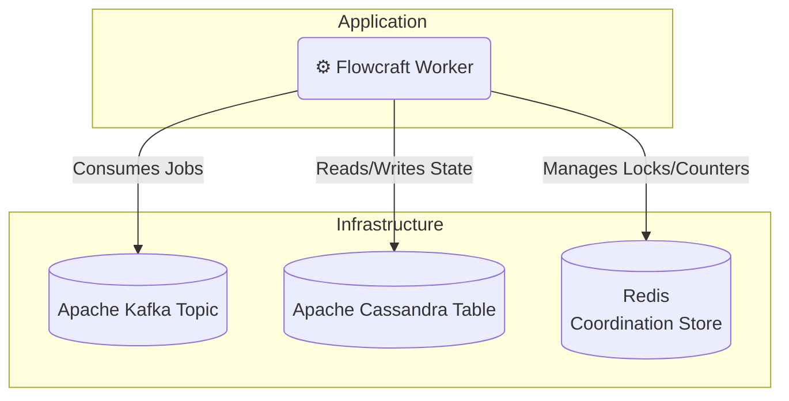

# Adapter: Kafka & Cassandra

[](https://www.npmjs.com/package/@flowcraft/kafka-adapter)

The Kafka and Cassandra adapter is designed for extreme scale and high-throughput scenarios. It uses **Apache Kafka** as a distributed streaming platform for the job queue and **Apache Cassandra** for a highly scalable, fault-tolerant context store. For the coordination store, it relies on Redis.

This stack is ideal for enterprise-grade, data-intensive applications that require massive ingestion rates and durability.

## Installation

You will need the adapter and clients for Kafka, Cassandra, and Redis.

```bash
npm install @flowcraft/kafka-adapter kafkajs cassandra-driver ioredis
```

## Architecture



## Usage

The following example shows how to configure and start a worker using the `KafkaAdapter`.

#### `worker.ts`
```typescript
import { CassandraContext, KafkaAdapter, RedisCoordinationStore } from '@flowcraft/kafka-adapter'
import { Client as CassandraClient } from 'cassandra-driver'
import IORedis from 'ioredis'
import { Kafka } from 'kafkajs'
// Assume agentNodeRegistry and blueprints are loaded from your application's shared files.
import { agentNodeRegistry, blueprints } from './shared'

async function main() {
	console.log('--- Starting Flowcraft Worker (Kafka/Cassandra) ---')

	// 1. Instantiate clients for your infrastructure.
	const kafka = new Kafka({
		clientId: 'flowcraft-worker-app',
		brokers: process.env.KAFKA_BROKERS.split(','), // e.g., ['kafka1:9092', 'kafka2:9092']
	})

	const cassandraClient = new CassandraClient({
		contactPoints: process.env.CASSANDRA_CONTACT_POINTS.split(','),
		localDataCenter: process.env.CASSANDRA_DATACENTER,
	})
	await cassandraClient.connect()

	const redisConnection = new IORedis(process.env.REDIS_URL)

	// 2. Create the coordination store.
	const coordinationStore = new RedisCoordinationStore(redisConnection)

	// 3. Instantiate the adapter.
	const adapter = new KafkaAdapter({
		kafka,
		cassandraClient,
		coordinationStore,
		topicName: 'flowcraft-jobs',
		groupId: 'flowcraft-worker-group',
		keyspace: 'flowcraft_ks', // You must create this keyspace
		contextTableName: 'contexts', // You must create this table
		statusTableName: 'statuses', // You must create this table
		runtimeOptions: {
			registry: agentNodeRegistry,
			blueprints,
		},
	})

	// 4. Start the worker. This connects the producer and consumer.
	adapter.start()

	console.log('Worker is running. Waiting for jobs...')
}

main().catch(console.error)
```

## Key Components

-   **Job Queue**: Uses an Apache Kafka topic. The adapter intelligently uses the `runId` as the message key, guaranteeing that all jobs for a single workflow execution are processed in order by the same consumer partition.
-   **Context Store**: The `CassandraContext` class stores state in a Cassandra table, partitioned by `runId` for fast, distributed reads and writes.
-   **Coordination Store**: The `RedisCoordinationStore` uses atomic Redis commands to manage fan-in joins.
