# Runtime Adapter: Kafka & Cassandra

[](https://www.npmjs.com/package/@flowcraft/kafka-adapter)

The Kafka and Cassandra adapter is designed for extreme scale and high-throughput scenarios. It uses **Apache Kafka** as a distributed streaming platform for the job queue and **Apache Cassandra** for a highly scalable, fault-tolerant context store. For the coordination store, it relies on Redis.

This stack is ideal for enterprise-grade, data-intensive applications that require massive ingestion rates and durability.

## Installation

You will need the adapter and clients for Kafka, Cassandra, and Redis.

```bash
npm install @flowcraft/kafka-adapter kafkajs cassandra-driver ioredis
```

## Infrastructure Setup

Before running the adapter, you need to set up the following components:

- **Kafka Topic**: For job streaming.
- **Cassandra Keyspace and Tables**: For context and status storage.
- **Redis**: For coordination.

### Using Docker Compose (Recommended for Development)

Create a `docker-compose.yml` file:

```yaml
version: '3.8'
services:
  kafka:
    image: confluentinc/cp-kafka:7.4.0
    hostname: kafka
    ports:
      - "9092:9092"
    environment:
      KAFKA_BROKER_ID: 1
      KAFKA_ZOOKEEPER_CONNECT: 'zookeeper:2181'
      KAFKA_LISTENER_SECURITY_PROTOCOL_MAP: PLAINTEXT:PLAINTEXT,PLAINTEXT_HOST:PLAINTEXT
      KAFKA_ADVERTISED_LISTENERS: PLAINTEXT://kafka:29092,PLAINTEXT_HOST://localhost:9092
      KAFKA_LISTENERS: PLAINTEXT://0.0.0.0:29092,PLAINTEXT_HOST://0.0.0.0:9092
      KAFKA_INTER_BROKER_LISTENER_NAME: PLAINTEXT
      KAFKA_OFFSETS_TOPIC_REPLICATION_FACTOR: 1
      KAFKA_GROUP_INITIAL_REBALANCE_DELAY_MS: 0
      KAFKA_CONFLUENT_METRICS_REPORTER_BOOTSTRAP_SERVERS: kafka:29092
      KAFKA_CONFLUENT_METRICS_REPORTER_TOPIC_REPLICAS: 1
      KAFKA_CONFLUENT_METRICS_ENABLE: 'true'
      KAFKA_CONFLUENT_SUPPORT_CUSTOMER_METRICS: 'true'
      KAFKA_AUTO_CREATE_TOPICS_ENABLE: 'true'
      KAFKA_JMX_PORT: 9101
      KAFKA_JMX_HOSTNAME: localhost
    depends_on:
      - zookeeper

  zookeeper:
    image: confluentinc/cp-zookeeper:7.4.0
    hostname: zookeeper
    ports:
      - "2181:2181"
    environment:
      ZOOKEEPER_CLIENT_PORT: 2181
      ZOOKEEPER_TICK_TIME: 2000

  cassandra:
    image: cassandra:4.1
    hostname: cassandra
    ports:
      - "9042:9042"
    environment:
      CASSANDRA_CLUSTER_NAME: flowcraft-cluster
      CASSANDRA_DC: datacenter1
      CASSANDRA_RACK: rack1

  redis:
    image: redis:7-alpine
    hostname: redis
    ports:
      - "6379:6379"
```

Run:
```bash
docker-compose up -d
```

Then, create the Kafka topic and Cassandra schema:

```bash
# Create Kafka topic
docker exec kafka kafka-topics --create --topic flowcraft-jobs --bootstrap-server localhost:9092 --partitions 1 --replication-factor 1

# Connect to Cassandra and create keyspace/tables
docker exec -it cassandra cqlsh -e "
CREATE KEYSPACE IF NOT EXISTS flowcraft_ks WITH REPLICATION = {'class': 'SimpleStrategy', 'replication_factor': 1};
USE flowcraft_ks;
CREATE TABLE contexts (runId text PRIMARY KEY, data text);
CREATE TABLE statuses (runId text PRIMARY KEY, status text, updated_at timestamp);
"
```

### Production Setup

For production, use managed services like Confluent Cloud for Kafka, DataStax Astra for Cassandra, and Redis Labs for Redis. Refer to their documentation for setup instructions.

## Architecture

```mermaid
graph TD
    subgraph "Application"
        Worker("⚙️ Flowcraft Worker")
    end

    subgraph "Infrastructure"
        Queue[("Apache Kafka Topic")]
        State[("Apache Cassandra Table")]
        Coordination[("Redis<br>Coordination Store")]
    end

    Worker -- "Consumes Jobs" --> Queue
    Worker -- "Reads/Writes State" --> State
    Worker -- "Manages Locks/Counters" --> Coordination
```



## Usage

The following example shows how to configure and start a worker using the `KafkaAdapter`.

#### `worker.ts`
```typescript
import { KafkaAdapter, RedisCoordinationStore } from '@flowcraft/kafka-adapter'
import { Client as CassandraClient } from 'cassandra-driver'
import IORedis from 'ioredis'
import { Kafka } from 'kafkajs'
// Assume agentNodeRegistry and blueprints are loaded from your application's shared files.
import { agentNodeRegistry, blueprints } from './shared'

async function main() {
	console.log('--- Starting Flowcraft Worker (Kafka/Cassandra) ---')

	// 1. Instantiate clients for your infrastructure.
	const kafka = new Kafka({
		clientId: 'flowcraft-worker-app',
		brokers: process.env.KAFKA_BROKERS.split(','), // e.g., ['kafka1:9092', 'kafka2:9092']
	})

	const cassandraClient = new CassandraClient({
		contactPoints: process.env.CASSANDRA_CONTACT_POINTS.split(','),
		localDataCenter: process.env.CASSANDRA_DATACENTER,
	})
	await cassandraClient.connect()

	const redisConnection = new IORedis(process.env.REDIS_URL)

	// 2. Create the coordination store.
	const coordinationStore = new RedisCoordinationStore(redisConnection)

	// 3. Instantiate the adapter.
	const adapter = new KafkaAdapter({
		kafka,
		cassandraClient,
		coordinationStore,
		topicName: 'flowcraft-jobs',
		groupId: 'flowcraft-worker-group',
		keyspace: 'flowcraft_ks', // You must create this keyspace
		contextTableName: 'contexts', // You must create this table
		statusTableName: 'statuses', // You must create this table
		runtimeOptions: {
			registry: agentNodeRegistry,
			blueprints,
		},
	})

	// 4. Start the worker. This connects the producer and consumer.
	adapter.start()

	console.log('Worker is running. Waiting for jobs...')
}

main().catch(console.error)
```

## Client Usage

Once your worker is running, you'll need a way to start workflows. The following example shows how to produce the initial jobs for a workflow using the Kafka adapter.

#### `client.ts`
```typescript
import { KafkaAdapter, RedisCoordinationStore } from '@flowcraft/kafka-adapter'
import { Client as CassandraClient } from 'cassandra-driver'
import type { WorkflowResult } from 'flowcraft'
import { analyzeBlueprint } from 'flowcraft'
import IORedis from 'ioredis'
import { Kafka, Producer } from 'kafkajs'
// Assume blueprints and config are loaded from your application's shared files.
import { blueprints, config } from './shared'
import 'dotenv/config'

const ACTIVE_USE_CASE = '4.content-moderation'

export async function waitForWorkflow(
	cassandraClient: CassandraClient,
	keyspace: string,
	tableName: string,
	runId: string,
	timeoutMs: number,
): Promise<{ status: string; payload?: WorkflowResult; reason?: string }> {
	const startTime = Date.now()

	console.log(`Awaiting result for Run ID ${runId} in Cassandra table: ${keyspace}.${tableName}`)

	while (Date.now() - startTime < timeoutMs) {
		try {
			const query = `SELECT status, result, reason FROM ${keyspace}.${tableName} WHERE runid = ?`
			const result = await cassandraClient.execute(query, [runId], { prepare: true })

			if (result.rows.length > 0 && result.rows[0].status !== 'running') {
				const row = result.rows[0]
				return {
					status: row.status,
					payload: row.status === 'completed' ? row.result : undefined,
					reason: row.reason,
				}
			}
		} catch (error) {
			console.error('Error checking workflow status:', error)
		}

		await new Promise((resolve) => setTimeout(resolve, 1000))
	}

	return {
		status: 'failed',
		reason: `Timeout: Client did not receive a result within ${timeoutMs}ms.`,
	}
}

async function main() {
	console.log('--- Distributed Workflow Client (Kafka/Cassandra) ---')

	const runId = Math.floor(Math.random() * 1000000).toString()

	// 1. Instantiate clients for your infrastructure (same as worker)
	const kafka = new Kafka({
		clientId: 'flowcraft-client-app',
		brokers: process.env.KAFKA_BROKERS.split(','), // e.g., ['kafka1:9092', 'kafka2:9092']
	})

	const cassandraClient = new CassandraClient({
		contactPoints: process.env.CASSANDRA_CONTACT_POINTS.split(','),
		localDataCenter: process.env.CASSANDRA_DATACENTER,
	})
	await cassandraClient.connect()

	const redisConnection = new IORedis(process.env.REDIS_URL)

	// 2. Create the coordination store using Redis (needed for status tracking)
	const coordinationStore = new RedisCoordinationStore(redisConnection)

	// 3. Get workflow configuration
	const useCase = config[ACTIVE_USE_CASE]
	const blueprint = blueprints[useCase.mainWorkflowId]

	const analysis = analyzeBlueprint(blueprint)
	const startNodeIds = analysis.startNodeIds
	const initialContextData = useCase.initialContext

	// 4. Set initial context in Cassandra
	const insertContextQuery = `INSERT INTO flowcraft_ks.contexts (runid, data) VALUES (?, ?)`
	await cassandraClient.execute(insertContextQuery, [runId, JSON.stringify(initialContextData)], { prepare: true })

	// 5. Initialize workflow status in Cassandra
	const insertStatusQuery = `INSERT INTO flowcraft_ks.statuses (runid, status, updated_at) VALUES (?, ?, ?)`
	await cassandraClient.execute(insertStatusQuery, [runId, 'running', new Date()], { prepare: true })

	// 6. Produce start jobs to Kafka topic
	const producer = kafka.producer()
	await producer.connect()

	const topicName = 'flowcraft-jobs'
	const startJobs = startNodeIds.map((nodeId: any) => ({
		key: runId, // Use runId as key for ordering
		value: JSON.stringify({
			runId,
			blueprintId: useCase.mainWorkflowId,
			nodeId,
		}),
	}))

	console.log(`🚀 Producing ${startJobs.length} start job(s) for Run ID: ${runId}`)
	await producer.send({
		topic: topicName,
		messages: startJobs,
	})

	await producer.disconnect()

	try {
		const finalStatus = await waitForWorkflow(cassandraClient, 'flowcraft_ks', 'statuses', runId, 60000)
		console.log('\n=============================================================')

		switch (finalStatus.status) {
			case 'completed':
				console.log(`✅ Workflow Run ID: ${runId} COMPLETED.`)
				console.log('Final Output:', finalStatus.payload?.context?.moderation_result)
				break
			case 'cancelled':
				console.warn(`🛑 Workflow Run ID: ${runId} was successfully CANCELLED.`)
				console.log(`   Reason: ${finalStatus.reason}`)
				break
			case 'failed':
				console.error(`❌ Workflow Run ID: ${runId} FAILED or timed out.`)
				console.error(`   Reason: ${finalStatus.reason}`)
				break
		}
		console.log('=============================================================\n')
	} catch (error) {
		console.error(`Error waiting for workflow to complete for Run ID ${runId}`, error)
	}

	await cassandraClient.shutdown()
	await redisConnection.quit()
}

main().catch(console.error)
```

This client example demonstrates how to:
- Set initial context data in Cassandra
- Initialize workflow status tracking in Cassandra
- Produce the initial jobs to Kafka topic to start workflow execution
- Wait for workflow completion by polling the Cassandra status table

## Workflow Reconciliation

To enhance fault tolerance, the Kafka adapter includes a utility for detecting and resuming stalled workflows. This is critical in production environments where workers might crash, leaving workflows in an incomplete state.

### How It Works

The reconciler queries the Cassandra `statuses` table for workflows that have a `status` of 'running' but whose `updated_at` timestamp is older than a configurable threshold. For each stalled run, it safely re-enqueues the next set of executable nodes. The adapter automatically maintains the `updated_at` timestamp in the status table.

> [!WARNING]
> The default query uses `ALLOW FILTERING`, which can be inefficient on large Cassandra tables. For production use, it is highly recommended to create a secondary index on the `status` column of your status table.

### Reconciler Usage

A reconciliation process should be run periodically as a separate script or scheduled job (e.g., a cron job or a simple `setInterval`).

#### `reconcile.ts`
```typescript
import { createKafkaReconciler } from '@flowcraft/kafka-adapter';

// Assume 'adapter' and 'cassandraClient' are initialized just like in your worker
const reconciler = createKafkaReconciler({
  adapter,
  cassandraClient,
  keyspace: 'flowcraft_ks',
  statusTableName: 'statuses',
  stalledThresholdSeconds: 300, // 5 minutes
});

async function runReconciliation() {
  console.log('Starting reconciliation cycle...');
  const stats = await reconciler.run();
  console.log(`Reconciliation complete. Stalled: ${stats.stalledRuns}, Resumed: ${stats.reconciledRuns}, Failed: ${stats.failedRuns}`);
}

// Run this function on a schedule
runReconciliation();
```

The `run()` method returns a `ReconciliationStats` object:
-   `stalledRuns`: Number of workflows identified as stalled.
-   `reconciledRuns`: Number of workflows where at least one job was successfully re-enqueued.
-   `failedRuns`: Number of workflows where an error occurred during the reconciliation attempt.

## Key Components

-   **Job Queue**: Uses an Apache Kafka topic. The adapter intelligently uses the `runId` as the message key, guaranteeing that all jobs for a single workflow execution are processed in order by the same consumer partition.
-   **Context Store**: The `CassandraContext` class stores state in a Cassandra table, partitioned by `runId` for fast, distributed reads and writes.
-   **Coordination Store**: The `RedisCoordinationStore` uses atomic Redis commands to manage fan-in joins.
-   **Reconciler**: The `createKafkaReconciler` factory provides a utility to find and resume stalled workflows.
