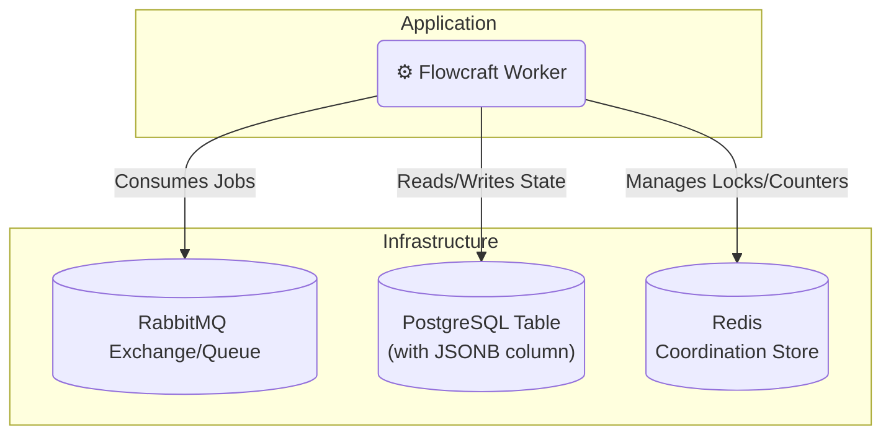

# Runtime Adapter: RabbitMQ & PostgreSQL

[](https://www.npmjs.com/package/@flowcraft/rabbitmq-adapter)

The RabbitMQ and PostgreSQL adapter is a classic, highly reliable combination for building distributed systems. It uses **RabbitMQ** as a powerful and flexible message broker and **PostgreSQL** for a durable, transactional context store. For the coordination store, it relies on Redis.

This stack is a popular and robust choice for a wide variety of on-premise and cloud deployments.

## Installation

You will need the adapter, clients for RabbitMQ and Postgres, and `ioredis`.

```bash
npm install @flowcraft/rabbitmq-adapter amqplib pg ioredis
```

## Architecture



## Usage

The following example shows how to configure and start a worker using the `RabbitMqAdapter`.

#### `worker.ts`
```typescript
import { RabbitMqAdapter, RedisCoordinationStore } from '@flowcraft/rabbitmq-adapter'
import * as amqplib from 'amqplib'
import IORedis from 'ioredis'
import { Client as PgClient } from 'pg'
// Assume agentNodeRegistry and blueprints are loaded from your application's shared files.
import { agentNodeRegistry, blueprints } from './shared'

async function main() {
	console.log('--- Starting Flowcraft Worker (RabbitMQ/Postgres) ---')

	// 1. Establish connections to your infrastructure.
	const amqpConnection = await amqplib.connect(process.env.RABBITMQ_URL)
	const pgClient = new PgClient({ connectionString: process.env.POSTGRES_URL })
	await pgClient.connect()
	const redisConnection = new IORedis(process.env.REDIS_URL)

	// 2. Create the coordination store.
	const coordinationStore = new RedisCoordinationStore(redisConnection)

	// 3. Instantiate the adapter.
	const adapter = new RabbitMqAdapter({
		amqpConnection,
		pgClient,
		coordinationStore,
		queueName: 'flowcraft-jobs',
		contextTableName: 'flowcraft_contexts', // You must create this table
		statusTableName: 'flowcraft_statuses', // You must create this table
		runtimeOptions: {
			registry: agentNodeRegistry,
			blueprints,
		},
	})

	// 4. Start the worker. It will create a channel and begin consuming jobs.
	adapter.start()

	console.log('Worker is running. Waiting for jobs...')
}

main().catch(console.error)
```

## Workflow Reconciliation

To enhance fault tolerance, the RabbitMQ adapter includes a utility for detecting and resuming stalled workflows. This is critical in production environments where workers might crash, leaving workflows in an incomplete state.

### How It Works

The reconciler queries the PostgreSQL `statuses` table for workflows that have a `status` of 'running' but whose `updated_at` timestamp is older than a configurable threshold. For each stalled run, it safely re-enqueues the next set of executable nodes. The adapter automatically maintains the `updated_at` timestamp in the status table.

### Reconciler Usage

A reconciliation process should be run periodically as a separate script or scheduled job (e.g., a cron job or a simple `setInterval`).

#### `reconcile.ts`
```typescript
import { createRabbitMqReconciler } from '@flowcraft/rabbitmq-adapter';

// Assume 'adapter' and 'pgClient' are initialized just like in your worker
const reconciler = createRabbitMqReconciler({
  adapter,
  pgClient,
  statusTableName: 'flowcraft_statuses',
  stalledThresholdSeconds: 300, // 5 minutes
});

async function runReconciliation() {
  console.log('Starting reconciliation cycle...');
  const stats = await reconciler.run();
  console.log(`Reconciliation complete. Stalled: ${stats.stalledRuns}, Resumed: ${stats.reconciledRuns}, Failed: ${stats.failedRuns}`);
}

// Run this function on a schedule
runReconciliation();
```

The `run()` method returns a `ReconciliationStats` object:
-   `stalledRuns`: Number of workflows identified as stalled.
-   `reconciledRuns`: Number of workflows where at least one job was successfully re-enqueued.
-   `failedRuns`: Number of workflows where an error occurred during the reconciliation attempt.

## Key Components

-   **Job Queue**: Uses a durable RabbitMQ queue. The adapter uses message acknowledgments (`ack`/`nack`) to ensure jobs are not lost if a worker fails.
-   **Context Store**: The `PostgresContext` class stores the state for each workflow run as a row in a PostgreSQL table, using an efficient `JSONB` column.
-   **Coordination Store**: The `RedisCoordinationStore` uses atomic Redis commands to safely manage fan-in joins.
-   **Reconciler**: The `createRabbitMqReconciler` factory provides a utility to find and resume stalled workflows.
