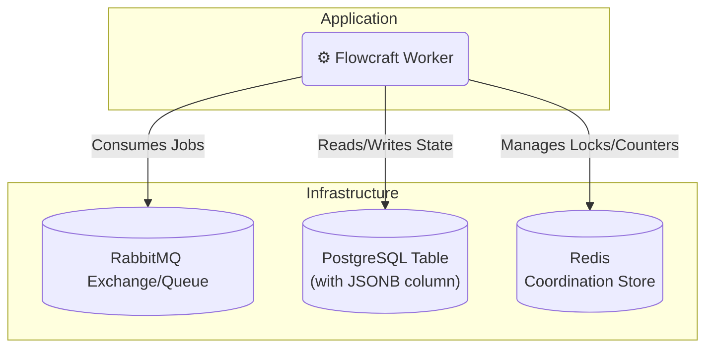

# Runtime Adapter: RabbitMQ & PostgreSQL

[](https://www.npmjs.com/package/@flowcraft/rabbitmq-adapter)

The RabbitMQ and PostgreSQL adapter is a classic, highly reliable combination for building distributed systems. It uses **RabbitMQ** as a powerful and flexible message broker and **PostgreSQL** for a durable, transactional context store. For the coordination store, it relies on Redis.

This stack is a popular and robust choice for a wide variety of on-premise and cloud deployments.

## Installation

You will need the adapter, clients for RabbitMQ and Postgres, and `ioredis`.

```bash
npm install @flowcraft/rabbitmq-adapter amqplib pg ioredis
```

## Architecture



## Usage

The following example shows how to configure and start a worker using the `RabbitMqAdapter`.

#### `worker.ts`
```typescript
import { PostgresContext, RabbitMqAdapter, RedisCoordinationStore } from '@flowcraft/rabbitmq-adapter'
import * as amqplib from 'amqplib'
import IORedis from 'ioredis'
import { Client as PgClient } from 'pg'
// Assume agentNodeRegistry and blueprints are loaded from your application's shared files.
import { agentNodeRegistry, blueprints } from './shared'

async function main() {
	console.log('--- Starting Flowcraft Worker (RabbitMQ/Postgres) ---')

	// 1. Establish connections to your infrastructure.
	const amqpConnection = await amqplib.connect(process.env.RABBITMQ_URL)
	const pgClient = new PgClient({ connectionString: process.env.POSTGRES_URL })
	await pgClient.connect()
	const redisConnection = new IORedis(process.env.REDIS_URL)

	// 2. Create the coordination store.
	const coordinationStore = new RedisCoordinationStore(redisConnection)

	// 3. Instantiate the adapter.
	const adapter = new RabbitMqAdapter({
		amqpConnection,
		pgClient,
		coordinationStore,
		queueName: 'flowcraft-jobs',
		contextTableName: 'flowcraft_contexts', // You must create this table
		statusTableName: 'flowcraft_statuses', // You must create this table
		runtimeOptions: {
			registry: agentNodeRegistry,
			blueprints,
		},
	})

	// 4. Start the worker. It will create a channel and begin consuming jobs.
	adapter.start()

	console.log('Worker is running. Waiting for jobs...')
}

main().catch(console.error)
```

## Key Components

-   **Job Queue**: Uses a durable RabbitMQ queue. The adapter uses message acknowledgments (`ack`/`nack`) to ensure jobs are not lost if a worker fails.
-   **Context Store**: The `PostgresContext` class stores the state for each workflow run as a row in a PostgreSQL table, using an efficient `JSONB` column.
-   **Coordination Store**: The `RedisCoordinationStore` uses atomic Redis commands to safely manage fan-in joins.
