# Runtime Adapter: RabbitMQ & PostgreSQL

[](https://www.npmjs.com/package/@flowcraft/rabbitmq-adapter)

The RabbitMQ and PostgreSQL adapter is a classic, highly reliable combination for building distributed systems. It uses **RabbitMQ** as a powerful and flexible message broker and **PostgreSQL** for a durable, transactional context store. For the coordination store, it relies on Redis.

This stack is a popular and robust choice for a wide variety of on-premise and cloud deployments.

## Installation

You will need the adapter, clients for RabbitMQ and Postgres, and `ioredis`.

```bash
npm install @flowcraft/rabbitmq-adapter amqplib pg ioredis
```

## Infrastructure Setup

Before running the adapter, you need to set up the following components:

- **RabbitMQ Queue**: For job queuing.
- **PostgreSQL Tables**: For context and status storage.
- **Redis**: For coordination.

### Using Docker Compose (Recommended for Development)

Create a `docker-compose.yml` file:

```yaml
version: '3.8'
services:
  rabbitmq:
    image: rabbitmq:3-management-alpine
    hostname: rabbitmq
    ports:
      - "5672:5672"
      - "15672:15672"  # Management UI
    environment:
      RABBITMQ_DEFAULT_USER: admin
      RABBITMQ_DEFAULT_PASS: admin123

  postgres:
    image: postgres:15-alpine
    hostname: postgres
    ports:
      - "5432:5432"
    environment:
      POSTGRES_DB: flowcraft
      POSTGRES_USER: flowcraft
      POSTGRES_PASSWORD: password123

  redis:
    image: redis:7-alpine
    hostname: redis
    ports:
      - "6379:6379"
```

Run:
```bash
docker-compose up -d
```

Then, create the PostgreSQL tables:

```bash
# Connect to PostgreSQL and create tables
docker exec -it postgres psql -U flowcraft -d flowcraft -c "
CREATE TABLE flowcraft_contexts (runId VARCHAR PRIMARY KEY, data JSONB);
CREATE TABLE flowcraft_statuses (runId VARCHAR PRIMARY KEY, status VARCHAR, updated_at TIMESTAMP);
"
```

### Production Setup

For production, use managed services like Amazon RDS for PostgreSQL, Amazon MQ or CloudAMQP for RabbitMQ, and Redis Labs for Redis. Refer to their documentation for setup instructions.

## Architecture

```mermaid
graph TD
    subgraph "Application"
        Worker("⚙️ Flowcraft Worker")
    end

    subgraph "Infrastructure"
        Queue[("RabbitMQ Exchange/Queue")]
        State[("PostgreSQL Table<br>(with JSONB column)")]
        Coordination[("Redis<br>Coordination Store")]
    end

    Worker -- "Consumes Jobs" --> Queue
    Worker -- "Reads/Writes State" --> State
    Worker -- "Manages Locks/Counters" --> Coordination
```



## Usage

The following example shows how to configure and start a worker using the `RabbitMqAdapter`.

#### `worker.ts`
```typescript
import { RabbitMqAdapter, RedisCoordinationStore } from '@flowcraft/rabbitmq-adapter'
import * as amqplib from 'amqplib'
import IORedis from 'ioredis'
import { Client as PgClient } from 'pg'
// Assume agentNodeRegistry and blueprints are loaded from your application's shared files.
import { agentNodeRegistry, blueprints } from './shared'

async function main() {
	console.log('--- Starting Flowcraft Worker (RabbitMQ/Postgres) ---')

	// 1. Establish connections to your infrastructure.
	const amqpConnection = await amqplib.connect(process.env.RABBITMQ_URL)
	const pgClient = new PgClient({ connectionString: process.env.POSTGRES_URL })
	await pgClient.connect()
	const redisConnection = new IORedis(process.env.REDIS_URL)

	// 2. Create the coordination store.
	const coordinationStore = new RedisCoordinationStore(redisConnection)

	// 3. Instantiate the adapter.
	const adapter = new RabbitMqAdapter({
		amqpConnection,
		pgClient,
		coordinationStore,
		queueName: 'flowcraft-jobs',
		contextTableName: 'flowcraft_contexts', // You must create this table
		statusTableName: 'flowcraft_statuses', // You must create this table
		runtimeOptions: {
			registry: agentNodeRegistry,
			blueprints,
		},
	})

	// 4. Start the worker. It will create a channel and begin consuming jobs.
	adapter.start()

	console.log('Worker is running. Waiting for jobs...')
}

main().catch(console.error)
```

## Client Usage

Once your worker is running, you'll need a way to start workflows. The following example shows how to publish the initial jobs for a workflow using the RabbitMQ adapter.

#### `client.ts`
```typescript
import { RabbitMqAdapter, RedisCoordinationStore } from '@flowcraft/rabbitmq-adapter'
import * as amqplib from 'amqplib'
import type { WorkflowResult } from 'flowcraft'
import { analyzeBlueprint } from 'flowcraft'
import IORedis from 'ioredis'
import { Client as PgClient } from 'pg'
// Assume blueprints and config are loaded from your application's shared files.
import { blueprints, config } from './shared'
import 'dotenv/config'

const ACTIVE_USE_CASE = '4.content-moderation'

export async function waitForWorkflow(
	pgClient: PgClient,
	tableName: string,
	runId: string,
	timeoutMs: number,
): Promise<{ status: string; payload?: WorkflowResult; reason?: string }> {
	const startTime = Date.now()

	console.log(`Awaiting result for Run ID ${runId} in PostgreSQL table: ${tableName}`)

	while (Date.now() - startTime < timeoutMs) {
		try {
			const result = await pgClient.query(
				`SELECT status, result, reason FROM ${tableName} WHERE "runId" = $1`,
				[runId]
			)

			if (result.rows.length > 0 && result.rows[0].status !== 'running') {
				const row = result.rows[0]
				return {
					status: row.status,
					payload: row.status === 'completed' ? row.result : undefined,
					reason: row.reason,
				}
			}
		} catch (error) {
			console.error('Error checking workflow status:', error)
		}

		await new Promise((resolve) => setTimeout(resolve, 1000))
	}

	return {
		status: 'failed',
		reason: `Timeout: Client did not receive a result within ${timeoutMs}ms.`,
	}
}

async function main() {
	console.log('--- Distributed Workflow Client (RabbitMQ/Postgres) ---')

	const runId = Math.floor(Math.random() * 1000000).toString()

	// 1. Establish connections to your infrastructure (same as worker)
	const amqpConnection = await amqplib.connect(process.env.RABBITMQ_URL)
	const pgClient = new PgClient({ connectionString: process.env.POSTGRES_URL })
	await pgClient.connect()
	const redisConnection = new IORedis(process.env.REDIS_URL)

	// 2. Create the coordination store using Redis (needed for status tracking)
	const coordinationStore = new RedisCoordinationStore(redisConnection)

	// 3. Get workflow configuration
	const useCase = config[ACTIVE_USE_CASE]
	const blueprint = blueprints[useCase.mainWorkflowId]

	const analysis = analyzeBlueprint(blueprint)
	const startNodeIds = analysis.startNodeIds
	const initialContextData = useCase.initialContext

	// 4. Set initial context in PostgreSQL
	await pgClient.query(
		'INSERT INTO flowcraft_contexts ("runId", data) VALUES ($1, $2)',
		[runId, JSON.stringify(initialContextData)]
	)

	// 5. Initialize workflow status in PostgreSQL
	await pgClient.query(
		'INSERT INTO flowcraft_statuses ("runId", status, updated_at) VALUES ($1, $2, $3)',
		[runId, 'running', new Date()]
	)

	// 6. Publish start jobs to RabbitMQ queue
	const channel = await amqpConnection.createChannel()
	const queueName = 'flowcraft-jobs'

	await channel.assertQueue(queueName, { durable: true })

	const startJobs = startNodeIds.map((nodeId: any) =>
		JSON.stringify({
			runId,
			blueprintId: useCase.mainWorkflowId,
			nodeId,
		})
	)

	console.log(`🚀 Publishing ${startJobs.length} start job(s) for Run ID: ${runId}`)
	for (const jobData of startJobs) {
		channel.sendToQueue(queueName, Buffer.from(jobData), { persistent: true })
	}

	await channel.close()

	try {
		const finalStatus = await waitForWorkflow(pgClient, 'flowcraft_statuses', runId, 60000)
		console.log('\n=============================================================')

		switch (finalStatus.status) {
			case 'completed':
				console.log(`✅ Workflow Run ID: ${runId} COMPLETED.`)
				console.log('Final Output:', finalStatus.payload?.context?.moderation_result)
				break
			case 'cancelled':
				console.warn(`🛑 Workflow Run ID: ${runId} was successfully CANCELLED.`)
				console.log(`   Reason: ${finalStatus.reason}`)
				break
			case 'failed':
				console.error(`❌ Workflow Run ID: ${runId} FAILED or timed out.`)
				console.error(`   Reason: ${finalStatus.reason}`)
				break
		}
		console.log('=============================================================\n')
	} catch (error) {
		console.error(`Error waiting for workflow to complete for Run ID ${runId}`, error)
	}

	await amqpConnection.close()
	await pgClient.end()
	await redisConnection.quit()
}

main().catch(console.error)
```

This client example demonstrates how to:
- Set initial context data in PostgreSQL
- Initialize workflow status tracking in PostgreSQL
- Publish the initial jobs to RabbitMQ queue to start workflow execution
- Wait for workflow completion by polling the PostgreSQL status table

## Workflow Reconciliation

To enhance fault tolerance, the RabbitMQ adapter includes a utility for detecting and resuming stalled workflows. This is critical in production environments where workers might crash, leaving workflows in an incomplete state.

### How It Works

The reconciler queries the PostgreSQL `statuses` table for workflows that have a `status` of 'running' but whose `updated_at` timestamp is older than a configurable threshold. For each stalled run, it safely re-enqueues the next set of executable nodes. The adapter automatically maintains the `updated_at` timestamp in the status table.

### Reconciler Usage

A reconciliation process should be run periodically as a separate script or scheduled job (e.g., a cron job or a simple `setInterval`).

#### `reconcile.ts`
```typescript
import { createRabbitMqReconciler } from '@flowcraft/rabbitmq-adapter';

// Assume 'adapter' and 'pgClient' are initialized just like in your worker
const reconciler = createRabbitMqReconciler({
  adapter,
  pgClient,
  statusTableName: 'flowcraft_statuses',
  stalledThresholdSeconds: 300, // 5 minutes
});

async function runReconciliation() {
  console.log('Starting reconciliation cycle...');
  const stats = await reconciler.run();
  console.log(`Reconciliation complete. Stalled: ${stats.stalledRuns}, Resumed: ${stats.reconciledRuns}, Failed: ${stats.failedRuns}`);
}

// Run this function on a schedule
runReconciliation();
```

The `run()` method returns a `ReconciliationStats` object:
-   `stalledRuns`: Number of workflows identified as stalled.
-   `reconciledRuns`: Number of workflows where at least one job was successfully re-enqueued.
-   `failedRuns`: Number of workflows where an error occurred during the reconciliation attempt.

## Key Components

-   **Job Queue**: Uses a durable RabbitMQ queue. The adapter uses message acknowledgments (`ack`/`nack`) to ensure jobs are not lost if a worker fails.
-   **Context Store**: The `PostgresContext` class stores the state for each workflow run as a row in a PostgreSQL table, using an efficient `JSONB` column.
-   **Coordination Store**: The `RedisCoordinationStore` uses atomic Redis commands to safely manage fan-in joins.
-   **Reconciler**: The `createRabbitMqReconciler` factory provides a utility to find and resume stalled workflows.
