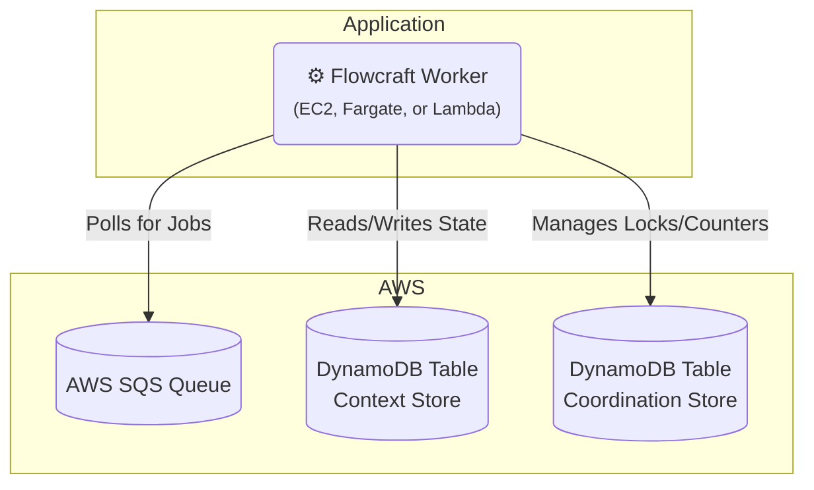

# Runtime Adapter: AWS (SQS & DynamoDB)

[](https://www.npmjs.com/package/@flowcraft/sqs-adapter)

The AWS adapter provides a fully native, serverless-friendly solution for running distributed workflows on Amazon Web Services. It uses **SQS** for job queuing and **DynamoDB** for both the context store and the coordination store.

This is an excellent choice for applications already deployed on AWS, as it requires no additional infrastructure management.

## Installation

You will need the adapter package and the relevant AWS SDK v3 clients.

```bash
npm install @flowcraft/sqs-adapter @aws-sdk/client-sqs @aws-sdk/client-dynamodb @aws-sdk/util-dynamodb
```

## Architecture

This adapter leverages native AWS services for all distributed concerns.



## Usage

The following example shows how to configure and start a worker using the `SqsAdapter`.

#### `worker.ts`
```typescript
import { DynamoDBClient } from '@aws-sdk/client-dynamodb'
import { SQSClient } from '@aws-sdk/client-sqs'
import { DynamoDbContext, DynamoDbCoordinationStore, SqsAdapter } from '@flowcraft/sqs-adapter'
// Assume agentNodeRegistry and blueprints are loaded from your application's shared files.
import { agentNodeRegistry, blueprints } from './shared'

async function main() {
	console.log('--- Starting Flowcraft Worker (AWS SQS/DynamoDB) ---')

	const region = process.env.AWS_REGION || 'us-east-1'

	// 1. Instantiate the AWS SDK clients.
	// In a real environment, credentials will be picked up automatically
	// from IAM roles or environment variables.
	const sqsClient = new SQSClient({ region })
	const dynamoDbClient = new DynamoDBClient({ region })

	// 2. Create the coordination store using DynamoDB for atomic operations.
	const coordinationStore = new DynamoDbCoordinationStore({
		client: dynamoDbClient,
		tableName: 'flowcraft-coordination', // You must create this table
	})

	// 3. Instantiate the adapter.
	const adapter = new SqsAdapter({
		sqsClient,
		dynamoDbClient,
		queueUrl: process.env.SQS_QUEUE_URL, // e.g., 'https://sqs.us-east-1.amazonaws.com/123456789012/flowcraft-jobs'
		contextTableName: 'flowcraft-contexts', // You must create this table
		statusTableName: 'flowcraft-statuses', // You must create this table
		coordinationStore,
		runtimeOptions: {
			registry: agentNodeRegistry,
			blueprints,
		},
	})

	// 4. Start the worker. It will begin long-polling SQS for jobs.
	adapter.start()

	console.log('Worker is running. Waiting for jobs...')
}

main().catch(console.error)
```

## Key Components

-   **Job Queue**: Uses an AWS SQS queue. The adapter polls for messages and deletes them upon successful processing.
-   **Context Store**: The `DynamoDbContext` class stores the state for each workflow run as a single item in a DynamoDB table, using the `runId` as the partition key.
-   **Coordination Store**: The `DynamoDbCoordinationStore` is a powerful, Redis-free implementation that uses DynamoDB's atomic counters and conditional expressions to safely manage distributed locks and fan-in joins.
