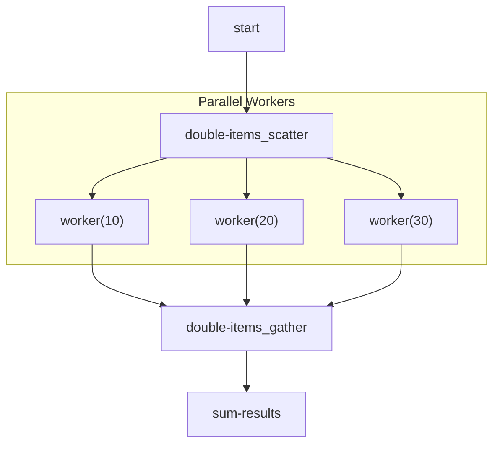

# Advanced Patterns: Batch Processing

A common workflow requirement is to perform the same operation on every item in a collection, often in parallel to save time. This is known as the **scatter-gather** pattern. Flowcraft provides a high-level `.batch()` method on the `Flow` builder to make this easy.

### The `.batch()` Method

The `.batch()` method automatically creates the necessary nodes and logic to:
1.	**Scatter**: Take an array from the context.
2.	**Process**: Schedule a dynamic "worker" node for each item in the array, running them in parallel.
3.	**Gather**: Wait for all worker nodes to complete and collect their results into a new array.

Here's the method signature:
```typescript
flow.batch(
	id: string, // A base ID for the batch operation
	worker: NodeFunction | NodeClass, // The implementation for the worker node
	options: {
		inputKey: string, // The context key holding the source array
		outputKey: string, // The context key where the results array will be saved
	}
)
```

### Example: Processing an Array in Parallel

Let's create a workflow that takes an array of numbers, doubles each one in parallel, and then sums the results.

```typescript
import { createFlow } from 'flowcraft';

const flow = createFlow("batch-workflow")
	// 1. Start node provides the initial array.
	.node("start", async () => ({ output: }))

	// 2. Define the batch operation.
	.batch("double-items",
		// This worker function will run for each item (10, 20, and 30).
		async ({ input }) => ({ output: input * 2 }),
		{
			inputKey: "start",		// Read the array from the output of the 'start' node.
			outputKey: "doubled",	// Save the results array to `context.doubled`.
		},
	)

	// 3. A final node runs after the batch is complete.
	.node("sum-results",
		// Its input is the array of results from the batch operation.
		async ({ input }) => {
			const sum = input.reduce((acc, val) => acc + val, 0); // 20 + 40 + 60 = 120
			return { output: sum };
		},
		{ inputs: "doubled" }, // Map the batch output to this node's input.
	)

	// 4. Wire the dependencies.
	// The output of 'start' goes to the scatter part of the batch.
	.edge("start", "double-items_scatter")
	// The output of the gather part of the batch goes to 'sum-results'.
	.edge("double-items_gather", "sum-results")
	.toBlueprint();
```

### How It Looks

Behind the scenes, `.batch()` creates a `scatter` and a `gather` node. The workflow graph looks like this:



The runtime dynamically creates and executes the worker nodes, providing a powerful and simple API for parallel processing.
