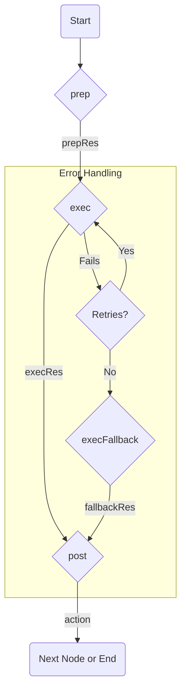

# Core Concepts

Flowcraft is built around a few simple, powerful concepts. Understanding these fundamentals will make it much easier to build, debug, and scale your workflows.

## 1. Node

The `Node` is the most fundamental building block, representing a single, reusable unit of work. Every task in your workflow, from calling an API to transforming data, is encapsulated within a `Node`.

### The Node Lifecycle

Every `Node` has a well-defined, three-phase lifecycle that separates concerns and promotes best practices.



1.  **`prep(args)`**: **Prepare Data**. This phase runs once. Its job is to gather all the data needed for execution, usually by reading from the `Context`. The result (`prepRes`) is passed to the `exec` phase.
2.  **`exec(args)`**: **Execute Core Logic**. This phase performs the main work. It is designed to be isolated and pure—it receives all its data from `prepRes` and should not interact with the `Context`. **This is the only phase that is retried on failure.**
3.  **`post(args)`**: **Process Results & Decide**. This phase runs once after a successful `exec` (or `execFallback`). Its job is to update the `Context` with the results and return an **action** string that determines which path the workflow should take next.

## 2. Flow

A `Flow` is a special type of `Node` that acts as a **container for a graph of other nodes**. It holds the starting point of a workflow and is responsible for orchestrating the execution of its graph.

You can think of a `Flow` as a "sub-workflow" or a "macro-node." Because it's a `Node` itself, a `Flow` can be nested inside another `Flow`, enabling powerful composition.

## 3. Context

The `Context` is the shared memory of a single workflow run. It's an object that is passed to every node, allowing them to share state and pass data to each other.

-   **Asynchronous by Default**: All context operations (`get`, `set`, etc.) are asynchronous and return `Promise`s. This is a core design principle that allows Flowcraft to support distributed state managers (like Redis) for multi-worker environments. You must always `await` context calls.
-   **Type-Safe**: You create `ContextKey`s to read and write from the context. This provides compile-time safety, preventing common bugs like typos or type mismatches.
-   **Mutable**: The context is mutable. Nodes read from it (usually in `prep`) and write back to it (usually in `post`).

```typescript
// Always use `await` when interacting with the context
const currentUser = await ctx.get(USER_KEY);
await ctx.set(RESULT_KEY, { data: '...' });
```

## 4. Action

An **action** is a `string` or `Symbol` returned by a node's `post()` method. The `Executor` uses this action to decide which path to take next in the workflow graph.

-   **`DEFAULT_ACTION`**: A special symbol used for simple linear sequences. `nodeA.next(nodeB)` is shorthand for creating a branch that triggers on `DEFAULT_ACTION`.
-   **Custom Actions**: Returning a custom string like `'success'` or `'error'` from `post()` enables conditional branching, allowing you to direct the workflow down different paths based on a node's outcome.

## 5. Executor

The **Executor** is the engine that runs a `Flow`. It is responsible for traversing the graph, calling each node's lifecycle methods in the correct order, applying middleware, and handling the actions returned by each node.

-   **`InMemoryExecutor`**: The default executor that runs your entire workflow in a single, in-memory process.
-   **Pluggable**: The executor is pluggable, meaning you can create your own to support different environments, like a distributed task queue system. This separation of concerns is what allows your core workflow logic to remain unchanged whether you're running it locally or on a fleet of servers.
