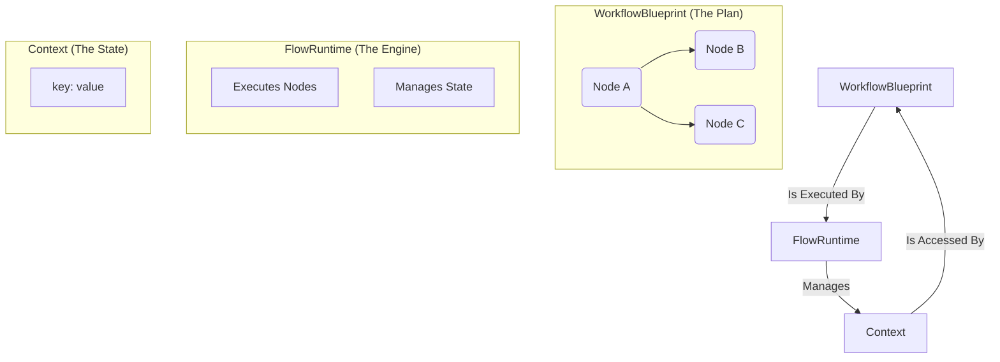

# Core Concepts

Flowcraft is built on a few simple but powerful concepts. Understanding them is key to building effective workflows.



### 1. Workflow Blueprint

A `WorkflowBlueprint` is a JSON-serializable object that declaratively defines your workflow's structure. It's the "data" part of the "functions as data" philosophy.

A blueprint consists of:
-   **`id`**: A unique identifier for the workflow.
-   **`nodes`**: An array of `NodeDefinition` objects, representing the tasks to be executed.
-   **`edges`**: An array of `EdgeDefinition` objects, defining the dependencies and data flow between nodes.

```typescript
interface WorkflowBlueprint {
	id: string
	nodes: NodeDefinition[]
	edges: EdgeDefinition[]
	metadata?: Record<string, any>
}
```

Because blueprints are just data, they can be stored as JSON, sent over a network, or generated dynamically.

### 2. Nodes

A node represents a single unit of work in your workflow. It encapsulates the logic you want to execute. Flowcraft supports two ways to define node logic:

-   **Function-based**: A simple `async` function that receives a `NodeContext` and returns a `NodeResult`. Ideal for simple, self-contained tasks.
-   **Class-based**: A class that extends `BaseNode`. This provides a more structured lifecycle (`prep`, `exec`, `post`, `fallback`), which is useful for complex logic, dependency injection, and testability.

### 3. Context

The `Context` is the shared state of a running workflow. It's a key-value store where nodes can read and write data. For example, an early node might fetch user data and save it to the context, allowing a later node to read that user data and perform an action.

Flowcraft provides two context interfaces:
-   **`ISyncContext`**: A high-performance, in-memory context used for local execution.
-   **`IAsyncContext`**: A promise-based interface designed for distributed systems where state might be stored in a remote database like Redis.

Nodes always interact with an `IAsyncContext` view, ensuring your business logic remains consistent whether you run locally or distributed.

### 4. Runtime

The `FlowRuntime` is the engine that executes a `WorkflowBlueprint`. It takes the blueprint and an initial context, then traverses the graph, executing each node in the correct order.

The runtime is responsible for:
-   Managing the workflow's state (the Context).
-   Handling retries and fallbacks.
-   Evaluating edge conditions to determine the next nodes to run.
-   Injecting dependencies and middleware.
-   Orchestrating both in-memory and distributed execution.
