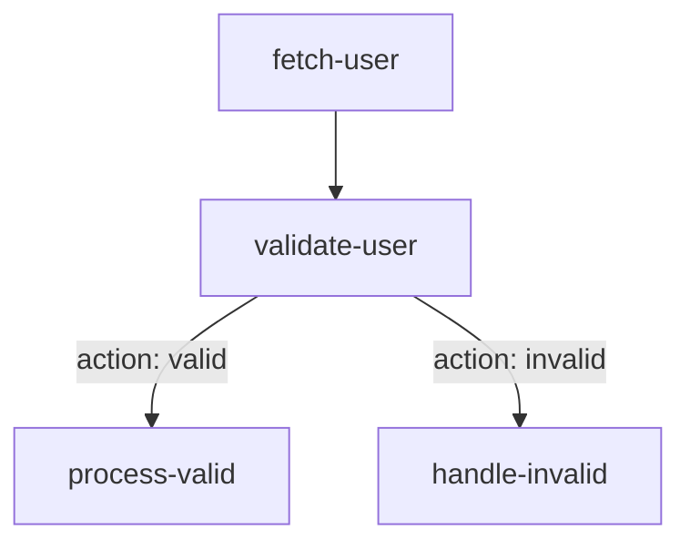

# Defining Workflows

Workflows are defined programmatically using the fluent `Flow` builder API. This provides a type-safe and intuitive way to construct your `WorkflowBlueprint`.

### Using `createFlow`

The entry point to the builder is the `createFlow` function. It takes a unique ID for your workflow and returns a `Flow` instance.

```typescript
import { createFlow } from 'flowcraft'

const flowBuilder = createFlow('my-first-workflow')
```

### Adding Nodes with `.node()`

You add tasks to your workflow using the `.node()` method. It takes three arguments:

1.  **`id`**: A unique string identifier for the node within the workflow.
2.  **`implementation`**: The logic for the node, which can be a `NodeFunction` or a `NodeClass`.
3.  **`options`** (optional): An object to configure the node's behavior.

```typescript
const flowBuilder = createFlow('user-processing')
	// A simple function-based node
	.node('fetch-user', async () => {
		const user = { id: 1, name: 'Alice' }
		return { output: user }
	})
	// A node with options
	.node('validate-user', async ({ input }) => {
		const isValid = input.name === 'Alice'
		return {
			output: isValid,
			action: isValid ? 'valid' : 'invalid'
		}
	}, {
		// This tells the runtime to provide the output of 'fetch-user'
		// as the 'input' for this node.
		inputs: 'fetch-user'
	})
```

### Adding Edges with `.edge()`

Edges define the dependencies and control flow between nodes. You create them with the `.edge()` method, specifying the `source` and `target` node IDs.

```typescript
const flowBuilder = createFlow('user-processing')
	.node('fetch-user', /* ... */)
	.node('validate-user', /* ... */)
	.node('process-valid', /* ... */)
	.node('handle-invalid', /* ... */)

	// Basic edge: runs 'validate-user' after 'fetch-user'
	.edge('fetch-user', 'validate-user')

	// Conditional edges based on the 'action' returned by 'validate-user'
	.edge('validate-user', 'process-valid', { action: 'valid' })
	.edge('validate-user', 'handle-invalid', { action: 'invalid' })
```

This workflow can be visualized as:



### Finalizing the Blueprint

Once your workflow is defined, call `.toBlueprint()` to get the serializable `WorkflowBlueprint` object. You will also need the function registry, which contains the node implementations.

```typescript
// Continuing from above...
const blueprint = flowBuilder.toBlueprint()
const functionRegistry = flowBuilder.getFunctionRegistry()

// Now you can pass these to the FlowRuntime
// const runtime = new FlowRuntime({ registry: functionRegistry });
// const result = await runtime.run(blueprint, {});
```
