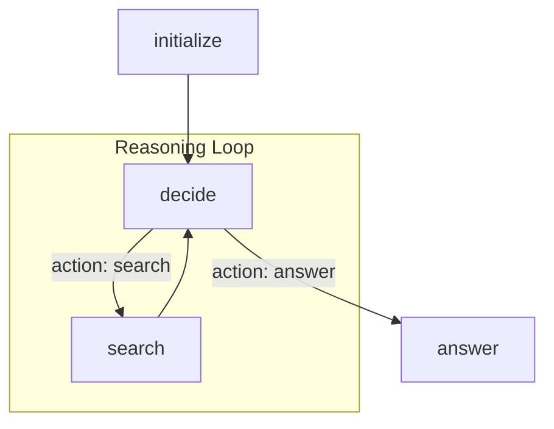

# Example: AI Agent Orchestration

Flowcraft excels at orchestrating multi-step AI processes, such as ReAct-style agents that can reason, act, and loop. This example demonstrates a simple research agent that can perform web searches to answer a question.

### The Goal

The agent will:
1.  Receive a question.
2.  **Decide** whether it has enough information to answer or if it needs to search the web.
3.  If it needs to search, it will formulate a query and **act** by calling a search tool.
4.  It will then loop back to the **decide** step with the new information.
5.  Once it decides it has enough information, it will generate a final answer.

### The Code

This example uses a `loop` and conditional `actions`.

```typescript
import { ConsoleLogger, createFlow, FlowRuntime, NodeContext, NodeResult } from 'flowcraft'
import yaml from 'yaml' // Using YAML for structured LLM output

// --- Mocks for LLM and Search Tool ---
async function mockLLM(prompt: string): Promise<any> {
	console.log(`\n[LLM Request]: ${prompt.substring(0, 100)}...`)
	if (prompt.includes('decide')) {
		if (prompt.includes('Nobel Prize')) {
			return `action: search\nreason: "The context is empty."\nsearch_query: "Nobel Prize in Physics 2024 winners"`
		}
		return `action: answer\nreason: "The context contains the answer."`
	}
	return 'Final answer based on context.'
}
async function mockSearch(query: string) { return `Search results for "${query}": John J. Hopfield and Geoffrey Hinton.` }

// --- Node Logic ---

// Decide node: The "brain" of the agent
async function decide(ctx: NodeContext): Promise<NodeResult> {
	const { question, search_context, loop_count } = await ctx.context.toJSON()
	const prompt = `Based on the question and context, decide whether to 'search' or 'answer'. Question: ${question}. Context: ${search_context}. Searches done: ${loop_count}.`
	const response = await mockLLM(prompt)
	const decision = yaml.parse(response)

	// Pass the search query to the next step via the context
	await ctx.context.set('current_query', decision.search_query)

	// Use an 'action' to control the workflow's path
	return { action: decision.action, output: decision }
}

// Search node: The "tool" of the agent
async function search(ctx: NodeContext): Promise<NodeResult> {
	const query = await ctx.context.get('current_query')
	const results = await mockSearch(query)
	const current_context = await ctx.context.get('search_context') || ''
	await ctx.context.set('search_context', `${current_context}\n${results}`)
	return { output: results }
}

// Answer node: The final output step
async function answer(ctx: NodeContext): Promise<NodeResult> {
	const { question, search_context } = await ctx.context.toJSON()
	const prompt = `Answer the question based on the context. Q: ${question}, C: ${search_context}`
	const finalAnswer = await mockLLM(prompt)
	return { output: finalAnswer }
}

// --- The Workflow Definition ---

const agentFlow = createFlow('research-agent')
	.node('initialize', async ({ context }) => {
		// Set up the initial state for the loop
		await context.set('search_context', '')
		await context.set('loop_count', 0)
	})
	.node('decide', decide, { config: { joinStrategy: 'any' } }) // 'any' allows re-execution
	.node('search', search)
	.node('answer', answer)

// The main loop
	.loop('research-loop', {
		startNodeId: 'decide',
		endNodeId: 'search', // The loop body includes 'decide' and 'search'
		condition: 'context.loop_count < 2 && last_action !== \'answer\'' // Exit condition
	})

// Edges
	.edge('initialize', 'decide')
	.edge('decide', 'search', { action: 'search' }) // Conditional path
	.edge('decide', 'answer', { action: 'answer' }) // Conditional path
	.edge('search', 'decide') // Loop back after searching
	.toBlueprint()

// --- Run the Agent ---
async function main() {
	const runtime = new FlowRuntime({
		logger: new ConsoleLogger(),
		registry: agentFlow.getFunctionRegistry()
	})

	const result = await runtime.run(
		agentFlow,
		{ question: 'Who won the Nobel Prize in Physics 2024?' }
	)
	console.log('\n--- Agent Finished ---')
	console.log('Final Answer:', result.context.answer)
}

main()
```

### Visualization

The agent's logic forms a loop, breaking out to the `answer` node when the `decide` node returns the `answer` action.



This pattern of using loops, conditional actions, and a shared context is fundamental to building powerful and autonomous AI agents with Flowcraft.
