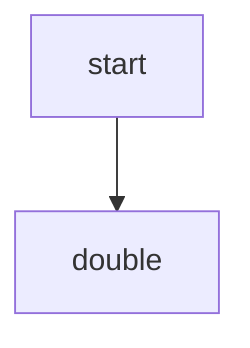

# Getting Started

This guide will walk you through installing Flowcraft and running your first workflow.

### Prerequisites

-   Node.js (version 18 or higher)
-   A package manager like npm, pnpm, or yarn
-   Basic knowledge of TypeScript

### Installation

Install Flowcraft into your project using your preferred package manager:

```bash
npm install flowcraft
```

### Your First Workflow

Let's create a simple workflow with two steps: one node to provide a starting number, and a second node to double it.

1.  Create a new file named `simple-flow.ts`.
2.  Add the following code:

```typescript
import { ConsoleLogger, createFlow, FlowRuntime } from 'flowcraft'

// 1. Define the workflow structure
const flow = createFlow('simple-workflow')
	// The first node, 'start', takes no input and outputs the number 42.
	.node('start', async () => ({ output: 42 }))
	// The second node, 'double', depends on 'start'.
	// Its input is automatically the output of its single predecessor.
	.node('double', async ({ input }) => ({ output: input * 2 }))
	// Define the dependency: 'start' must run before 'double'.
	.edge('start', 'double')
	// Finalize the definition into a serializable blueprint.
	.toBlueprint()

// 2. Set up the runtime
// The runtime needs the implementations of the nodes, which are
// collected by the flow builder.
const runtime = new FlowRuntime({
	logger: new ConsoleLogger(),
	registry: flow.getFunctionRegistry(),
})

// 3. Run the workflow
async function run() {
	// Start the workflow with an empty initial context.
	const result = await runtime.run(flow, {})

	console.log('Workflow Result:', result)
	// Expected Output:
	// {
	//   context: { start: 42, double: 84 },
	//   serializedContext: '{"start":42,"double":84}',
	//   status: 'completed'
	// }
}

run()
```

This workflow can be visualized as:



### Running the Example

Execute the file:
```bash
npx tsx simple-flow.ts
```

You should see the final workflow result logged to the console, showing that the `context` contains the output from both the `start` and `double` nodes.
