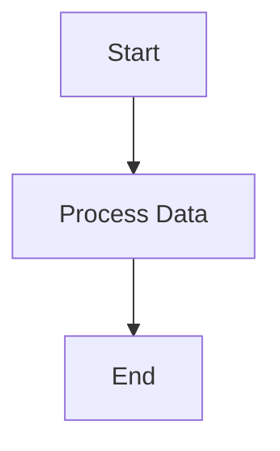

# What is Flowcraft?

**Flowcraft** is a lightweight, unopinionated, and progressively scalable runtime for executing declarative workflows defined as directed acyclic graphs (DAGs). It is designed to reliably orchestrate complex business processes, data pipelines, ETL workflows, or AI agent orchestrations with a focus on simplicity, portability, and extensibility.

A simple workflow might look like this:

### Core Philosophy

Unlike heavy platforms like Temporal or Airflow, or domain-specific libraries like LangChain, Flowcraft is a foundational engine that does one thing exceptionally well: **execute a graph of functions defined as data**. It provides a flexible, type-safe API to define workflows, execute them with resilience, and scale from in-memory scripts to distributed systems without changing the core business logic.

### Key Features

-   **Declarative Workflows**: Define workflows as serializable `WorkflowBlueprint` objects with nodes (tasks) and edges (dependencies).
-   **Unopinionated Logic**: Nodes can be simple functions or structured classes, supporting any logic (e.g., LLM calls, database queries, or data transformations).
-   **Progressive Scalability**: Run workflows in-memory for testing or scale to distributed systems using the same blueprint.
-   **Resilient Execution**: Built-in support for retries, fallbacks, timeouts, and graceful cancellation.
-   **Advanced Patterns**: Includes batch processing (scatter-gather) and loop constructs for complex workflows.
-   **Extensibility**: Pluggable loggers, evaluators, serializers, and middleware for custom behavior.
-   **Static Analysis**: Tools to detect cycles, validate blueprints, and generate Mermaid diagrams for visualization.
-   **Type-Safe API**: Fully typed with TypeScript for a robust developer experience.
