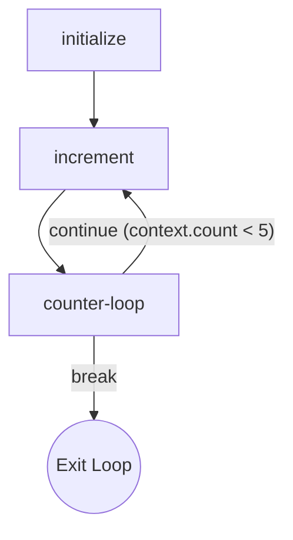

# Loops

For workflows that require iteration, the [`Flow`](/api/flow#flow-class) builder provides a [`.loop()`](/api/flow#loop-id-options) method. This allows you to execute a portion of your graph repeatedly until a condition is met.

## The `.loop()` Method

The [`.loop()`](/api/flow#loop-id-options) method creates a special `loop-controller` node that manages the iteration. After the last node in the loop body executes, the controller evaluates a condition to decide whether to run the loop again or exit.

Here's the method signature:
```typescript
flow.loop(
	id: string, // A unique ID for the loop construct
	options: {
		startNodeId: string, // The ID of the first node in the loop body
		endNodeId: string, // The ID of the last node in the loop body
		condition: string, // An expression to evaluate. If true, the loop continues.
	}
)
```

## Example: A Simple Counter

Let's build a workflow that increments a counter from 0 to 5.

```typescript
import { createFlow } from 'flowcraft'

const flow = createFlow('loop-workflow')
	// 1. Initialize the counter in the context before the loop starts.
	.node('initialize', async ({ context }) => {
		await context.set('count', 0)
		return { output: 'Initialized' }
	})

	// 2. This is the body of our loop. It reads, increments, and saves the counter.
	.node('increment', async ({ context }) => {
		const currentCount = await context.get('count') || 0
		const newCount = currentCount + 1
		await context.set('count', newCount)
		console.log(`Count is now: ${newCount}`)
		return { output: newCount }
	})

	// 3. Define the loop.
	.loop('counter', {
		startNodeId: 'increment',
		endNodeId: 'increment', // The loop body is just one node.
		condition: 'context.count < 5' // Continue as long as this is true.
	})

	// 4. Define the edges.
	.edge('initialize', 'increment')
	.toBlueprint()
```

### How It Works

The [`.loop()`](/api/flow#loop-id-options) method intelligently wires the graph for you. It adds a `loop-controller` node and creates the necessary edges. The resulting graph looks like this:



1.  `initialize` runs once, setting `count` to 0.
2.  It triggers `increment`, which sets `count` to 1.
3.  `increment` completes and triggers `counter-loop`.
4.  The controller evaluates `"context.count < 5"`. Since `1 < 5` is true, it triggers `increment` again.
5.  This cycle repeats until `count` reaches 5. At that point, the condition is false, and the workflow branch terminates.

> [!NOTE]
> The [`.loop()`](/api/flow#loop-id-options) method automatically configures the `joinStrategy` of the loop's start and end nodes to `'any'` so they can be re-executed on each iteration.

## Security Considerations

By default, Flowcraft uses [`PropertyEvaluator`](/api/evaluator#propertyevaluator-class) for expression evaluation, which only allows simple property access (e.g., `result.output.status`). Complex expressions with operators like `<`, `>`, `===`, or `!==` (as shown in the example above) require the [`UnsafeEvaluator`](/api/evaluator#unsafeevaluator-class).

If your loop condition uses comparison or logical operators, you must explicitly configure your runtime to use [`UnsafeEvaluator`](/api/evaluator#unsafeevaluator-class):

```typescript
import { FlowRuntime, UnsafeEvaluator } from 'flowcraft'

const runtime = new FlowRuntime({
  evaluator: new UnsafeEvaluator(),
})
```

> [!WARNING]
> [`UnsafeEvaluator`](/api/evaluator#unsafeevaluator-class) uses `new Function()` and can execute arbitrary JavaScript code. Only use it in trusted environments where all workflow definitions are authored by trusted developers. For production systems, consider implementing a custom evaluator using a sandboxed library like [`jsep`](https://npmjs.com/package/jsep).
