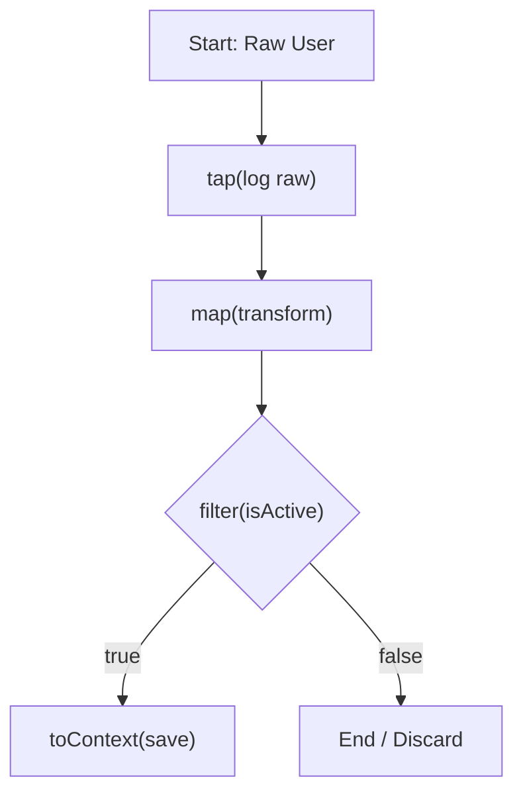

# Data Processing Pipelines

A very common use case for a workflow is to process a piece of data through a series of transformation, validation, and storage steps. Flowcraft's fluent API on the `Node` class is perfect for this, allowing you to define a clear, readable, and powerful pipeline by chaining methods together.

## Key Concepts

The fluent API consists of several methods that each return a **new `Node` instance**, allowing them to be chained.

-   `.map(fn)`: Transforms the result of the previous step. The function `fn` receives the result and returns a new result.
-   `.filter(predicate)`: Acts as a conditional gate. If the `predicate` function returns `true`, the chain continues; if `false`, the chain branches to a special `FILTER_FAILED` action.
-   `.tap(fn)`: "Taps into" the chain to perform a side-effect (like logging) without modifying the data.
-   `.toContext(key)`: A terminal operation that stores the final result of the chain into the `Context` using a `ContextKey`.

> [!IMPORTANT]
> **Immutable Chains**
>
> Each method in the fluent chain is **immutable**. It returns a brand new `Node` instance. You must capture the result of the entire chain in a single variable.

## Example: A User Processing Pipeline

Let's build a workflow that:

1.  Starts with a raw user object.
2.  Logs the initial object for debugging (`.tap`).
3.  Transforms the object into a more usable format (`.map`).
4.  Filters out inactive users (`.filter`).
5.  Stores the final, processed data in the `Context` (`.toContext`).



### 1. The Pipeline Definition

We can define this entire pipeline by chaining methods. We'll start with a simple `Node` that provides the initial data.

```typescript
import { contextKey, FILTER_FAILED, Flow, Node, TypedContext } from 'flowcraft'

// A simple node that just returns a value, to start our chain
class ValueNode<T> extends Node<void, T> {
	constructor(private value: T) { super() }
	async exec(): Promise<T> { return this.value }
}

// Define context keys for our results
const PROCESSED_USER = contextKey<string>('processed_user')
const FAILED_USER_ID = contextKey<number>('failed_user_id')

// Our raw input data
const rawUser = { id: 42, firstName: 'jane', lastName: 'doe', status: 'active' }

// --- The Pipeline ---
const userProcessingPipeline = new ValueNode(rawUser)
	.tap(user => console.log(`[DEBUG] Processing user ID: ${user.id}`))
	.map(user => ({
		userId: user.id,
		fullName: `${user.firstName.charAt(0).toUpperCase()}${user.firstName.slice(1)} ${user.lastName.toUpperCase()}`,
		isActive: user.status === 'active',
	}))
	.filter(processedUser => processedUser.isActive) // <-- This is our conditional gate
	.map(activeUser => `Welcome, ${activeUser.fullName}!`)
	.toContext(PROCESSED_USER) // <-- This only runs if the filter passes
```

### 2. Wiring the Branches

The `.filter()` method creates a branch. The `DEFAULT_ACTION` path continues the chain if the filter passes. The `FILTER_FAILED` path is taken if it fails. We need to create and wire up a node to handle that failure path.

```typescript
// A node to handle the case where the filter fails
const handleInactiveUser = new ValueNode(rawUser)
	.map(user => user.id)
	.toContext(FAILED_USER_ID)

// Connect the failure path from our main pipeline
userProcessingPipeline.next(handleInactiveUser, FILTER_FAILED)

// Create the final flow, starting with the main pipeline
const flow = new Flow(userProcessingPipeline)
```

### 3. Running the Pipeline

Now, let's run it. Since our user is `active`, the filter will pass.

```typescript
const context = new TypedContext()
await flow.run(context)

console.log('\n--- Active User Result ---')
console.log('Processed User:', await context.get(PROCESSED_USER)) // "Welcome, Jane DOE!"
console.log('Failed User ID:', await context.get(FAILED_USER_ID)) // undefined
```

If we were to change the input data to be an inactive user:
`const rawUser = { id: 99, ..., status: 'inactive' }`, the output would be:

```
--- Inactive User Result ---
Processed User: undefined
Failed User ID: 99
```

This demonstrates how to build a concise yet powerful data processing sequence that includes transformation, debugging, conditional logic, and state management, all in a single, readable chain.
