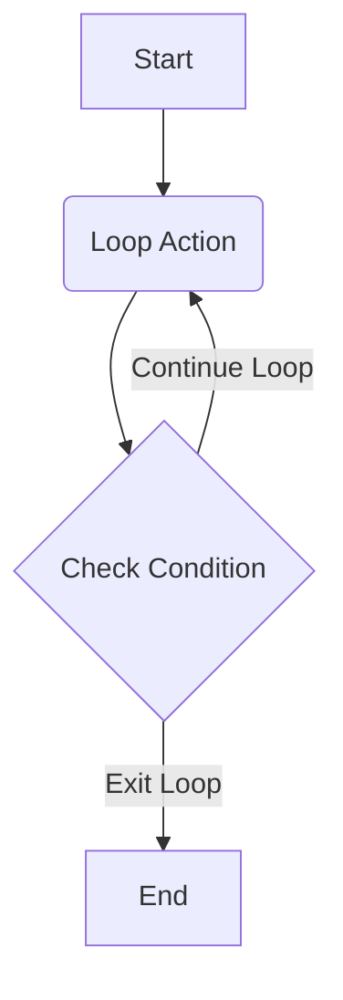

# Recipes: Creating a Loop

A common requirement in workflows is to perform an action repeatedly until a certain condition is met. While Flowcraft does not have a dedicated "loop" node, you can easily create loops by wiring a graph of nodes into a cycle.

The key is to have a "decider" node that, based on some condition, either continues the loop or exits it.

## The Pattern

1. **Action Node**: A node that performs the main work of the loop's body.
2. **Decider Node**: A node that checks a condition after the action is performed.
3. **Cyclical Connection**: The decider node connects back to the action node to continue the loop.
4. **Exit Connection**: The decider node connects to a different node to break the loop.



## Example: A Counter Loop

Let's build a simple workflow that increments a counter from 0 to 3.

### 1. Define Context and Nodes

We need a key for our counter and three nodes:

- `InitializeCounterNode`: Sets the counter to 0.
- `IncrementCounterNode`: Adds 1 to the counter. This is our "Loop Action".
- `CheckCounterNode`: Checks if the counter has reached the limit. This is our "Decider".
- `EndNode`: A final node to execute after the loop is finished.

```typescript
import { contextKey, Flow, Node, TypedContext } from 'flowcraft'

// The value we will be incrementing
const COUNTER = contextKey<number>('counter')
const MAX_LOOPS = 3

const initializeNode = new Node().exec(async ({ ctx }) => ctx.set(COUNTER, 0))
const endNode = new Node().exec(() => console.log('Loop finished.'))

// The main work of the loop
class IncrementCounterNode extends Node {
	async exec({ ctx }) {
		const current = ctx.get(COUNTER)!
		console.log(`Loop body: Incrementing counter from ${current} to ${current + 1}`)
		ctx.set(COUNTER, current + 1)
	}
}

// The decider node
class CheckCounterNode extends Node<void, void, 'continue' | 'exit'> {
	async post({ ctx }) {
		const current = ctx.get(COUNTER)!
		if (current < MAX_LOOPS) {
			console.log(`Condition check: ${current} < ${MAX_LOOPS}. Continuing loop.`)
			return 'continue' // The action to continue the loop
		}
		else {
			console.log(`Condition check: ${current} >= ${MAX_LOOPS}. Exiting loop.`)
			return 'exit' // The action to break the loop
		}
	}
}
```

### 2. Wire the Loop

Now, we connect the nodes to form the cycle.

```typescript
// Create instances
const init = initializeNode
const increment = new IncrementCounterNode()
const check = new CheckCounterNode()
const end = endNode

// Define the flow path
init.next(increment)

// The 'increment' node always goes to the 'check' node
increment.next(check)

// The 'check' node is the key to the loop
check.next(increment, 'continue') // If action is 'continue', go back to increment
check.next(end, 'exit') // If action is 'exit', go to the end

// Create the flow starting with initialization
const loopFlow = new Flow(init)
```

### 3. Run the Flow

```typescript
await loopFlow.run(new TypedContext())
```

The output will be:

```
Loop body: Incrementing counter from 0 to 1
Condition check: 1 < 3. Continuing loop.
Loop body: Incrementing counter from 1 to 2
Condition check: 2 < 3. Continuing loop.
Loop body: Incrementing counter from 2 to 3
Condition check: 3 >= 3. Exiting loop.
Loop finished.
```

This simple, powerful pattern is the foundation for building any kind of loop, from simple counters to complex agentic loops that decide whether to search for more information or answer a question based on the current context. The **[Research Agent (`sandbox/2.research/`)](https://github.com/gorango/flowcraft/tree/master/sandbox/2.research/)** example uses this exact pattern for its core logic.
