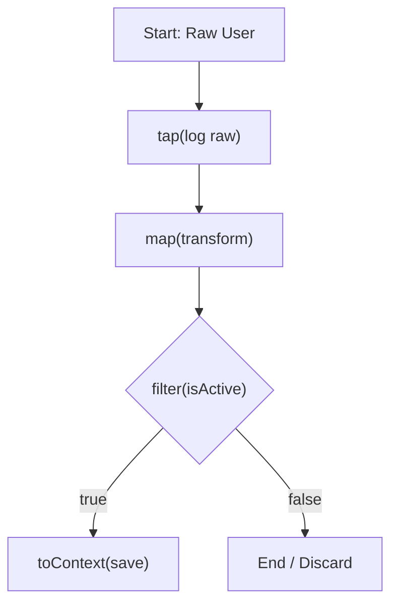

# Recipes: Creating a Data Processing Pipeline

A common use case for a workflow is to process a piece of data through a series of transformation, validation, and storage steps. Cascade's fluent API on the `Node` class (`.map`, `.filter`, `.tap`, `.toContext`) is perfect for this, allowing you to define a clear, readable, and powerful pipeline.

## The Goal

Create a workflow that:

1. Starts with a raw user object.
2. Logs the initial object for debugging (`.tap`).
3. Transforms the object into a more usable format (`.map`).
4. Filters out inactive users (`.filter`).
5. Stores the final, processed data in the `Context` (`.toContext`).



## The Implementation

We can define this entire pipeline by chaining methods, starting from a simple node that provides the initial data.

### 1. The Pipeline Definition

We'll use a `ValueNode` (a simple `Node` that just returns a value from its `exec` method) as the starting point for our chain.

```typescript
import { Node, contextKey, TypedContext, Flow, FILTER_FAILED } from 'cascade'

// A simple node that just returns a value, to start our chain
class ValueNode<T> extends Node<void, T> {
  constructor(private value: T) { super() }
  async exec(): Promise<T> { return this.value }
}

// Define context keys for our results
const PROCESSED_USER = contextKey<string>('processed_user')
const FAILED_USER_ID = contextKey<number>('failed_user_id')

// Our raw input data
const rawUser = { id: 42, firstName: 'jane', lastName: 'doe', status: 'active' }

// --- The Pipeline ---
const userProcessingPipeline = new ValueNode(rawUser)
  .tap(user => console.log(`[DEBUG] Processing user ID: ${user.id}`))
  .map(user => ({
    userId: user.id,
    fullName: `${user.firstName.charAt(0).toUpperCase()}${user.firstName.slice(1)} ${user.lastName.toUpperCase()}`,
    isActive: user.status === 'active',
  }))
  .filter(processedUser => processedUser.isActive) // <-- This is our conditional gate
  .map(activeUser => `Welcome, ${activeUser.fullName}!`)
  .toContext(PROCESSED_USER) // <-- This only runs if the filter passes
```

### 2. Wiring the Branches

The `.filter()` method creates a branch. The `DEFAULT_ACTION` path continues the chain if the filter passes. The `FILTER_FAILED` path is taken if it fails. We need to wire up a node to handle that failure path.

```typescript
// A node to handle the case where the filter fails
const handleInactiveUser = new ValueNode(rawUser)
  .map(user => user.id)
  .toContext(FAILED_USER_ID)

// Connect the failure path
userProcessingPipeline.next(handleInactiveUser, FILTER_FAILED)

const flow = new Flow(userProcessingPipeline)
```

### 3. Running the Pipeline

Now, let's run it. Since our user is `active`, the filter will pass.

```typescript
const context = new TypedContext()
await flow.run(context)

console.log('\n--- Active User Result ---')
console.log('Processed User:', context.get(PROCESSED_USER)) // "Welcome, Jane DOE!"
console.log('Failed User ID:', context.get(FAILED_USER_ID)) // undefined
```

If we change the input data to be an inactive user:
`const rawUser = { id: 99, ..., status: 'inactive' }`, the output would be:

```
--- Inactive User Result ---
Processed User: undefined
Failed User ID: 99
```

This demonstrates how to build a concise yet powerful data processing sequence that includes transformation, debugging, conditional logic, and state management, all in a single, readable chain.
