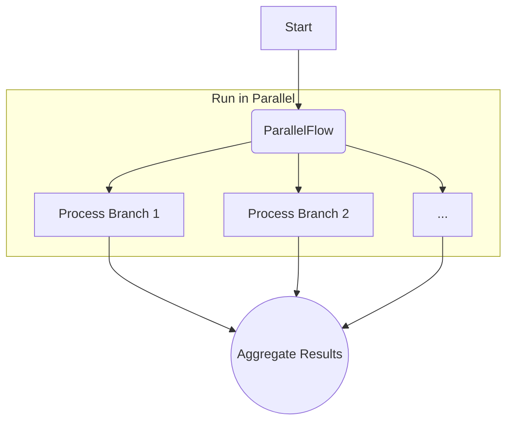

# Recipes: Dynamic Fan-Out and Fan-In

A "fan-out, fan-in" pattern is where a workflow splits into multiple parallel branches that execute concurrently (fan-out) and then merges the results of those branches back together before proceeding (fan-in).

Cascade provides a dedicated `ParallelFlow` builder that makes creating this pattern simple and declarative.

## The Pattern

1. **`ParallelFlow`**: This builder takes an array of nodes that will be executed concurrently.
2. **Aggregation Node**: A single node is connected to the `ParallelFlow` instance. It will only run after *all* the parallel branches have completed, allowing it to "fan-in" or aggregate the results from the `Context`.



## Example: Parallel Data Enrichment

Imagine we have a user object and we want to perform two slow, independent API calls simultaneously: one to get the user's recent activity and another to get their profile metadata.

### 1. Define Context and Nodes

We'll need keys for the initial input and the results of each parallel branch.

```typescript
import { Flow, Node, TypedContext, contextKey, ParallelFlow } from 'cascade'

// Context Keys
const USER_ID = contextKey<string>('user_id')
const ACTIVITY_DATA = contextKey<any>('activity_data')
const METADATA = contextKey<any>('metadata')
const FINAL_REPORT = contextKey<string>('final_report')

// A mock API call
const mockApiCall = (operation: string, delay: number) => {
  console.log(`Starting API call: ${operation}...`)
  return new Promise(resolve => setTimeout(() => {
    console.log(`...Finished API call: ${operation}`)
    resolve({ result: `${operation} data` })
  }, delay))
}

// Nodes for each parallel task
const fetchActivityNode = new Node()
  .exec(async ({ ctx }) => mockApiCall(`fetchActivity for ${ctx.get(USER_ID)}`, 100))
  .toContext(ACTIVITY_DATA)

const fetchMetadataNode = new Node()
  .exec(async ({ ctx }) => mockApiCall(`fetchMetadata for ${ctx.get(USER_ID)}`, 150))
  .toContext(METADATA)

// The final aggregation node (the "fan-in" point)
const createReportNode = new Node()
  .exec(async ({ ctx }) => {
    const activity = ctx.get(ACTIVITY_DATA)
    const metadata = ctx.get(METADATA)
    return `Report created. Activity: ${activity.result}, Metadata: ${metadata.result}`
  })
  .toContext(FINAL_REPORT)
```

### 2. Wire the Flow with `ParallelFlow`

We create a `ParallelFlow` instance with our two API-calling nodes. Then, we connect our aggregation node to run after the parallel block is complete.

```typescript
// Create the parallel fan-out block
const parallelEnrichment = new ParallelFlow([
  fetchActivityNode,
  fetchMetadataNode,
])

// After all parallel nodes are done, run the report node.
parallelEnrichment.next(createReportNode)

const enrichmentFlow = new Flow(parallelEnrichment)
```

### 3. Run the Flow

```typescript
const context = new TypedContext([
  [USER_ID, 'user-123']
])

console.time('ParallelExecution')
await enrichmentFlow.run(context)
console.timeEnd('ParallelExecution')

console.log(context.get(FINAL_REPORT))
```

The output will be:

```
Starting API call: fetchActivity for user-123...
Starting API call: fetchMetadata for user-123...
...Finished API call: fetchActivity for user-123
...Finished API call: fetchMetadata for user-123
ParallelExecution: 155.25ms
Report created. Activity: fetchActivity for user-123 data, Metadata: fetchMetadata for user-123 data
```

Notice that the total execution time is approximately the duration of the *longest* API call (150ms), not the sum of both (~250ms). This demonstrates how the `ParallelFlow` builder provides a clean and powerful way to implement the fan-out, fan-in pattern for I/O-bound tasks. The `GraphBuilder` uses this same component internally whenever it detects this pattern in a declarative graph.
