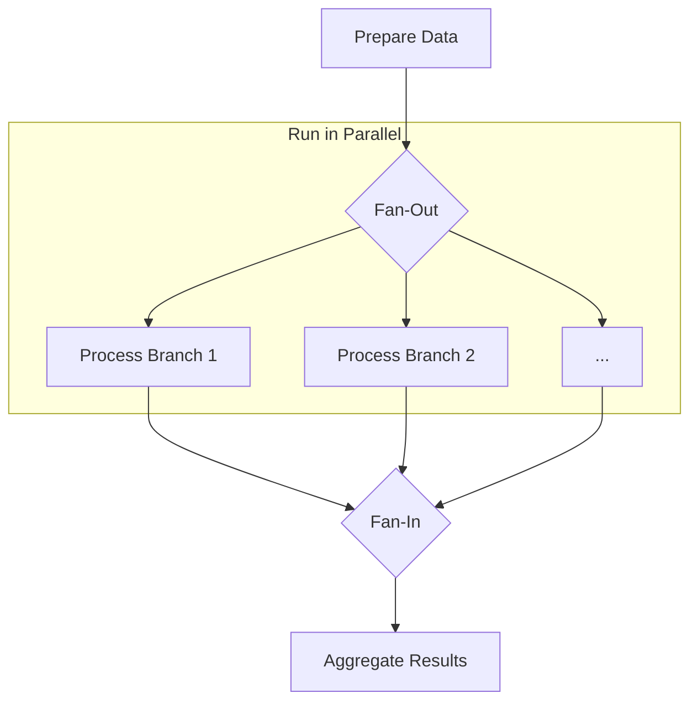

# Recipes: Dynamic Fan-Out and Fan-In

A "fan-out, fan-in" pattern is where a workflow splits into multiple parallel branches that execute concurrently (fan-out) and then merges the results of those branches back together before proceeding (fan-in).

Cascade's `GraphBuilder` handles this pattern automatically, but you can also implement it manually to understand the underlying mechanism. This recipe shows how to build a simple fan-out, fan-in flow that processes different parts of an input object in parallel.

## The Pattern

1. **Preparation Node**: A starting node that prepares the distinct pieces of data to be processed in parallel.
2. **Parallel Fan-Out**: A special `ParallelNode` (or `ParallelBatchFlow`) executes multiple independent nodes, each handling one piece of the data.
3. **Aggregation Node**: After all parallel branches complete, a final node runs to "fan-in" or aggregate the results from the `Context`.



## Example: Parallel Data Enrichment

Imagine we have a user object and we want to perform two slow, independent API calls simultaneously: one to get the user's recent activity and another to get their profile metadata.

### 1. Define Context and Nodes

We'll need keys for the initial input and the results of each parallel branch.

```typescript
import { Flow, Node, TypedContext, contextKey, ParallelBatchFlow } from 'cascade'

// Context Keys
const USER_ID = contextKey<string>('user_id')
const ACTIVITY_DATA = contextKey<any>('activity_data')
const METADATA = contextKey<any>('metadata')
const FINAL_REPORT = contextKey<string>('final_report')

// A mock API call
const mockApiCall = (operation: string, delay: number) => {
  console.log(`Starting API call: ${operation}...`)
  return new Promise(resolve => setTimeout(() => {
    console.log(`...Finished API call: ${operation}`)
    resolve({ result: `${operation} data` })
  }, delay))
}

// Nodes for each parallel task
const fetchActivityNode = new Node()
  .exec(async ({ ctx }) => mockApiCall(`fetchActivity for ${ctx.get(USER_ID)}`, 100))
  .toContext(ACTIVITY_DATA)

const fetchMetadataNode = new Node()
  .exec(async ({ ctx }) => mockApiCall(`fetchMetadata for ${ctx.get(USER_ID)}`, 150))
  .toContext(METADATA)

// The final aggregation node (the "fan-in" point)
const createReportNode = new Node()
  .exec(async ({ ctx }) => {
    const activity = ctx.get(ACTIVITY_DATA)
    const metadata = ctx.get(METADATA)
    return `Report created. Activity: ${activity.result}, Metadata: ${metadata.result}`
  })
  .toContext(FINAL_REPORT)
```

### 2. Wire the Flow with a Parallel Runner

We can use `ParallelBatchFlow` as a simple way to run a dynamic list of nodes in parallel. We'll create a custom flow that prepares the list of nodes to run.

```typescript
// This custom flow acts as our parallel fan-out orchestrator.
class FanOutFlow extends ParallelBatchFlow {
  constructor() {
    // The "nodeToRun" for a ParallelBatchFlow is itself a Node.
    // In this dynamic case, the `prep` method will provide the actual node
    // instance in the parameters for each "item".
    super(new Node().exec(async ({ params }) => params.node.run(params.ctx)))
  }

  // The prep method returns the list of nodes to run in parallel.
  async prep({ ctx }) {
    return [
      { node: fetchActivityNode, ctx },
      { node: fetchMetadataNode, ctx },
    ]
  }
}

// Create instances and wire the flow
const fanOut = new FanOutFlow()
const report = createReportNode

fanOut.next(report) // After the parallel block, create the report.

const enrichmentFlow = new Flow(fanOut)
```

### 3. Run the Flow

```typescript
const context = new TypedContext([
  [USER_ID, 'user-123']
])

console.time('ParallelExecution')
await enrichmentFlow.run(context)
console.timeEnd('ParallelExecution')

console.log(context.get(FINAL_REPORT))
```

The output will be:

```
Starting API call: fetchActivity for user-123...
Starting API call: fetchMetadata for user-123...
...Finished API call: fetchActivity for user-123
...Finished API call: fetchMetadata for user-123
ParallelExecution: 155.25ms
Report created. Activity: fetchActivity for user-123 data, Metadata: fetchMetadata for user-123 data
```

Notice that the total execution time is approximately the duration of the *longest* API call (150ms), not the sum of both (~250ms). This demonstrates the power of the fan-out, fan-in pattern for I/O-bound tasks. The `GraphBuilder` automates the creation of the parallel runner node whenever it detects this pattern in a declarative graph.
