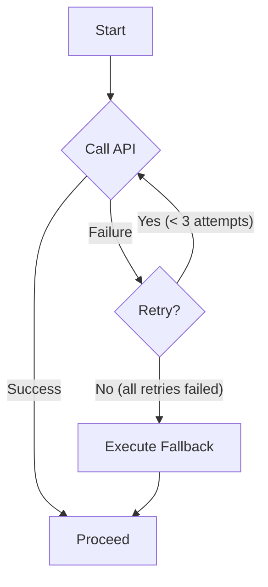

# Recipes: Building a Resilient API Call Node

A very common task in any workflow is calling an external API. These calls can be unreliable due to network issues or temporary service outages. This recipe shows you how to build a robust `Node` that can handle these failures gracefully using Flowcraft's built-in retry and fallback mechanisms.

## The Goal

Create a node that:

1. Calls an external API.
2. If the API call fails, automatically retries the call a few times.
3. If all retries fail, executes a fallback logic (e.g., returns a cached or default value) so the workflow can continue.



## The Implementation

We will create a `FetchDataNode` that simulates calling a flaky API.

### 1. The Node Definition

We configure the node's retry behavior directly in its constructor options. The core logic is in `exec`, and the safety net is in `execFallback`.

```typescript
import { contextKey, Node, NodeArgs, TypedContext } from 'flowcraft'

const API_RESULT = contextKey<any>('api_result')

class FetchDataNode extends Node<void, any> {
	private attempts = 0

	constructor() {
		// Configure the node to try a total of 3 times (1 initial + 2 retries),
		// waiting 200ms between attempts.
		super({ maxRetries: 3, wait: 200 })
	}

	// The main logic: try to call the API.
	async exec(): Promise<any> {
		this.attempts++
		console.log(`Attempting to call API... (attempt #${this.attempts})`)

		// Simulate a failing API that succeeds on the 3rd try.
        // To test the fallback, change this condition to always fail, e.g., `if (true)`.
		if (this.attempts < 3) {
			throw new Error('API service is temporarily unavailable.')
		}

		// This will only be reached on the 3rd attempt in our simulation.
		console.log('API call successful!')
		return { id: 123, data: 'live data from API' }
	}

	// The fallback logic: run if all `exec` attempts fail.
	async execFallback({ error }): Promise<any> {
		console.error(`All API attempts failed. Final error: "${error.message}"`)
		console.log('Returning cached/default data as a fallback.')
		return { id: 123, data: 'cached fallback data' }
	}

	// The post-logic: store the result (from either exec or execFallback)
	async post({ ctx, execRes }: NodeArgs<void, any>) {
		await ctx.set(API_RESULT, execRes)
	}
}
```

### 2. Running the Resilient Node

Now, we can run this node as part of a flow. The behavior will differ based on whether the `exec` eventually succeeds or the `execFallback` is triggered.

```typescript
import { ConsoleLogger, Flow, TypedContext } from 'flowcraft'

const resilientNode = new FetchDataNode()
const flow = new Flow(resilientNode)
const context = new TypedContext()

// Use a logger to see the retry warnings
await flow.run(context, { logger: new ConsoleLogger() })

console.log('\nWorkflow complete.')
console.log('Final result in context:', await context.get(API_RESULT))
```

### Expected Output (Success on Retry)

If the API succeeds on the 3rd attempt, the output will show the retries followed by the successful live data.

```
[INFO] Running node: FetchDataNode
Attempting to call API... (attempt #1)
[WARN] Attempt 1/3 failed for FetchDataNode. Retrying...
Attempting to call API... (attempt #2)
[WARN] Attempt 2/3 failed for FetchDataNode. Retrying...
Attempting to call API... (attempt #3)
API call successful!

Workflow complete.
Final result in context: { id: 123, data: 'live data from API' }
```

### Expected Output (Fallback Execution)

If you modify the `exec` method to always throw an error, the fallback will be executed:

```
[INFO] Running node: FetchDataNode
Attempting to call API... (attempt #1)
[WARN] Attempt 1/3 failed for FetchDataNode. Retrying...
Attempting to call API... (attempt #2)
[WARN] Attempt 2/3 failed for FetchDataNode. Retrying...
Attempting to call API... (attempt #3)
[ERROR] All retries failed for FetchDataNode. Executing fallback.
All API attempts failed. Final error: "API service is temporarily unavailable."
Returning cached/default data as a fallback.

Workflow complete.
Final result in context: { id: 123, data: 'cached fallback data' }
```

This pattern is essential for building production-grade workflows that can withstand transient failures. For more details, see the full guide on **[Error Handling](../advanced-guides/error-handling.md)**.
