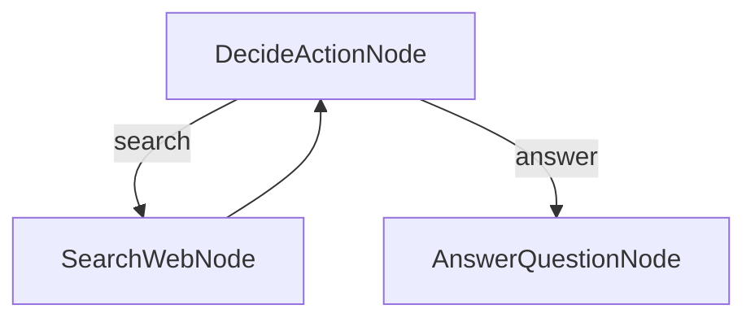
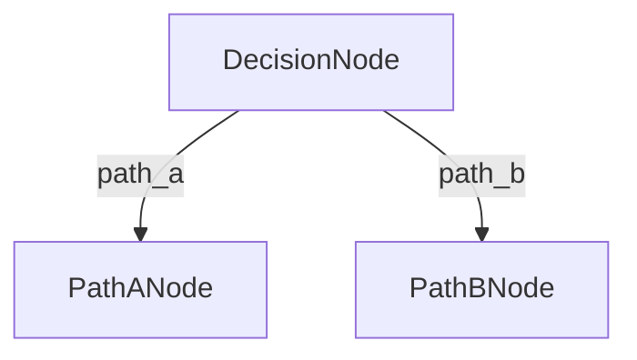
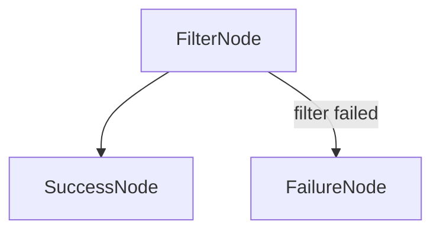
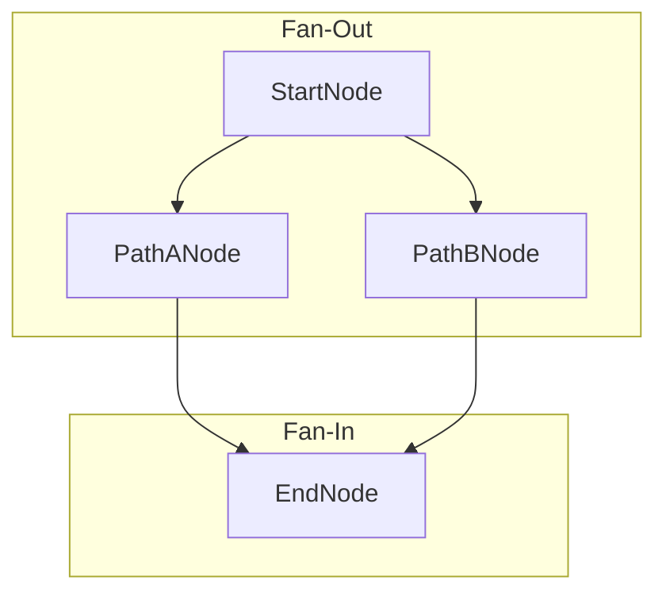

# Visualizing Workflows with Mermaid.js

Complex workflows with multiple branches, loops, and fan-outs can be difficult to reason about from code alone. To help with this, Flowcraft includes utilities to automatically create visual diagrams of any `Flow` instance.

This is an invaluable tool for:

- **Debugging**: Quickly verify that your nodes are wired together exactly as you intended.
- **Documentation**: Embed diagrams directly into your project's `README.md` or technical documentation.
- **Onboarding**: Help new team members understand the control flow of a complex business process at a glance.

## Visualizing Programmatic Flows

For flows built programmatically (using `.next()`), use the `generateMermaidGraph` utility.

Let's visualize the "Research Agent" from the sandbox examples, which contains a decision loop:

```typescript
import { DEFAULT_ACTION, Flow, generateMermaidGraph, Node } from 'flowcraft'

// Define the nodes for the agent
class DecideActionNode extends Node<void, void, 'search' | 'answer'> {
	async post() { return 'search' /* or 'answer' */ }
}
class SearchWebNode extends Node {}
class AnswerQuestionNode extends Node {}

// Create instances and wire the graph
const decideNode = new DecideActionNode()
const searchNode = new SearchWebNode()
const answerNode = new AnswerQuestionNode()
decideNode.next(searchNode, 'search')
decideNode.next(answerNode, 'answer')
searchNode.next(decideNode, DEFAULT_ACTION) // Loop back

const researchAgentFlow = new Flow(decideNode)

// Generate and print the Mermaid syntax
const mermaidGraph = generateMermaidGraph(researchAgentFlow)
console.log(mermaidGraph)
```

### Generated Syntax

Running the code above will print the following Mermaid.js syntax to the console:

```mmd
graph TD
  DecideActionNode_0[DecideActionNode]
  SearchWebNode_0[SearchWebNode]
  AnswerQuestionNode_0[AnswerQuestionNode]
  DecideActionNode_0 -- "search" --> SearchWebNode_0
  DecideActionNode_0 -- "answer" --> AnswerQuestionNode_0
  SearchWebNode_0 --> DecideActionNode_0
```

### Rendered Graph

This prints the Mermaid syntax, which you can render in GitHub or the [Mermaid Editor](https://mermaid.live).



## Visualizing Declarative Graphs (`GraphBuilder`)

For flows built with `GraphBuilder` from declarative definitions (like JSON), the builder itself provides the best way to get a visualization. By passing `true` as the second argument to the `.build()` method, the builder will log a complete Mermaid diagram of the final, **flattened graph** to the `info` log level.

This is especially powerful as it shows the true structure the executor will run, including:
- Inlined sub-workflows.
- Automatically injected `InputMappingNode` and `OutputMappingNode`.
- Generated `ParallelFlow` blocks for fan-out/fan-in patterns.

```typescript
const builder = new GraphBuilder(
	registry,
	{},
	{},
	new ConsoleLogger({ level: 'info' }) // Ensure 'info' logs are visible
)

// This will log the Mermaid diagram to the console.
const { flow } = builder.build(myGraphDefinition, true)
```
This is the recommended way to visualize complex, composed workflows.

## Supported Features

The visualizer correctly represents all of Flowcraft's core branching and flow control patterns.

### Conditional Branching

Custom action strings are rendered as labels on the connecting arrows.



### Filter Logic

The special `FILTER_FAILED` action is given a descriptive label. The `DEFAULT_ACTION` has no label for clarity.



### Fan-In / Convergence

When multiple nodes connect to the same successor, the graph shows all arrows converging.


