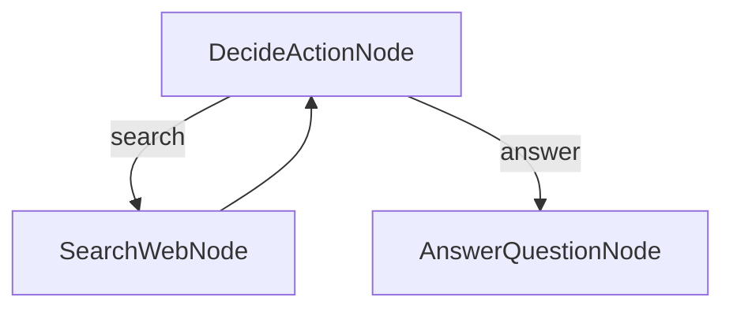
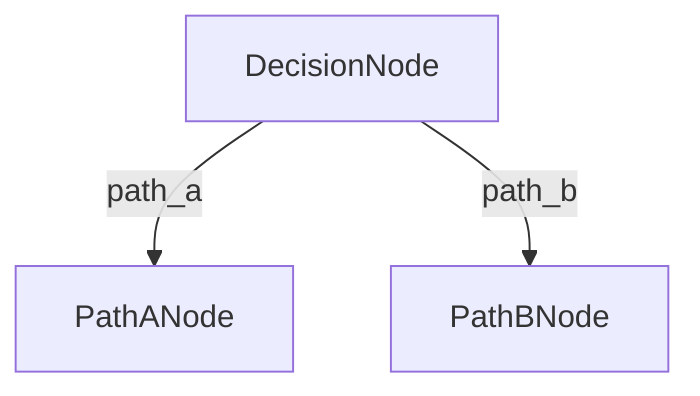
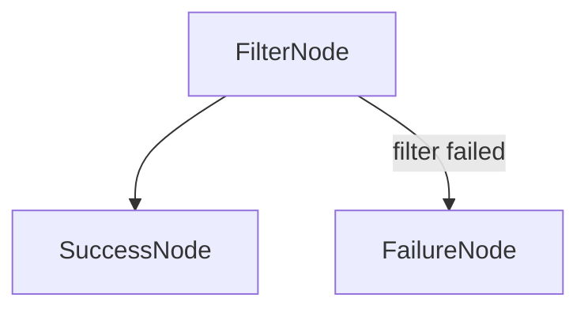
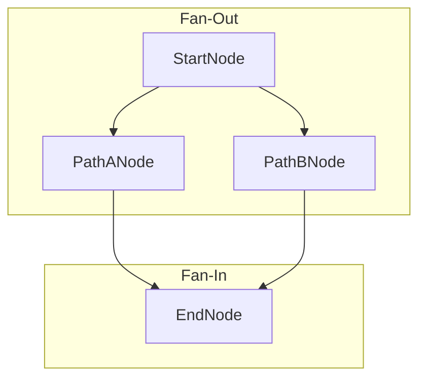

# Visualizing Workflows with Mermaid.js

Complex workflows with multiple branches, loops, and fan-outs can be difficult to reason about from code alone. To help with this, Cascade includes a `generateMermaidGraph` utility that can automatically create a visual diagram of any `Flow` instance.

This utility is an invaluable tool for:

- **Debugging**: Quickly verify that your nodes are wired together exactly as you intended.
- **Documentation**: Embed diagrams directly into your project's `README.md` or technical documentation.
- **Onboarding**: Help new team members understand the control flow of a complex business process at a glance.

## Quick Start

To use the utility, simply import `generateMermaidGraph`, create your `Flow` instance, and pass it to the function.

Let's visualize the "Research Agent" from the sandbox examples, which contains a decision loop:

```typescript
import { DEFAULT_ACTION, Flow, generateMermaidGraph, Node } from 'cascade';

// Define the nodes for the agent
class DecideActionNode extends Node<void, void, 'search' | 'answer'> {
  async post() { return 'search'; /* or 'answer' */ }
}
class SearchWebNode extends Node {}
class AnswerQuestionNode extends Node {}

// Create instances
const decideNode = new DecideActionNode();
const searchNode = new SearchWebNode();
const answerNode = new AnswerQuestionNode();

// Wire the graph
decideNode.next(searchNode, 'search');
decideNode.next(answerNode, 'answer');
searchNode.next(decideNode, DEFAULT_ACTION); // Loop back to the decision node

const researchAgentFlow = new Flow(decideNode);

// Generate and print the Mermaid syntax
const mermaidGraph = generateMermaidGraph(researchAgentFlow);
console.log(mermaidGraph);
```

### Generated Syntax

Running the code above will print the following Mermaid.js syntax to the console:

```mmd
graph TD
  DecideActionNode_0[DecideActionNode]
  SearchWebNode_0[SearchWebNode]
  AnswerQuestionNode_0[AnswerQuestionNode]
  DecideActionNode_0 -- "search" --> SearchWebNode_0
  DecideActionNode_0 -- "answer" --> AnswerQuestionNode_0
  SearchWebNode_0 --> DecideActionNode_0
```

### Rendered Graph

When this syntax is rendered, it produces the following diagram:



## How to Render the Graph

You can render the generated syntax in several places:

- **GitHub**: Directly in markdown files (`.md`), issues, and pull requests.
- **VS Code**: Using a markdown previewer with a Mermaid extension installed.
- **Online Editors**: Paste the syntax into the [Mermaid Live Editor](https://mermaid.live).

## Supported Features

The visualizer correctly represents all of Cascade's core branching and flow control patterns.

### Conditional Branching

Custom action strings are rendered as labels on the connecting arrows.

**Code**:

```typescript
const decision = new DecisionNode();
decision.next(new PathANode(), 'path_a');
decision.next(new PathBNode(), 'path_b');
```

**Graph**:



### Filter Logic

The special `FILTER_FAILED` action is given a descriptive label. The `DEFAULT_ACTION` has no label for clarity.

**Code**:

```typescript
const filter = new FilterNode();
filter.next(new SuccessNode(), DEFAULT_ACTION);
filter.next(new FailureNode(), FILTER_FAILED);
```

**Graph**:



### Fan-In / Convergence

When multiple nodes connect to the same successor, the graph shows all arrows converging.

**Code**:

```typescript
const branchA = new PathANode();
const branchB = new PathBNode();
const end = new EndNode();
branchA.next(end);
branchB.next(end);
```

**Graph**:



### Node Naming

If your flow uses multiple instances of the same `Node` class, the generator will append a unique index to each one (e.g., `ProcessNode_0`, `ProcessNode_1`) to distinguish them in the graph.
