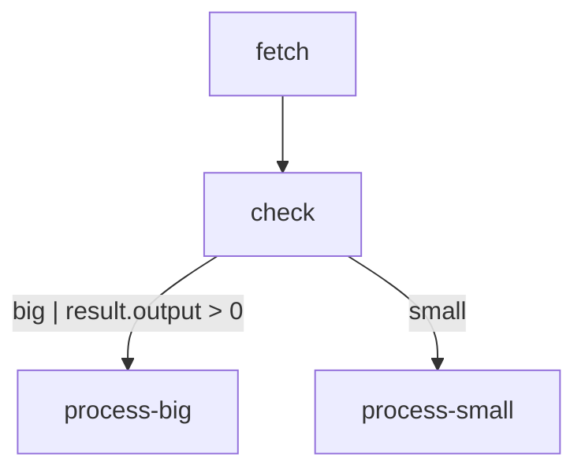

# Analysis and Debugging: Visualizing Workflows

Understanding the structure of a complex workflow can be challenging just by reading code or JSON. Flowcraft includes a utility to generate [Mermaid](https://mermaid.js.org/) diagram syntax directly from a `WorkflowBlueprint`.

This makes it easy to visualize, document, and debug your workflows.

### `generateMermaid`

The `generateMermaid` function takes a blueprint and returns a string of Mermaid flowchart syntax.

```typescript
import { createFlow, generateMermaid } from 'flowcraft'

const flow = createFlow('conditional-workflow')
	.node('fetch', async () => ({ output: { value: 10 } }))
	.node('check', async ({ input }) => ({
		action: input.value > 5 ? 'big' : 'small'
	}))
	.node('process-big', async () => ({}))
	.node('process-small', async () => ({}))
	.edge('fetch', 'check')
	.edge('check', 'process-big', { action: 'big', condition: 'result.output > 0' })
	.edge('check', 'process-small', { action: 'small' })
	.toBlueprint()

const mermaidSyntax = generateMermaid(flow)
console.log(mermaidSyntax)
```

### Rendering the Diagram

The output of `generateMermaid` will be:
```
flowchart TD
    fetch["fetch"]
    check["check"]
    process-big["process-big"]
    process-small["process-small"]
    fetch --> check
    check -- "big | result.output > 0" --> process-big
    check -- "small" --> process-small
```

When this syntax is rendered by a tool that supports Mermaid (like this documentation site, GitHub markdown, or the Mermaid Live Editor), you get a clear visual representation of your workflow:


Notice how the `action` and `condition` from the edges are automatically added as labels to the connections in the diagram.

Visualizing your workflows is an invaluable tool for:
-   **Debugging**: Quickly spot incorrect connections or logic flows.
-   **Documentation**: Automatically generate up-to-date diagrams for your team.
-   **Onboarding**: Help new team members understand the structure of complex processes.
