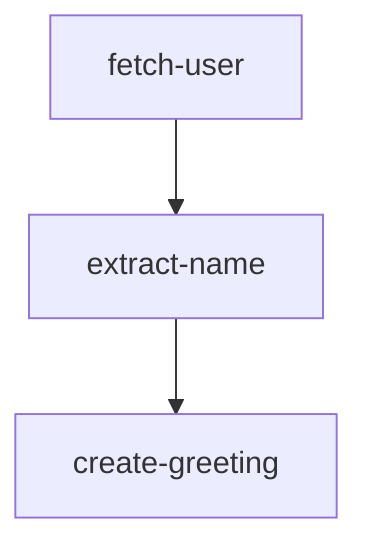
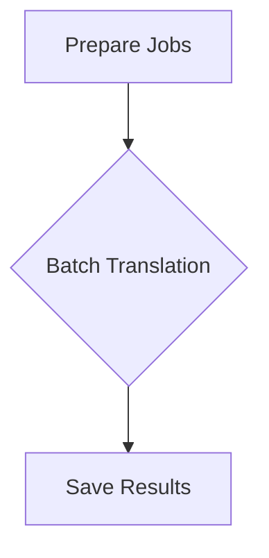
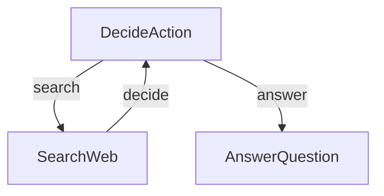
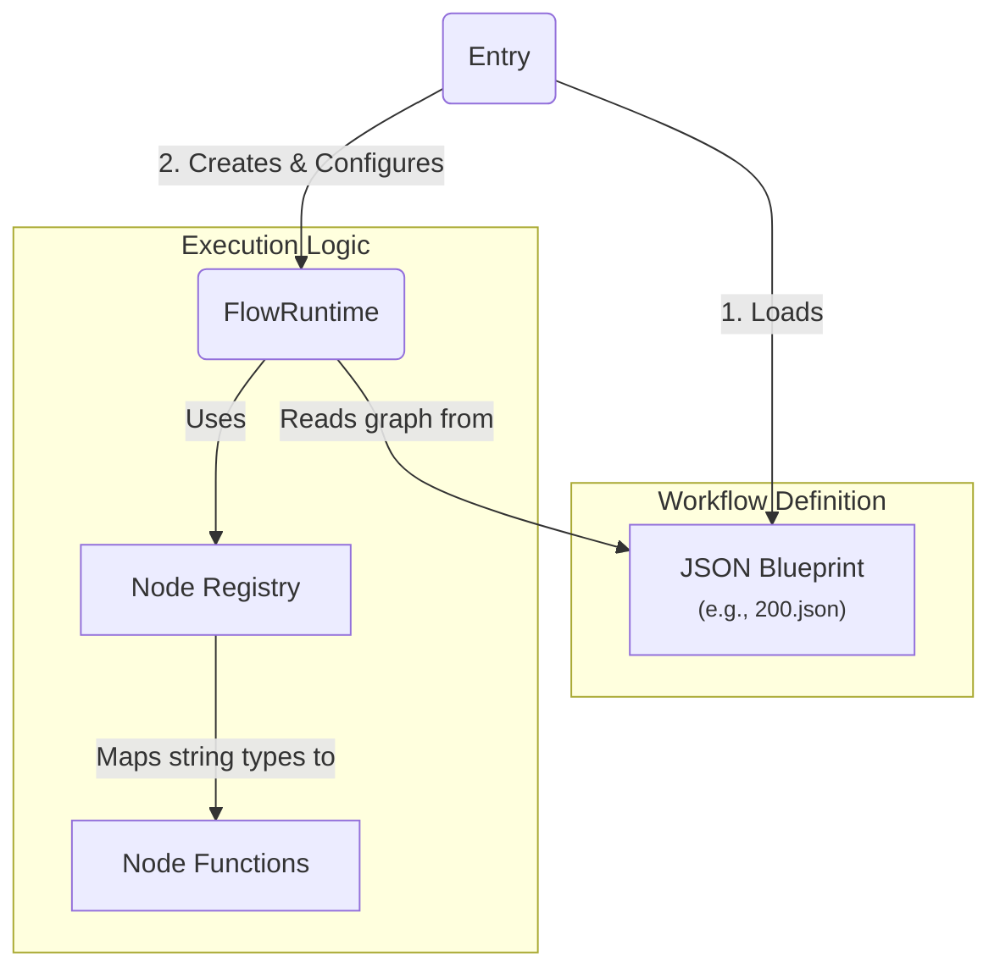
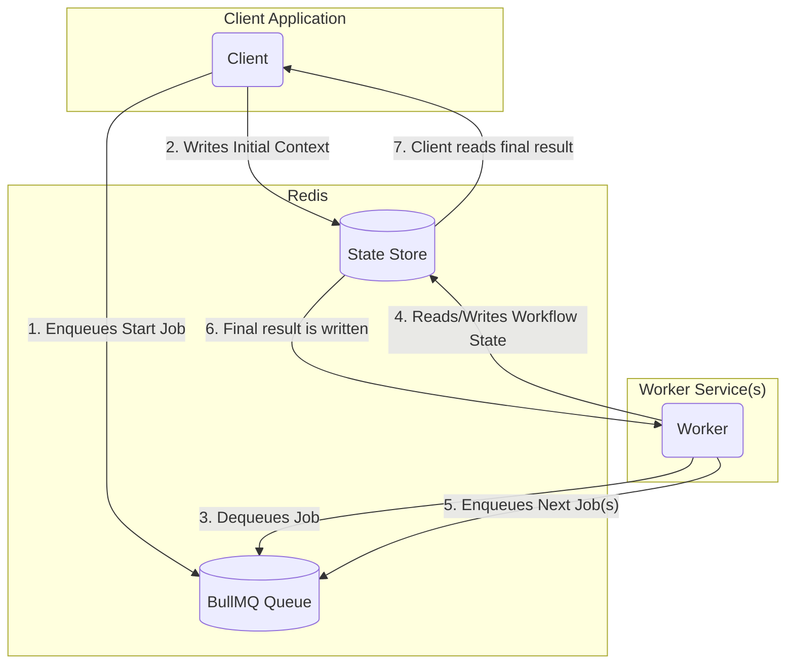
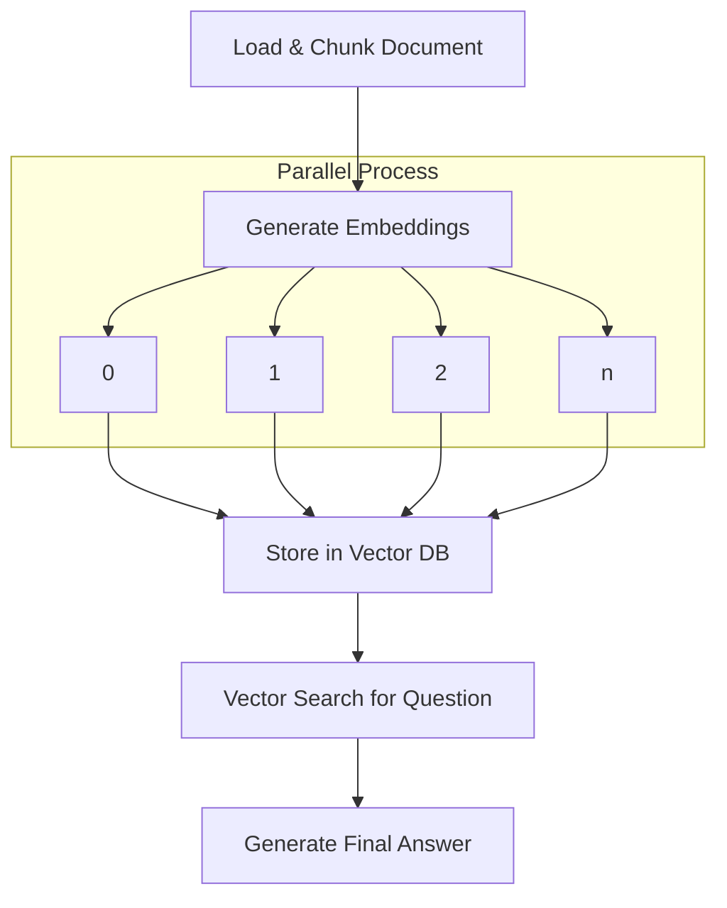

# Examples Index

[[view source code]](https://github.com/gorango/flowcraft/tree/master/examples)

This page provides an overview of all Flowcraft examples, including summaries and visualizations of each workflow.

You can clone the [Flowcraft repository](https://github.com/gorango/flowcraft/tree/master/examples) to run them all locally.

## [Basic Workflow](/examples/basic)

A basic, linear workflow that creates a greeting message. It demonstrates defining a workflow with [`createFlow`](/api/flow#createflow-id), passing data between nodes, and executing with [`FlowRuntime`](/api/runtime#flowruntime-class).

## [Parallel Batch Translation](/examples/translate)

Demonstrates using Flowcraft's [`.batch()`](/api/flow#batch-tinput-toutput-taction-id-worker-options) helper to translate a document into multiple languages concurrently, showcasing performance improvements for I/O-bound tasks.

## [Research Agent](/examples/research)

A simple research agent that searches the web and answers questions using conditional branching and [loops](/guide/loops).

## [Dynamic AI Workflows from JSON Files](/examples/declarative)

An in-memory runtime engine for executing [declarative workflows](/guide/declarative) defined as JSON files, with support for parallelism, branching, and [subflows](/guide/subflows).

## [Distributed Dynamic Workflows](/examples/distributed)

Implements the previous example, but in a distributed environment using [BullMQ](/guide/adapters/bullmq), with client-worker separation and awaitable workflows.

## [RAG Workflow for Document Analysis](/examples/rag)

A sophisticated RAG agent that implements a custom [serializer](/guide/serializers), ingests documents, generates embeddings, performs vector searches, and synthesizes answers.

