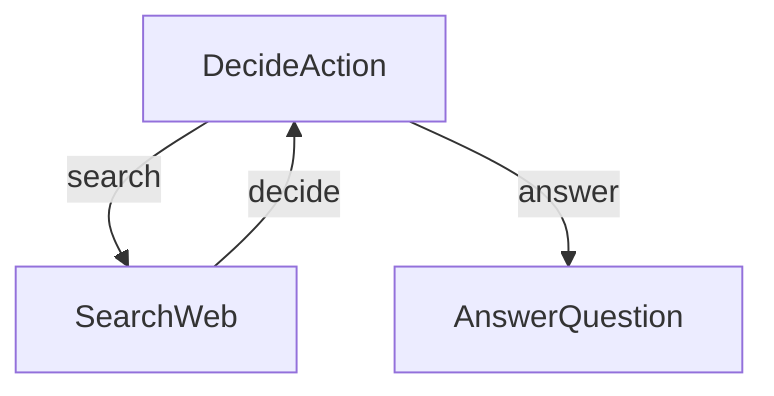

# Research Agent

[[view source code]](https://github.com/gorango/flowcraft/tree/master/examples/3.research)

This example demonstrates a simple yet powerful research agent that can search the web and answer questions. It uses conditional branching in the workflow to decide its next action.

## The Goal

The agent will:
1. Receive a question.
2. **Decide** whether it has enough information to answer or if it needs to search the web.
3. If it needs to search, it will formulate a query and **act** by calling a search tool.
4. It will then loop back to the **decide** step with the new information.
5. Once it decides it has enough information, it will generate a final answer.



This pattern of using loops, conditional actions, and a shared context is fundamental to building powerful and autonomous AI agents with Flowcraft.

## The Code

#### `utils.ts`
Provides utility functions for calling the OpenAI API to generate responses and for performing web searches using SerpApi.

```typescript
import process from 'node:process'
import OpenAI from 'openai'
import { getJson } from 'serpapi'
import 'dotenv/config'

const openaiClient = new OpenAI()

/**
 * Calls the OpenAI Chat Completions API.
 * @param prompt The user prompt to send to the LLM.
 * @returns The content of the LLM's response as a string.
 */
export async function callLLM(prompt: string): Promise<string> {
	try {
		console.log(`\n--- Sending to LLM ---\n${prompt.substring(0, 300)}...\n---------------------\n`)
		const response = await openaiClient.chat.completions.create({
			model: 'gpt-4o-mini',
			messages: [
				{ role: 'system', content: `Today's date is ${new Date().toISOString()}.` },
				{ role: 'user', content: prompt },
			],
			temperature: 0.2,
		})
		const result = response.choices[0].message.content || ''
		console.log(`--- Received from LLM ---\n${result}\n-----------------------\n`)
		return result
	}
	catch (error: any) {
		console.error('Error calling OpenAI API:', error)
		throw new Error(`OpenAI API call failed: ${error.message}`)
	}
}

/**
 * Calls the SerpApi API to search the web.
 * @param query The search query.
 * @returns The search results as a string.
 */
export async function searchWeb(query: string): Promise<string> {
	const apiKey = process.env.SERP_API_KEY
	if (!apiKey) {
		throw new Error('SERP_API_KEY environment variable is required')
	}

	try {
		const results = await getJson({
			engine: 'google',
			q: query,
			num: 5,
			api_key: apiKey,
		})
		const organicResults = results.organic_results || []
		const formattedResults = organicResults.map((result: any, index: number) =>
			`${index + 1}. ${result.title}\n   URL: ${result.link}\n   Snippet: ${result.snippet}`,
		).join('\n\n')
		return formattedResults || 'No results found.'
	}
	catch (error: any) {
		console.error('Error calling SerpAPI:', error)
		return `Error: Could not fetch search results. ${error.message}`
	}
}
```

#### `flow.ts`
Defines the workflow logic for the research agent, including nodes for decision-making, web searching, and answering, with loop controls for iterative querying.

```typescript
import type { NodeContext, NodeResult } from 'flowcraft'
import { createFlow } from 'flowcraft'
import { callLLM, searchWeb } from './utils.js'

// --- Node Logic ---

// Decide node: The "brain" of the agent
async function decide(ctx: NodeContext): Promise<NodeResult> {
	const { question, search_context, loop_count } = await ctx.context.toJSON()
	const prompt = `Based on the question and context, decide whether to 'search' or 'answer'. Respond in JSON format with 'action' (search or answer) and 'reason'. If action is 'search', include 'search_query'.

Question: ${question}
Context: ${search_context}
Searches count: ${loop_count}

JSON Response:`
	const response = await callLLM(prompt)
	const decision = JSON.parse(
		response
			.replace(/^```json\n/, '')
			.replace(/\n```$/, '')
			.trim(),
	)

	// Pass the search query to the next step via the context
	await ctx.context.set('current_query', decision.search_query)

	// Set last_action for loop condition
	await ctx.context.set('last_action', decision.action)

	// Use an 'action' to control the workflow's path
	return { action: decision.action, output: decision }
}

// Search node: The "tool" of the agent
async function search(ctx: NodeContext): Promise<NodeResult> {
	const query = await ctx.context.get('current_query')
	const results = await searchWeb(query)
	const current_context = await ctx.context.get('search_context') || ''
	await ctx.context.set('search_context', `${current_context}\n${results}`)

	// Increment loop_count after each search
	const currentLoopCount = await ctx.context.get('loop_count') || 0
	await ctx.context.set('loop_count', currentLoopCount + 1)

	return { output: results }
}

// Answer node: The final output step
async function answer(ctx: NodeContext): Promise<NodeResult> {
	const { question, search_context } = await ctx.context.toJSON()
	const prompt = `Answer the question based on the context. Q: ${question}, C: ${search_context}`
	const finalAnswer = await callLLM(prompt)
	return { output: finalAnswer }
}

// --- The Workflow Definition ---

export function createAgentFlow() {
	const flow = createFlow('research-agent')

	flow
		.node('initialize', async ({ context }) => {
			// Set up the initial state for the loop
			await context.set('search_context', '')
			await context.set('loop_count', 0)
			await context.set('last_action', null) // Initialize last_action
			return { output: 'Initialized' }
		})
		.node('decide', decide, { config: { joinStrategy: 'any' } }) // 'any' allows re-execution
		.node('search', search)
		.node('answer', answer)

		// The main loop
		.loop('research', {
			startNodeId: 'decide',
			endNodeId: 'search', // The loop body includes 'decide' and 'search'
			condition: 'loop_count < 2 && last_action !== \'answer\'', // Exit condition
		})
		// If the loop breaks, go to the answer node
		.edge('research-loop', 'answer', { action: 'break' })
		// NOTE: loop controllers get '-loop' appended to their IDs
		// Either use a string reference like above or more explicitly:
		// .edge(flow.getLoopControllerId('research'), 'answer', { action: 'break' })

		// Edges
		.edge('initialize', 'decide')
		.edge('decide', 'search', { action: 'search' }) // Conditional path
		.edge('decide', 'answer', { action: 'answer' }) // Conditional path
		.edge('search', 'decide') // Loop back after searching

	return flow
}
```

#### `main.ts`
Serves as the entry point, parsing command-line arguments for the question, creating the agent flow, and executing it using the FlowRuntime.

```typescript
import process from 'node:process'
import { ConsoleLogger, FlowRuntime } from 'flowcraft'
import { createAgentFlow } from './flow.js'

async function main() {
	const args = process.argv.slice(2)
	const questionArg = args.find(arg => arg !== '--') || args[args.length - 1]
	const question = questionArg || 'Who won the Nobel Prize in Physics 2024?'

	const agentFlow = createAgentFlow()
	const blueprint = agentFlow.toBlueprint()
	const functionRegistry = agentFlow.getFunctionRegistry()

	const runtime = new FlowRuntime({
		logger: new ConsoleLogger(),
	})

	const result = await runtime.run(
		blueprint,
		{ question },
		{ functionRegistry },
	)
	console.log('\n--- Agent Finished ---')
	console.log('Final Answer:', result.context.answer)
}

main()
```

---

[[view source code]](https://github.com/gorango/flowcraft/tree/master/examples/3.research)
