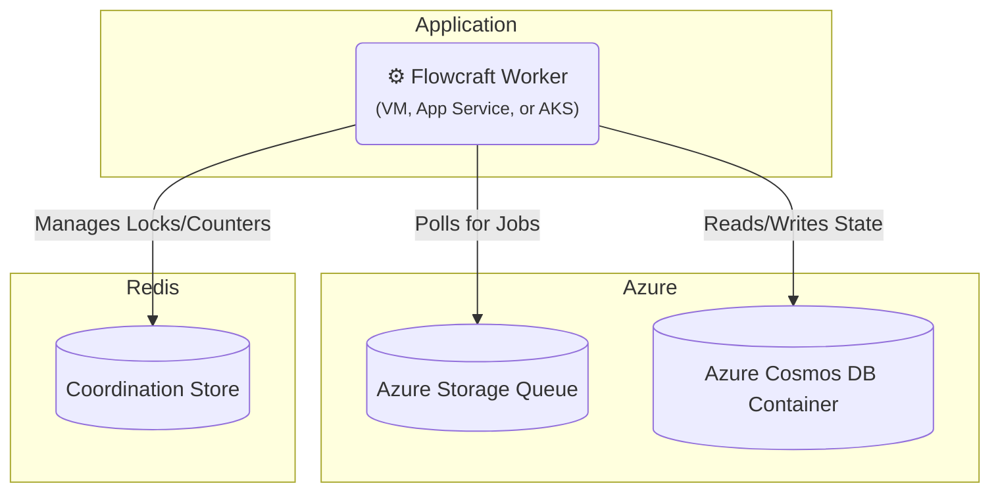

# Runtime Adapter: Azure (Queues, Cosmos DB & Redis)

[](https://www.npmjs.com/package/@flowcraft/azure-adapter)

This adapter provides a distributed solution for [Flowcraft](https://flowcraft.dev) leveraging Microsoft Azure services. It uses **Azure Queue Storage** for job queuing, **Azure Cosmos DB** for state persistence, and **Redis** for high-performance coordination.

## Installation

You will need the adapter and its peer dependencies for Azure and Redis.

```bash
npm install flowcraft @flowcraft/azure-adapter @azure/storage-queue @azure/cosmos ioredis
```

## Architecture

This adapter leverages native Azure services for the queue and context, with Redis handling coordination.



## Infrastructure Setup

You must have the following resources provisioned:
-   An **Azure Storage Account** with a Queue.
-   An **Azure Cosmos DB** account (Core SQL API) with a database and two containers (one for context, one for status).
-   A **Redis** instance (e.g., Azure Cache for Redis) accessible by your workers.

### Using Azure CLI

```bash
# 1. Create Storage Account and Queue
az storage account create --name flowcraftstorage --resource-group my-rg
az storage queue create --name flowcraft-jobs --account-name flowcraftstorage

# 2. Create Cosmos DB Account, Database, and Containers
az cosmosdb create --name flowcraft-cosmos --resource-group my-rg
az cosmosdb sql database create --account-name flowcraft-cosmos --name flowcraft-db --resource-group my-rg
az cosmosdb sql container create --account-name flowcraft-cosmos --database-name flowcraft-db --name contexts --partition-key-path "/runId" --resource-group my-rg
az cosmosdb sql container create --account-name flowcraft-cosmos --database-name flowcraft-db --name statuses --partition-key-path "/runId" --resource-group my-rg

# 3. Create Redis Cache
az redis create --name flowcraft-redis --resource-group my-rg --location eastus --sku Basic --vm-size c0
```

### Using Terraform

```hcl
resource "azurerm_storage_account" "main" {
  name                     = "flowcraftstorage"
  resource_group_name      = var.resource_group_name
  location                 = var.location
  account_tier             = "Standard"
  account_replication_type = "LRS"
}

resource "azurerm_storage_queue" "jobs" {
  name                 = "flowcraft-jobs"
  storage_account_name = azurerm_storage_account.main.name
}

resource "azurerm_cosmosdb_account" "main" {
  name                = "flowcraft-cosmos"
  resource_group_name = var.resource_group_name
  location            = var.location
  offer_type          = "Standard"
  kind                = "GlobalDocumentDB"
  // ... other required config
}

resource "azurerm_cosmosdb_sql_database" "main" {
  name                = "flowcraft-db"
  resource_group_name = azurerm_cosmosdb_account.main.resource_group_name
  account_name        = azurerm_cosmosdb_account.main.name
}

resource "azurerm_cosmosdb_sql_container" "contexts" {
  name                = "contexts"
  resource_group_name = azurerm_cosmosdb_account.main.resource_group_name
  account_name        = azurerm_cosmosdb_account.main.name
  database_name       = azurerm_cosmosdb_sql_database.main.name
  partition_key_path  = "/runId"
}
// ... also for statuses container and redis
```

## Worker Usage

The following example demonstrates how to set up and start a worker.

```typescript
import { CosmosClient } from '@azure/cosmos'
import { QueueClient } from '@azure/storage-queue'
import { AzureQueueAdapter, RedisCoordinationStore } from '@flowcraft/azure-adapter'
import { FlowRuntime } from 'flowcraft'
import Redis from 'ioredis'

// 1. Define your blueprints and registry
const blueprints = { /* your workflow blueprints */ }
const registry = { /* your node implementations */ }

// 2. Initialize service clients
const queueClient = new QueueClient(process.env.AZURE_STORAGE_CONNECTION_STRING, 'your-queue-name')
const cosmosClient = new CosmosClient(process.env.COSMOS_DB_CONNECTION_STRING)
const redisClient = new Redis(process.env.REDIS_CONNECTION_STRING)

// 3. Create a runtime instance
const runtime = new FlowRuntime({ blueprints, registry })

// 4. Set up the coordination store
const coordinationStore = new RedisCoordinationStore(redisClient)

// 5. Initialize the adapter
const adapter = new AzureQueueAdapter({
  runtimeOptions: runtime.options,
  coordinationStore,
  queueClient,
  cosmosClient,
  cosmosDatabaseName: 'your-cosmos-db-name',
  contextContainerName: 'workflow-contexts',
  statusContainerName: 'workflow-statuses',
})

// 6. Start the worker
adapter.start()

console.log('Flowcraft worker with Azure adapter is running...')
```

## Starting a Workflow (Client-Side)

A client starts a workflow by creating the initial state in Cosmos DB and enqueuing the first job(s).

```typescript
import { analyzeBlueprint } from 'flowcraft'
import { CosmosClient } from '@azure/cosmos'
import { QueueClient } from '@azure/storage-queue'

async function startWorkflow(blueprint, initialContext) {
  const runId = crypto.randomUUID()
  const cosmosClient = new CosmosClient(process.env.COSMOS_DB_CONNECTION_STRING)
  const queueClient = new QueueClient(process.env.AZURE_STORAGE_CONNECTION_STRING, 'your-queue-name')

  // 1. Set initial context and status in Cosmos DB
  const db = cosmosClient.database('your-cosmos-db-name')
  await db.container('workflow-contexts').items.create({ id: runId, ...initialContext })
  await db.container('workflow-statuses').items.create({ id: runId, status: 'running', lastUpdated: new Date().toISOString() })

  // 2. Analyze blueprint for start nodes
  const analysis = analyzeBlueprint(blueprint)
  const startJobs = analysis.startNodeIds.map(nodeId =>
    queueClient.sendMessage(JSON.stringify({ runId, blueprintId: blueprint.id, nodeId }))
  )

  // 3. Enqueue start jobs
  await Promise.all(startJobs)

  console.log(`Workflow ${runId} started.`)
  return runId
}
```

## Reconciliation

The adapter includes a utility to find and resume stalled workflows, ensuring workflows complete even if workers fail.

### How It Works

The reconciler queries the Cosmos DB status container for 'running' workflows that have not been updated recently and re-enqueues their next valid jobs.

### Usage

```typescript
import { createAzureReconciler } from '@flowcraft/azure-adapter'

// 'adapter' and 'cosmosClient' should be initialized as in the worker setup
const reconciler = createAzureReconciler({
  adapter,
  cosmosClient,
  cosmosDatabaseName: 'your-cosmos-db-name',
  statusContainerName: 'workflow-statuses',
  stalledThresholdSeconds: 300, // 5 minutes
})

// Run this function periodically
async function reconcile() {
  const stats = await reconciler.run()
  console.log(`Reconciled ${stats.reconciledRuns} of ${stats.stalledRuns} stalled runs.`)
}
```

## Key Components

- **`AzureQueueAdapter`**: Orchestrates job processing from Azure Queues.
- **`CosmosDbContext`**: An `IAsyncContext` implementation for Cosmos DB.
- **`RedisCoordinationStore`**: An `ICoordinationStore` for distributed locks using Redis.
- **`createAzureReconciler`**: A factory function to create the reconciliation utility.
