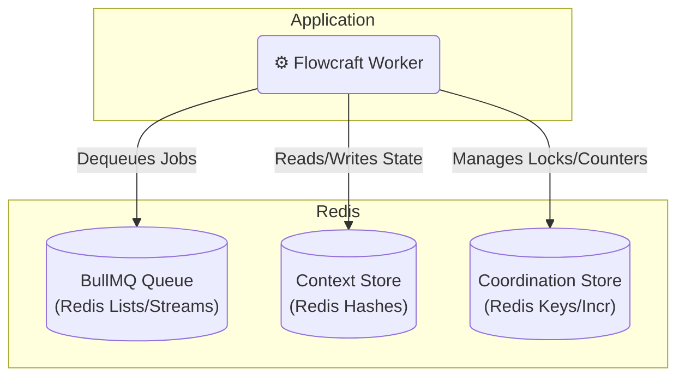

# Runtime Adapter: BullMQ (Redis)

[](https://www.npmjs.com/package/@flowcraft/bullmq-adapter)

The BullMQ adapter is a robust, high-performance solution that leverages Redis for all distributed components: the job queue, the context store, and the coordination store. This makes it an excellent choice for its simplicity, efficiency, and the rich feature set provided by the battle-tested [BullMQ](https://bullmq.io/) library.

## Installation

You will need the adapter package, `bullmq`, and `ioredis`.

```bash
npm install flowcraft @flowcraft/bullmq-adapter bullmq ioredis
```

## Architecture

This adapter uses Redis for all three distributed concerns, resulting in a streamlined and efficient setup.



## Infrastructure Setup

The only prerequisite is a running Redis instance. For local development, you can use Docker:

```bash
docker run -d -p 6379:6379 --name flowcraft-redis redis:7-alpine
```

For production, consider a managed Redis service like AWS ElastiCache, Azure Cache for Redis, or Google Memorystore.

## Worker Usage

The following example shows how to set up and start a worker that processes jobs from the BullMQ queue.

```typescript
import { BullMQAdapter, RedisCoordinationStore } from '@flowcraft/bullmq-adapter'
import { FlowRuntime } from 'flowcraft'
import Redis from 'ioredis'

// 1. Define your workflow blueprints and node implementations
const blueprints = { /* your workflow blueprints */ }
const registry = { /* your node implementations */ }

// 2. Initialize the Redis client. This will be shared across components.
const redisConnection = new Redis(process.env.REDIS_URL, {
  maxRetriesPerRequest: null // Recommended for long-running workers
})

// 3. Create a runtime instance with your blueprints and registry
const runtime = new FlowRuntime({ blueprints, registry })

// 4. Set up the coordination store
const coordinationStore = new RedisCoordinationStore(redisConnection)

// 5. Initialize the adapter
const adapter = new BullMQAdapter({
  runtimeOptions: runtime.options,
  coordinationStore,
  connection: redisConnection,
  queueName: 'my-workflow-queue', // Optional: defaults to 'flowcraft-queue'
})

// 6. Start the worker to begin processing jobs
adapter.start()

console.log('Flowcraft worker with BullMQ adapter is running...')
```

## Starting a Workflow (Client-Side)

To start a workflow, a client needs to set the initial context and enqueue the first job(s).

```typescript
import { analyzeBlueprint } from 'flowcraft'
import { Queue } from 'bullmq'
import Redis from 'ioredis'

async function startWorkflow(blueprint, initialContext) {
  const runId = crypto.randomUUID()
  const redis = new Redis(process.env.REDIS_URL)
  const queue = new Queue('my-workflow-queue', { connection: redis })

  // 1. Set the initial context in a Redis Hash
  const contextKey = `workflow:state:${runId}`
  await redis.hset(contextKey, initialContext)

  // 2. Analyze the blueprint to find the starting node(s)
  const analysis = analyzeBlueprint(blueprint)
  const startJobs = analysis.startNodeIds.map(nodeId => ({
    name: 'executeNode', // Default job name for the adapter
    data: { runId, blueprintId: blueprint.id, nodeId },
  }))

  // 3. Enqueue the start jobs
  await queue.addBulk(startJobs)

  console.log(`Workflow ${runId} started with ${startJobs.length} initial job(s).`)

  await redis.quit()
  await queue.close()
  return runId
}
```

## Reconciliation

The adapter includes a utility to detect and resume stalled workflows, which is crucial for production reliability.

### How It Works

The reconciler scans Redis keys for workflow states and checks their idle time. If a workflow has been idle for longer than a specified threshold, it is considered stalled, and the reconciler will re-enqueue the appropriate next jobs.

### Usage

```typescript
import { createBullMQReconciler } from '@flowcraft/bullmq-adapter'

// 'adapter' and 'redisConnection' should be initialized as in the worker setup
const reconciler = createBullMQReconciler({
  adapter,
  redis: redisConnection,
  stalledThresholdSeconds: 300, // 5 minutes
})

// Run this function periodically (e.g., via a cron job)
async function reconcile() {
  const stats = await reconciler.run()
  console.log(`Scanned ${stats.scannedKeys} keys, reconciled ${stats.reconciledRuns} runs.`)
}
```

## Key Components

- **`BullMQAdapter`**: The main class that connects to BullMQ and orchestrates job processing.
- **`RedisContext`**: An `IAsyncContext` implementation that stores workflow state in a Redis Hash.
- **`RedisCoordinationStore`**: An `ICoordinationStore` implementation for distributed locks and counters.
- **`createBullMQReconciler`**: A factory function to create the workflow reconciliation utility.
