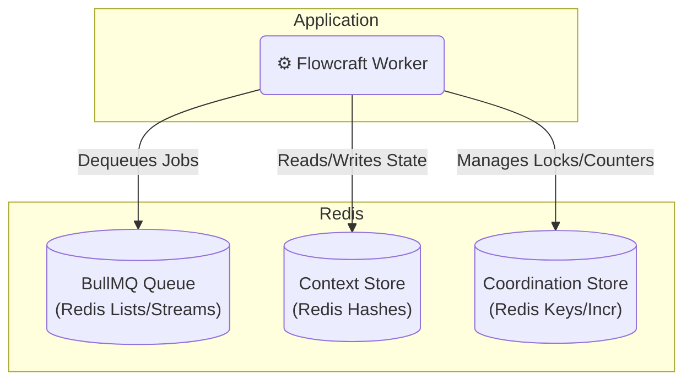

# Runtime Adapter: BullMQ (Redis)

[](https://www.npmjs.com/package/@flowcraft/bullmq-adapter)

The BullMQ adapter is a robust, high-performance solution that leverages Redis for all distributed components: the job queue, the context store, and the coordination store. This makes it an excellent choice for its simplicity, efficiency, and the rich feature set provided by the battle-tested [BullMQ](https://bullmq.io/) library.

## Installation

You will need the adapter package, `bullmq`, and `ioredis`.

```bash
npm install @flowcraft/bullmq-adapter bullmq ioredis
```

## Infrastructure Setup

The BullMQ adapter requires only a Redis instance, which handles the queue, context store, and coordination store.

### Using Docker (Recommended for Development)

Run a Redis container:

```bash
docker run -d -p 6379:6379 --name flowcraft-redis redis:7-alpine
```

### Production Setup

For production, use managed Redis services like:

- **AWS ElastiCache for Redis**
- **Azure Cache for Redis**
- **Google Cloud Memorystore for Redis**
- **Redis Labs**

Configure your Redis URL in environment variables (e.g., `REDIS_URL=redis://localhost:6379` for local development).

## Architecture

This adapter uses Redis for all three distributed concerns, making for a streamlined and efficient setup.



## Usage

The following example shows how to configure and start a worker using the `BullMQAdapter`. The worker will automatically connect to the queue and begin processing jobs.

#### `worker.ts`
```typescript
import { BullMQAdapter, RedisCoordinationStore } from '@flowcraft/bullmq-adapter'
import IORedis from 'ioredis'
// Assume agentNodeRegistry and blueprints are loaded from your application's shared files.
import { agentNodeRegistry, blueprints } from './shared'

async function main() {
	console.log('--- Starting Flowcraft Worker (BullMQ) ---')

	// 1. Establish a connection to Redis. BullMQ and Flowcraft will share this.
	const redisConnection = new IORedis({
		maxRetriesPerRequest: null, // Recommended for long-running workers
	})

	// 2. Create the coordination store.
	const coordinationStore = new RedisCoordinationStore(redisConnection)

	// 3. Instantiate the adapter.
	const adapter = new BullMQAdapter({
		connection: redisConnection,
		queueName: 'flowcraft-job-queue', // Optional: defaults to 'flowcraft-queue'
		coordinationStore,
		runtimeOptions: {
			// Provide the runtime with the necessary node implementations and blueprints.
			registry: agentNodeRegistry,
			blueprints,
		},
	})

	// 4. Start the worker. It will now listen for and execute jobs.
	adapter.start()

	console.log('Worker is running. Waiting for jobs...')
}

main().catch(console.error)
```

## Client Usage

Once your worker is running, you'll need a way to start workflows. The following example shows how to enqueue the initial jobs for a workflow using the BullMQ adapter.

#### `client.ts`
```typescript
import { Queue } from 'bullmq'
import type { WorkflowResult } from 'flowcraft'
import { analyzeBlueprint } from 'flowcraft'
import IORedis from 'ioredis'
// Assume blueprints and config are loaded from your application's shared files.
import { blueprints, config } from './shared'
import 'dotenv/config'

const QUEUE_NAME = 'flowcraft-queue'
const ACTIVE_USE_CASE = '4.content-moderation'

export async function waitForWorkflow(
	redis: IORedis,
	runId: string,
	timeoutMs: number,
): Promise<{ status: string; payload?: WorkflowResult; reason?: string }> {
	const statusKey = `workflow:status:${runId}`
	const startTime = Date.now()

	console.log(`Awaiting result for Run ID ${runId} on key: ${statusKey}`)

	while (Date.now() - startTime < timeoutMs) {
		const statusJson = await redis.get(statusKey)
		if (statusJson) {
			await redis.del(statusKey) // Clean up
			return JSON.parse(statusJson)
		}
		await new Promise((resolve) => setTimeout(resolve, 500))
	}

	return {
		status: 'failed',
		reason: `Timeout: Client did not receive a result within ${timeoutMs}ms.`,
	}
}

async function main() {
	console.log('--- Distributed Workflow Client (BullMQ) ---')

	const runId = Math.floor(Math.random() * 10).toString()
	const redisConnection = new IORedis({ maxRetriesPerRequest: null })
	const queue = new Queue(QUEUE_NAME, { connection: redisConnection })

	const useCase = config[ACTIVE_USE_CASE]
	const blueprint = blueprints[useCase.mainWorkflowId]

	const analysis = analyzeBlueprint(blueprint)
	const startNodeIds = analysis.startNodeIds

	const initialContextData = useCase.initialContext

	const stateKey = `workflow:state:${runId}`
	for (const [key, value] of Object.entries(initialContextData)) {
		await redisConnection.hset(stateKey, key, JSON.stringify(value))
	}

	const startJobs = startNodeIds.map((nodeId: any) => ({
		name: 'executeNode',
		data: { runId, blueprintId: useCase.mainWorkflowId, nodeId },
	}))

	console.log(`🚀 Enqueuing ${startJobs.length} start job(s) for Run ID: ${runId}`)
	await queue.addBulk(startJobs)

	try {
		const finalStatus = await waitForWorkflow(redisConnection, runId, 60000)
		console.log('\n=============================================================')

		switch (finalStatus.status) {
			case 'completed':
				console.log(`✅ Workflow Run ID: ${runId} COMPLETED.`)
				console.log('Final Output:', finalStatus.payload?.context?.moderation_result)
				break
			case 'cancelled':
				console.warn(`🛑 Workflow Run ID: ${runId} was successfully CANCELLED.`)
				console.log(`   Reason: ${finalStatus.reason}`)
				break
			case 'failed':
				console.error(`❌ Workflow Run ID: ${runId} FAILED or timed out.`)
				console.error(`   Reason: ${finalStatus.reason}`)
				break
		}
		console.log('=============================================================\n')
	} catch (error) {
		console.error(`Error waiting for workflow to complete for Run ID ${runId}`, error)
	}

	await redisConnection.quit()
	await queue.close()
}

main().catch(console.error)
```

This client example demonstrates how to:
- Analyze a blueprint to determine start nodes
- Set initial context data in Redis
- Enqueue the initial jobs to start workflow execution
- Wait for workflow completion

For a complete working example with more detailed setup, see the [distributed example](/examples/distributed).

## Workflow Reconciliation

To enhance fault tolerance, the BullMQ adapter includes a utility for detecting and resuming stalled workflows. This is critical in production environments where workers might crash, leaving workflows in an incomplete state.

### How It Works

The reconciler leverages Redis's `OBJECT IDLETIME` command. It scans for workflow state keys and checks how long they have been idle (i.e., not written to). If a key is idle longer than the configured threshold, the corresponding workflow is considered stalled, and the reconciler attempts to resume it.

### Reconciler Usage

A reconciliation process should be run periodically as a separate script or scheduled job (e.g., a cron job or a simple `setInterval`).

#### `reconcile.ts`
```typescript
import { createBullMQReconciler } from '@flowcraft/bullmq-adapter';

// Assume 'adapter' and 'redisConnection' are initialized just like in your worker
const reconciler = createBullMQReconciler({
  adapter,
  redis: redisConnection,
  stalledThresholdSeconds: 300, // 5 minutes
});

async function runReconciliation() {
  console.log('Starting reconciliation cycle...');
  const stats = await reconciler.run();
  console.log(`Reconciliation complete. Scanned: ${stats.scannedKeys}, Stalled: ${stats.stalledRuns}, Resumed: ${stats.reconciledRuns}, Failed: ${stats.failedRuns}`);
}

// Run this function on a schedule
runReconciliation();
```

The `run()` method returns a `ReconciliationStats` object:
-   `scannedKeys`: Total number of workflow state keys scanned in Redis.
-   `stalledRuns`: Number of workflows identified as stalled.
-   `reconciledRuns`: Number of workflows where at least one job was successfully re-enqueued.
-   `failedRuns`: Number of workflows where an error occurred during the reconciliation attempt.

## Key Components

-   **Job Queue**: Managed by BullMQ, which provides a reliable and feature-rich queueing system on top of Redis.
-   **Context Store**: The `RedisContext` class implements the `IAsyncContext` interface. It stores the state for each workflow run in a separate Redis Hash.
-   **Coordination Store**: The `RedisCoordinationStore` uses atomic Redis commands like `INCR` and `SETNX` to safely manage distributed locks and counters for fan-in joins.
-   **Reconciler**: The `createBullMQReconciler` factory provides a utility to find and resume stalled workflows.
