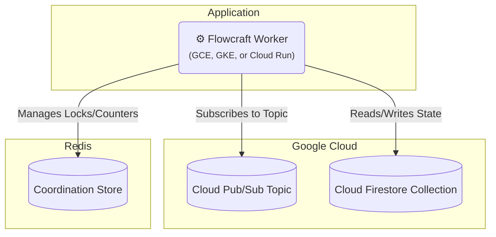

# Runtime Adapter: Google Cloud (Pub/Sub & Firestore)

[](https://www.npmjs.com/package/@flowcraft/gcp-adapter)

The Google Cloud adapter provides a fully native, serverless-friendly solution for running distributed workflows on GCP. It uses **Pub/Sub** for event-driven job queuing, **Firestore** for the context store, and **Redis** for coordination.

## Installation

You will need the adapter package, the GCP clients, and `ioredis`.

```bash
npm install flowcraft @flowcraft/gcp-adapter @google-cloud/pubsub @google-cloud/firestore ioredis
```

## Architecture

This adapter leverages native GCP services for the queue and context, with Redis handling coordination.



## Infrastructure Setup

Before running, you need to provision the following GCP resources:
- A **Pub/Sub Topic** and a corresponding **Subscription**.
- A **Firestore Database**. The required collections will be created by the adapter.
- A **Redis** instance (e.g., Memorystore for Redis).

### Using gcloud CLI

```bash
# 1. Create Pub/Sub topic and subscription
gcloud pubsub topics create flowcraft-jobs
gcloud pubsub subscriptions create flowcraft-workers --topic flowcraft-jobs

# 2. Enable Firestore API
gcloud services enable firestore.googleapis.com

# 3. Create a Redis instance in Memorystore
gcloud redis instances create flowcraft-redis --size=1 --region=us-central1
```

### Using Terraform

```hcl
resource "google_pubsub_topic" "flowcraft_jobs" {
  name = "flowcraft-jobs"
}

resource "google_pubsub_subscription" "flowcraft_workers" {
  name  = "flowcraft-workers"
  topic = google_pubsub_topic.flowcraft_jobs.name
}

resource "google_firestore_database" "database" {
  project     = var.project_id
  name        = "(default)"
  location_id = "nam5" // Example location, choose one near your app
  type        = "FIRESTORE_NATIVE"
}

resource "google_redis_instance" "flowcraft_redis" {
  name           = "flowcraft-redis"
  memory_size_gb = 1
  region         = "us-central1"
}
```

## Worker Usage

The following example demonstrates how to configure and start a worker.

```typescript
import { PubSubAdapter, RedisCoordinationStore } from '@flowcraft/gcp-adapter'
import { Firestore } from '@google-cloud/firestore'
import { PubSub } from '@google-cloud/pubsub'
import { FlowRuntime } from 'flowcraft'
import Redis from 'ioredis'

// 1. Define your blueprints and registry
const blueprints = { /* your workflow blueprints */ }
const registry = { /* your node implementations */ }

// 2. Initialize service clients
const pubsubClient = new PubSub({ projectId: process.env.GCP_PROJECT_ID })
const firestoreClient = new Firestore({ projectId: process.env.GCP_PROJECT_ID })
const redisClient = new Redis(process.env.REDIS_URL)

// 3. Create a runtime instance
const runtime = new FlowRuntime({ blueprints, registry })

// 4. Set up the coordination store
const coordinationStore = new RedisCoordinationStore(redisClient)

// 5. Initialize the adapter
const adapter = new PubSubAdapter({
  runtimeOptions: runtime.options,
  coordinationStore,
  pubsubClient,
  firestoreClient,
  topicName: 'flowcraft-jobs',
  subscriptionName: 'flowcraft-workers',
  contextCollectionName: 'workflow-contexts',
  statusCollectionName: 'workflow-statuses',
})

// 6. Start the worker
adapter.start()

console.log('Flowcraft worker with GCP adapter is running...')
```

## Starting a Workflow (Client-Side)

A client starts a workflow by creating the initial state in Firestore and publishing the first job(s) to Pub/Sub.

```typescript
import { analyzeBlueprint } from 'flowcraft'
import { Firestore } from '@google-cloud/firestore'
import { PubSub } from '@google-cloud/pubsub'

async function startWorkflow(blueprint, initialContext) {
  const runId = crypto.randomUUID()
  const projectId = process.env.GCP_PROJECT_ID
  const firestore = new Firestore({ projectId })
  const pubsub = new PubSub({ projectId })

  // 1. Set initial context and status in Firestore
  await firestore.collection('workflow-contexts').doc(runId).set(initialContext)
  await firestore.collection('workflow-statuses').doc(runId).set({ status: 'running', lastUpdated: new Date() })

  // 2. Analyze blueprint for start nodes
  const analysis = analyzeBlueprint(blueprint)
  const topic = pubsub.topic('flowcraft-jobs')
  const publishPromises = analysis.startNodeIds.map(nodeId => {
    const data = Buffer.from(JSON.stringify({ runId, blueprintId: blueprint.id, nodeId }))
    return topic.publishMessage({ data })
  })

  // 3. Publish start jobs
  await Promise.all(publishPromises)

  console.log(`Workflow ${runId} started.`)
  return runId
}
```

## Reconciliation

The adapter includes a utility to find and resume stalled workflows by querying Firestore.

### How It Works

The reconciler queries the Firestore status collection for 'running' workflows that have been idle for too long and re-publishes their next valid jobs.

### Usage

```typescript
import { createGcpReconciler } from '@flowcraft/gcp-adapter'

// 'adapter' and 'firestoreClient' should be initialized as in the worker setup
const reconciler = createGcpReconciler({
  adapter,
  firestoreClient,
  statusCollectionName: 'workflow-statuses',
  stalledThresholdSeconds: 300, // 5 minutes
})

// Run this function periodically
async function reconcile() {
  const stats = await reconciler.run()
  console.log(`Reconciled ${stats.reconciledRuns} of ${stats.stalledRuns} stalled runs.`)
}
```

## Webhook Endpoints

The GCP adapter supports webhook endpoints for workflows using `Flow.createWebhook()`. Webhook endpoints can be registered using Cloud Functions, Cloud Run, or API Gateway.

### `registerWebhookEndpoint(runId, nodeId)`

Registers a webhook endpoint for the specified workflow run and node.

- **`runId`** `string`: The unique identifier for the workflow execution.
- **`nodeId`** `string`: The ID of the webhook node.
- **Returns**: `Promise<{ url: string; event: string }>` - The webhook URL and event name.

**Example Implementation:**
```typescript
// In PubSubAdapter
public async registerWebhookEndpoint(runId: string, nodeId: string): Promise<{ url: string; event: string }> {
  const eventName = `webhook:${runId}:${nodeId}`
  // Use Cloud Functions URL or custom domain
  const url = `https://your-region-your-project.cloudfunctions.net/webhook/${runId}/${nodeId}`

  // Store webhook mapping in Firestore for later retrieval
  await this.firestore.collection('webhooks').doc(`${runId}:${nodeId}`).set({
    eventName,
    url,
    createdAt: new Date()
  })

  return { url, event: eventName }
}
```

### Handling Webhook Requests with Cloud Functions

Create a Cloud Function to handle webhook requests and publish messages to Pub/Sub:

```typescript
// Cloud Function
import { PubSub } from '@google-cloud/pubsub'
import { Firestore } from '@google-cloud/firestore'

const pubsub = new PubSub()
const firestore = new Firestore()

export async function webhookHandler(req: any, res: any) {
  const { runId, nodeId } = req.params
  const payload = req.body

  // Get webhook mapping from Firestore
  const webhookDoc = await firestore.collection('webhooks').doc(`${runId}:${nodeId}`).get()

  if (webhookDoc.exists) {
    const webhookData = webhookDoc.data()

    // Publish event to Pub/Sub topic
    await pubsub.topic('flowcraft-events').publishMessage({
      data: Buffer.from(JSON.stringify({
        event: webhookData.eventName,
        payload
      }))
    })

    res.status(200).send('OK')
  } else {
    res.status(404).send('Webhook not found')
  }
}
```

## Key Components

- **`PubSubAdapter`**: Orchestrates job processing from a Pub/Sub subscription.
- **`FirestoreContext`**: An `IAsyncContext` implementation for Firestore.
- **`RedisCoordinationStore`**: An `ICoordinationStore` for distributed locks using Redis.
- **`createGcpReconciler`**: A factory function to create the reconciliation utility.
