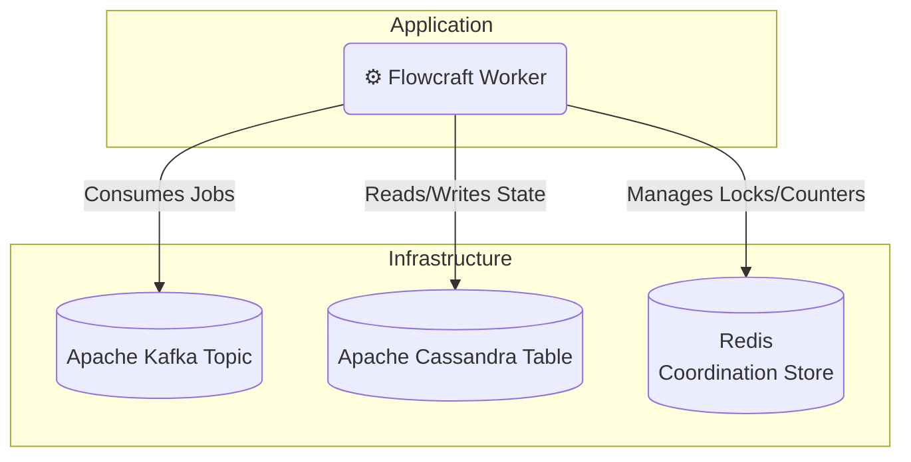

# Runtime Adapter: Kafka & Cassandra

[](https://www.npmjs.com/package/@flowcraft/kafka-adapter)

This adapter is designed for high-throughput environments, using **Apache Kafka** for streaming job processing, **Apache Cassandra** for scalable state persistence, and **Redis** for high-performance coordination.

## Installation

You will need the adapter and clients for Kafka, Cassandra, and Redis.

```bash
npm install flowcraft @flowcraft/kafka-adapter kafkajs cassandra-driver ioredis
```

## Architecture



## Infrastructure Setup

You must have Kafka, Cassandra, and Redis available. For local development, Docker Compose is recommended.

### Using Docker Compose

Create a `docker-compose.yml` file:
```yaml
version: '3.8'
services:
  zookeeper:
    image: confluentinc/cp-zookeeper:7.9.4
    ports: ["2181:2181"]
    environment:
      ZOOKEEPER_CLIENT_PORT: 2181
  kafka:
    image: confluentinc/cp-kafka:7.9.4
    ports: ["9092:9092"]
    depends_on: [zookeeper]
    environment:
      KAFKA_BROKER_ID: 1
      KAFKA_ZOOKEEPER_CONNECT: 'zookeeper:2181'
      KAFKA_ADVERTISED_LISTENERS: PLAINTEXT://localhost:9092
      KAFKA_OFFSETS_TOPIC_REPLICATION_FACTOR: 1
  cassandra:
    image: cassandra:5.0.5
    ports: ["9042:9042"]
  redis:
    image: redis:8-alpine
    ports: ["6379:6379"]
```

After running `docker-compose up -d`, create the Kafka topic and Cassandra schema:
```bash
# 1. Create the Kafka topic
docker exec kafka kafka-topics --create --topic flowcraft-jobs --bootstrap-server localhost:9092

# 2. Create the Cassandra keyspace and tables
docker exec -it cassandra cqlsh -e "
CREATE KEYSPACE IF NOT EXISTS flowcraft_ks WITH REPLICATION = {'class': 'SimpleStrategy', 'replication_factor': 1};
USE flowcraft_ks;
CREATE TABLE contexts (run_id text PRIMARY KEY, context_data text);
CREATE TABLE statuses (run_id text PRIMARY KEY, status text, updated_at timestamp);
"
```

## Worker Usage

The following example shows how to configure and start a worker.

```typescript
import { KafkaAdapter, RedisCoordinationStore } from '@flowcraft/kafka-adapter'
import { Client as CassandraClient } from 'cassandra-driver'
import { FlowRuntime } from 'flowcraft'
import Redis from 'ioredis'
import { Kafka } from 'kafkajs'

// 1. Define your blueprints and registry
const blueprints = { /* your workflow blueprints */ }
const registry = { /* your node implementations */ }

// 2. Initialize service clients
const kafka = new Kafka({ brokers: [process.env.KAFKA_BROKER] })
const cassandraClient = new CassandraClient({
  contactPoints: [process.env.CASSANDRA_HOST],
  localDataCenter: 'datacenter1',
  keyspace: 'flowcraft_ks',
})
const redisClient = new Redis(process.env.REDIS_URL)

// 3. Create a runtime instance
const runtime = new FlowRuntime({ blueprints, registry })

// 4. Set up the coordination store
const coordinationStore = new RedisCoordinationStore(redisClient)

// 5. Initialize the adapter
const adapter = new KafkaAdapter({
  runtimeOptions: runtime.options,
  coordinationStore,
  kafka,
  cassandraClient,
  keyspace: 'flowcraft_ks',
  contextTableName: 'contexts',
  statusTableName: 'statuses',
  topicName: 'flowcraft-jobs',
  groupId: 'flowcraft-workers',
})

// 6. Start the worker
await adapter.start()

console.log('Flowcraft worker with Kafka adapter is running...')
```

## Starting a Workflow (Client-Side)

A client starts a workflow by creating the initial state in Cassandra and producing the first job(s) to Kafka.

```typescript
import { analyzeBlueprint } from 'flowcraft'
import { Client as CassandraClient } from 'cassandra-driver'
import { Kafka } from 'kafkajs'

async function startWorkflow(blueprint, initialContext) {
  const runId = crypto.randomUUID()
  const kafka = new Kafka({ brokers: [process.env.KAFKA_BROKER] })
  const cassandra = new CassandraClient({ contactPoints: [process.env.CASSANDRA_HOST], localDataCenter: 'datacenter1', keyspace: 'flowcraft_ks' })

  // 1. Set initial context and status in Cassandra
  await cassandra.execute('INSERT INTO contexts (run_id, context_data) VALUES (?, ?)', [runId, JSON.stringify(initialContext)])
  await cassandra.execute('INSERT INTO statuses (run_id, status, updated_at) VALUES (?, ?, ?)', [runId, 'running', new Date()])

  // 2. Analyze blueprint for start nodes and prepare Kafka messages
  const analysis = analyzeBlueprint(blueprint)
  const messages = analysis.startNodeIds.map(nodeId => ({
    key: runId, // Using runId as key ensures messages for the same workflow go to the same partition
    value: JSON.stringify({ runId, blueprintId: blueprint.id, nodeId }),
  }))

  // 3. Produce start jobs to Kafka
  const producer = kafka.producer()
  await producer.connect()
  await producer.send({ topic: 'flowcraft-jobs', messages })
  await producer.disconnect()

  console.log(`Workflow ${runId} started.`)
  return runId
}
```

## Reconciliation

The adapter includes a utility to find and resume stalled workflows by querying Cassandra.

### How It Works

The reconciler queries the Cassandra status table for 'running' workflows that have been idle for too long and produces their next valid jobs to Kafka.

> [!WARNING]
> The default query uses `ALLOW FILTERING`, which can be inefficient on large tables. For production use, it is highly recommended to create a secondary index on the `status` column of your status table.

### Usage

```typescript
import { createKafkaReconciler } from '@flowcraft/kafka-adapter'

// 'adapter' and 'cassandraClient' should be initialized as in the worker setup
const reconciler = createKafkaReconciler({
  adapter,
  cassandraClient,
  keyspace: 'flowcraft_ks',
  statusTableName: 'statuses',
  stalledThresholdSeconds: 300, // 5 minutes
})

// Run this function periodically
async function reconcile() {
  const stats = await reconciler.run()
  console.log(`Reconciled ${stats.reconciledRuns} of ${stats.stalledRuns} stalled runs.`)
}
```

## Webhook Endpoints

The Kafka adapter supports webhook endpoints for workflows using `Flow.createWebhook()`. Webhook endpoints can be registered using web frameworks or dedicated webhook services.

### `registerWebhookEndpoint(runId, nodeId)`

Registers a webhook endpoint for the specified workflow run and node.

- **`runId`** `string`: The unique identifier for the workflow execution.
- **`nodeId`** `string`: The ID of the webhook node.
- **Returns**: `Promise<{ url: string; event: string }>` - The webhook URL and event name.

**Example Implementation:**
```typescript
// In KafkaAdapter
public async registerWebhookEndpoint(runId: string, nodeId: string): Promise<{ url: string; event: string }> {
  const eventName = `webhook:${runId}:${nodeId}`
  const url = `https://your-app.com/webhooks/${runId}/${nodeId}`

  // Store webhook mapping in Cassandra for later retrieval
  await this.cassandra.execute(
    'INSERT INTO webhooks (webhook_id, event_name, url, created_at) VALUES (?, ?, ?, ?)',
    [`${runId}:${nodeId}`, eventName, url, new Date()],
    { prepare: true }
  )

  return { url, event: eventName }
}
```

### Handling Webhook Requests

Create an HTTP endpoint to handle webhook requests and produce messages to Kafka:

```typescript
// Express.js webhook handler
import { Kafka } from 'kafkajs'

const kafka = new Kafka({ brokers: ['localhost:9092'] })
const producer = kafka.producer()

await producer.connect()

app.post('/webhooks/:runId/:nodeId', async (req, res) => {
  const { runId, nodeId } = req.params
  const payload = req.body

  // Get webhook mapping from Cassandra
  const result = await cassandra.execute(
    'SELECT event_name FROM webhooks WHERE webhook_id = ?',
    [`${runId}:${nodeId}`],
    { prepare: true }
  )

  if (result.rows.length > 0) {
    const eventName = result.rows[0].event_name

    // Produce event to Kafka topic
    await producer.send({
      topic: 'flowcraft-events',
      messages: [{
        value: JSON.stringify({
          event: eventName,
          payload
        })
      }]
    })

    res.status(200).send('OK')
  } else {
    res.status(404).send('Webhook not found')
  }
})
```

## Key Components

- **`KafkaAdapter`**: Consumes from and produces to a Kafka topic.
- **`CassandraContext`**: An `IAsyncContext` implementation for Cassandra.
- **`RedisCoordinationStore`**: An `ICoordinationStore` for distributed locks.
- **`createKafkaReconciler`**: A factory function to create the reconciliation utility.
