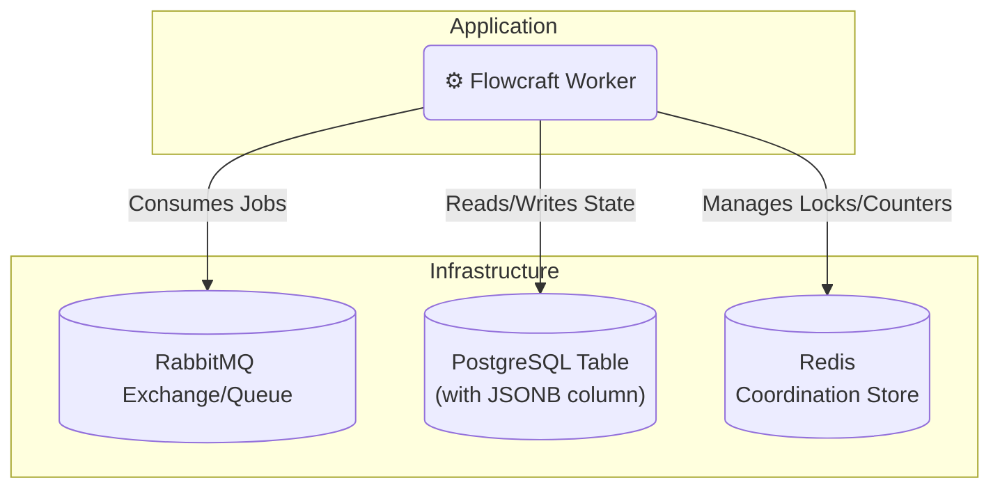

# Runtime Adapter: RabbitMQ & PostgreSQL

[](https://www.npmjs.com/package/@flowcraft/rabbitmq-adapter)

This adapter uses a traditional and reliable enterprise stack: **RabbitMQ** for job queuing, **PostgreSQL** for transactional state persistence, and **Redis** for high-performance coordination.

## Installation

You will need the adapter and clients for RabbitMQ, PostgreSQL, and Redis.

```bash
npm install flowcraft @flowcraft/rabbitmq-adapter amqplib pg ioredis
```

## Architecture



## Infrastructure Setup

You must have RabbitMQ, PostgreSQL, and Redis available. For local development, Docker Compose is recommended.

### Using Docker Compose

Create a `docker-compose.yml` file:
```yaml
version: '3.8'
services:
  rabbitmq:
    image: rabbitmq:3.13.0-management-alpine
    ports: ["5672:5672", "15672:15672"] # App & Management UI
  postgres:
    image: postgres:16-alpine
    ports: ["5432:5432"]
    environment:
      POSTGRES_DB: flowcraft_db
      POSTGRES_USER: user
      POSTGRES_PASSWORD: password
  redis:
    image: redis:8-alpine
    ports: ["6379:6379"]
```

After running `docker-compose up -d`, connect to PostgreSQL and create the required tables:
```sql
-- For context data
CREATE TABLE flowcraft_contexts (
    run_id TEXT PRIMARY KEY,
    context_data JSONB NOT NULL
);

-- For final status
CREATE TABLE flowcraft_statuses (
    run_id TEXT PRIMARY KEY,
    status TEXT NOT NULL,
    updated_at TIMESTAMPTZ DEFAULT NOW(),
    result JSONB
);
```

## Worker Usage

The following example demonstrates how to set up and start a worker.

```typescript
import { RabbitMqAdapter, RedisCoordinationStore } from '@flowcraft/rabbitmq-adapter'
import amqplib from 'amqplib'
import { FlowRuntime } from 'flowcraft'
import Redis from 'ioredis'
import { Client as PgClient } from 'pg'

// 1. Define your blueprints and registry
const blueprints = { /* your workflow blueprints */ }
const registry = { /* your node implementations */ }

// 2. Initialize service clients
const amqpConnection = await amqplib.connect(process.env.RABBITMQ_URL)
const pgClient = new PgClient({ connectionString: process.env.POSTGRES_URL })
await pgClient.connect()
const redisClient = new Redis(process.env.REDIS_URL)

// 3. Create a runtime instance
const runtime = new FlowRuntime({ blueprints, registry })

// 4. Set up the coordination store
const coordinationStore = new RedisCoordinationStore(redisClient)

// 5. Initialize the adapter
const adapter = new RabbitMqAdapter({
  runtimeOptions: runtime.options,
  coordinationStore,
  amqpConnection,
  pgClient,
  contextTableName: 'flowcraft_contexts',
  statusTableName: 'flowcraft_statuses',
  queueName: 'flowcraft-jobs',
})

// 6. Start the worker
adapter.start()

console.log('Flowcraft worker with RabbitMQ adapter is running...')
```

## Starting a Workflow (Client-Side)

A client starts a workflow by creating the initial state in PostgreSQL and publishing the first job(s) to RabbitMQ.

```typescript
import { analyzeBlueprint } from 'flowcraft'
import amqplib from 'amqplib'
import { Client as PgClient } from 'pg'

async function startWorkflow(blueprint, initialContext) {
  const runId = crypto.randomUUID()
  const pg = new PgClient({ connectionString: process.env.POSTGRES_URL })
  await pg.connect()
  const amqp = await amqplib.connect(process.env.RABBITMQ_URL)

  // 1. Set initial context and status in PostgreSQL
  await pg.query('INSERT INTO flowcraft_contexts (run_id, context_data) VALUES ($1, $2)', [runId, initialContext])
  await pg.query('INSERT INTO flowcraft_statuses (run_id, status) VALUES ($1, $2)', [runId, 'running'])

  // 2. Analyze blueprint for start nodes
  const analysis = analyzeBlueprint(blueprint)

  // 3. Publish start jobs to RabbitMQ
  const channel = await amqp.createChannel()
  const queue = 'flowcraft-jobs'
  await channel.assertQueue(queue, { durable: true })

  analysis.startNodeIds.forEach(nodeId => {
    const job = Buffer.from(JSON.stringify({ runId, blueprintId: blueprint.id, nodeId }))
    channel.sendToQueue(queue, job, { persistent: true })
  })

  await channel.close()
  await amqp.close()
  await pg.end()

  console.log(`Workflow ${runId} started.`)
  return runId
}
```

## Reconciliation

The adapter includes a utility to find and resume stalled workflows by querying PostgreSQL.

### How It Works

The reconciler queries the PostgreSQL status table for 'running' workflows that have been idle for too long and publishes their next valid jobs to RabbitMQ.

### Usage

```typescript
import { createRabbitMqReconciler } from '@flowcraft/rabbitmq-adapter'

// 'adapter' and 'pgClient' should be initialized as in the worker setup
const reconciler = createRabbitMqReconciler({
  adapter,
  pgClient,
  statusTableName: 'flowcraft_statuses',
  stalledThresholdSeconds: 300, // 5 minutes
})

// Run this function periodically
async function reconcile() {
  const stats = await reconciler.run()
  console.log(`Reconciled ${stats.reconciledRuns} of ${stats.stalledRuns} stalled runs.`)
}
```

## Webhook Endpoints

The RabbitMQ adapter supports webhook endpoints for workflows using `Flow.createWebhook()`. Webhook endpoints can be registered using web frameworks like Express.js or dedicated webhook services.

### `registerWebhookEndpoint(runId, nodeId)`

Registers a webhook endpoint for the specified workflow run and node.

- **`runId`** `string`: The unique identifier for the workflow execution.
- **`nodeId`** `string`: The ID of the webhook node.
- **Returns**: `Promise<{ url: string; event: string }>` - The webhook URL and event name.

**Example Implementation:**
```typescript
// In RabbitMqAdapter
public async registerWebhookEndpoint(runId: string, nodeId: string): Promise<{ url: string; event: string }> {
  const eventName = `webhook:${runId}:${nodeId}`
  const url = `https://your-app.com/webhooks/${runId}/${nodeId}`

  // Store webhook mapping in PostgreSQL for later retrieval
  await this.postgres.query(
    'INSERT INTO webhooks (webhook_id, event_name, url, created_at) VALUES ($1, $2, $3, $4)',
    [`${runId}:${nodeId}`, eventName, url, new Date()]
  )

  return { url, event: eventName }
}
```

### Handling Webhook Requests

Create an HTTP endpoint to handle webhook requests and publish messages to RabbitMQ:

```typescript
// Express.js webhook handler
import amqp from 'amqplib'

const connection = await amqp.connect('amqp://localhost')
const channel = await connection.createChannel()

app.post('/webhooks/:runId/:nodeId', async (req, res) => {
  const { runId, nodeId } = req.params
  const payload = req.body

  // Get webhook mapping from PostgreSQL
  const result = await postgres.query(
    'SELECT event_name FROM webhooks WHERE webhook_id = $1',
    [`${runId}:${nodeId}`]
  )

  if (result.rows.length > 0) {
    const eventName = result.rows[0].event_name

    // Publish event to RabbitMQ exchange
    await channel.publish('flowcraft-events', '', Buffer.from(JSON.stringify({
      event: eventName,
      payload
    })))

    res.status(200).send('OK')
  } else {
    res.status(404).send('Webhook not found')
  }
})
```

## Key Components

- **`RabbitMqAdapter`**: Consumes from a RabbitMQ queue and orchestrates job execution.
- **`PostgresContext`**: An `IAsyncContext` implementation for PostgreSQL `JSONB` columns.
- **`RedisCoordinationStore`**: An `ICoordinationStore` for distributed locks.
- **`createRabbitMqReconciler`**: A factory function to create the reconciliation utility.
